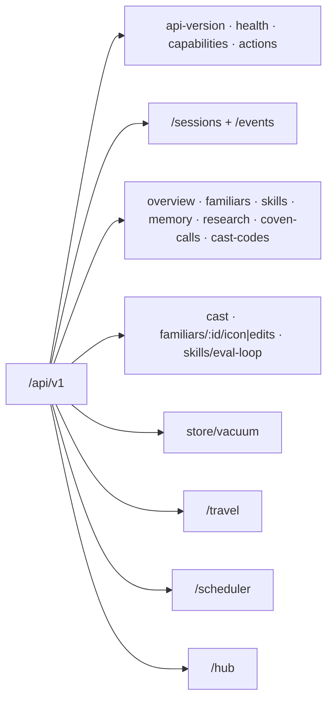

The Coven daemon exposes its public API as HTTP over same-user local IPC. On
Unix-like hosts, this is `<COVEN_HOME>/coven.sock`; on Windows, it is an
owner-only named pipe selected by `COVEN_HOME`. Health and `coven daemon status`
report the active endpoint, so clients must not construct a Windows pipe name
from the Unix convention. The active contract is **`coven.daemon.v1`** served
under `/api/v1`. This page is the canonical endpoint index — every route the
daemon serves is listed here.



All error responses use the structured envelope documented in the [API contract](/API-CONTRACT#structured-error-envelope): `{ "error": { "code", "message", "details" } }`. Unknown routes, action ids, and API versions fail closed. Clients negotiate the named `coven.daemon.v1` contract with `GET /api/v1/health`, then check every capability required by the operation. Boolean operation-group flags (`sessions`, `events`, `travel`, `scheduler`, `hub`, `executorDispatch`, `sessionHandoff`, `sessionLaunchPolicy`, `afs`, `afsCommit`, `afsCommitDryRun`, `fleetTrust`, `fleetDiscovery`) are advertised in the health `capabilities` block — treat a group as unavailable unless health advertises it. Capabilities advertise availability and never grant permission.

## Fleet trust and discovery

The [fleet trust model](/FLEET-TRUST) defines the authority and disclosure
boundary. Tailscale is transport and bounded peer inventory, never
authorization.

| Method | Route | Purpose |
| --- | --- | --- |
| GET | `/api/v1/discovery/advertisement` | Minimal untrusted service/version/pairing probe. |
| POST | `/api/v1/discovery/negotiate` | Select a mutually supported protocol or fail closed. |
| POST | `/api/v1/fleet/enrollment-credentials` | Create a single-use credential (`ttlSeconds`, maximum 600). |
| POST | `/api/v1/fleet/enroll` | Atomically redeem enrollment and return the node credential once. |
| GET | `/api/v1/fleet/local-node` | Inspect stable identity, role, lifecycle, sharing, capabilities, and actionable next state. |
| PUT | `/api/v1/fleet/local-node/role` | Configure `hub`, `executor`, or `both` plus advertised capabilities. |
| PUT | `/api/v1/fleet/local-node/sharing` | Idempotently enable/disable executor sharing. |
| POST | `/api/v1/fleet/local-node/lifecycle/:action` | Start, stop, drain, resume, or operation-idempotent restart. |
| POST | `/api/v1/fleet/pairing-requests` | Request explicit approval; returns a private request secret once. |
| GET | `/api/v1/fleet/pairing-requests` | List minimal pending requests for local Cave approval. |
| POST | `/api/v1/fleet/pairing-requests/:id/approve` | Idempotently approve a pending request. |
| POST | `/api/v1/fleet/pairing-requests/:id/deny` | Idempotently deny a pending request. |
| POST | `/api/v1/fleet/pairing-requests/:id/claim` | Claim an approved request once using its private secret. |
| POST | `/api/v1/fleet/local-credentials` | Store a delivered credential in executor-local custody. |
| POST | `/api/v1/fleet/local-credentials/:hubId/proof` | Derive a reconnect proof without returning the credential. |
| POST | `/api/v1/fleet/challenges` | Create a 60-second, single-use challenge for a trusted node. |
| POST | `/api/v1/fleet/reconnect` | Authenticate a node id, nonce, and derived proof. |
| POST | `/api/v1/fleet/jobs/claim` | Authenticated executor claim of one queued job addressed to its node id. |
| POST | `/api/v1/fleet/jobs/complete` | Authenticated, lease-bound executor result delivery. |
| POST | `/api/v1/fleet/local-jobs/system-info` | Queue a bounded system-information job for an approved node. |
| GET | `/api/v1/fleet/local-jobs` | List recent durable Fleet jobs and normalized results. |
| POST | `/api/v1/fleet/local-jobs/run` | Execute one claimed Fleet job through the local executor policy. |
| GET | `/api/v1/fleet/trusted-nodes` | List trust lifecycle metadata; never credential hashes. |
| POST | `/api/v1/fleet/trusted-nodes/:id/revoke` | Idempotently revoke durable trust. |

## Contract and discovery

| Method | Path | Purpose | Success |
|---|---|---|---|
| GET | `/api/v1/api-version` | Read the legacy route-family token. | `{ apiVersion: "v1", supportedApiVersions: ["v1"] }` |
| GET | `/api/v1/health` | Daemon reachability, version, capabilities, pid, hub summary, event-writer state, and local storage pressure. | `{ ok, apiVersion, covenVersion, capabilities, daemon, hub, eventWriter, storage }` |
| GET | `/api/v1/capabilities` | Control-plane capability catalog with policy hints and action ids. | `{ capabilities: [...] }` |
| GET | `/api/v1/capabilities/harnesses` | Aggregate of harness-native capability manifests plus Coven skills (`?refresh=1` re-scans). | `{ coven_skills, harness_capabilities, scanned_at }` |
| GET | `/api/v1/capabilities/:harness` | One harness's capability manifest (`?refresh=1` re-scans). | manifest object · `404 harness_not_found` |
| POST | `/api/v1/actions` | Route a known control-plane action id (intent envelope). | `{ ok, accepted, status, event }` · `400 invalid_request` |

The health `capabilities` object currently contains all 14 fields:
`sessions`, `events`, `travel`, `scheduler`, `hub`, `executorDispatch`,
`eventCursor`, `structuredErrors`, `sessionHandoff`, `sessionLaunchPolicy`,
`afs`, `afsMount`, `afsCommit`, and `afsCommitDryRun`. The
`sessionLaunchPolicy` field is `true` only over owner-gated local IPC and is
always `false` over TCP; Host and Origin allowlists do not elevate TCP
authority. `daemon` is either `null` or
`{ pid, startedAt, socket }`, where the socket is under
the active local IPC endpoint; the optional `hub` field is a control-plane
summary.
The optional `eventWriter` field reports the daemon-owned persistence queue,
including its state, exact queued events/bytes, capacity, dropped output,
connection, transaction, commit, and last-error counters.
The optional `storage` field is `{ status, databaseBytes, walBytes,
oldestRetainedEventAt, lastPruneAt, pruneAgeSeconds, lastCheckpointAt,
checkpointAgeSeconds, writerBacklogEvents, writerBacklogBytes, freeDiskBytes,
maintenanceBlocked, lastMaintenanceError? }`. `status` is `ok`, `warning`,
`critical`, or `degraded`; clients should surface `critical` and `degraded`
before storage exhaustion rather than treating a reachable daemon as healthy.
`writerBacklogEvents` and `writerBacklogBytes` mirror the same live queue
snapshot reported by `eventWriter`.

## Sessions and events

| Method | Path | Purpose | Body / query | Success | Errors |
|---|---|---|---|---|---|
| GET | `/api/v1/sessions` | List sessions. | — | `SessionRecord[]` | — |
| POST | `/api/v1/sessions` | Launch a project-scoped harness session. `launchPolicy` requires `capabilities.sessionLaunchPolicy === true`; its initial exact contract is `{ approval: "never", sandbox: "workspace-write", addDirs?: string[] }` for Codex `nonInteractive`, with every additional directory absolute, existing, canonicalized, and explicitly listed (including an external mission workspace when named). The field is owner-local-IPC-only; TCP returns `403 forbidden`. | `{ projectRoot, cwd?, harness, prompt, title?, launchMode?, launchPolicy?, conversation?, conversationId? }` | `SessionRecord` | `400 invalid_request`, `403 forbidden`, `500 launch_failed` |
| POST | `/api/v1/sessions/external` | Register (or idempotently re-register) an externally launched session. | session descriptor | `201` new / `200` existing | `400`, `409 session_id_conflict` |
| GET | `/api/v1/sessions/:id` | Fetch one session. | — | `SessionRecord` | `404 session_not_found` |
| POST | `/api/v1/sessions/:id/complete` | Mark an external session completed. | `{ exitCode?, ... }` | updated record | `404 session_not_found`, `422 not_external_session` |
| GET | `/api/v1/sessions/:id/events` | Read redacted session events. | `?afterSeq`, `?afterEventId`, `?limit` | `{ events, nextCursor, hasMore }` | `404 session_not_found` |
| GET | `/api/v1/sessions/:id/log` | Read bounded redacted log previews. | — | `[{ ts, level, message }]` | `404 session_not_found` |
| POST | `/api/v1/sessions/:id/input` | Forward input to a live session. | `{ data }` | `{ ok, accepted }` | `400`, `404`, `409 session_not_live`, `500 send_input_failed` |
| POST | `/api/v1/sessions/:id/kill` | Kill a live session. | — | `{ ok, accepted }` | `404`, `409 session_not_live`, `500 kill_failed` |
| POST | `/api/v1/sessions/:id/handoffs` | Validate, redact, and offer a `coven.handoff.v1` packet. | packet | `{ handoff, packet, eventCursor, workspace }` | `400`, `404`, `409`, `413 handoff_too_large` |
| GET | `/api/v1/sessions/:id/handoffs` | Read durable handoffs (`?latest=true` narrows to the latest). | `?latest=true` | `{ handoffs }` | `404` |
| POST | `/api/v1/sessions/:id/handoffs/:handoffId/claim` | Atomically claim a generation and fence source input. | `{ expectedGeneration, claimant, idempotencyKey, destinationWorkspace }` | `{ handoff, sourceInputFenced }` | `409 handoff_stale_generation`, `handoff_already_claimed`, `transcript_diverged`, `workspace_diverged` |
| POST | `/api/v1/sessions/:id/handoffs/:handoffId/ack` | Acknowledge a quiesced source cursor. | `{ claimant }` | `{ handoff }` | `409` |
| POST | `/api/v1/sessions/:id/handoffs/:handoffId/continuations` | Record a destination import and return a fixed untrusted-context prelude. | `{ destination }` | `{ continuation, packet, prompt, provenance }` | `409 source_acknowledgement_required` |
| GET | `/api/v1/sessions/:id/artifacts/:artifactId` | Read one raw (unredacted) artifact. | `?raw=1` required | raw payload | `400` (missing `raw=1`), `403 raw_artifacts_disabled`, `404` |
| GET | `/api/v1/events` | Read paginated redacted events for a session. | `?sessionId` required, `?afterSeq`, `?afterEventId`, `?limit` | `{ events, nextCursor, hasMore }` | `400 invalid_request` |

Event payloads are redacted by default; the raw artifact route requires explicit local raw-artifact persistence. See [STREAM-JSON](/STREAM-JSON) for event payload shapes.

Handoff routes are local-IPC-only and require the `sessionHandoff`
capability. They do not authenticate remote callers; a companion needs a
separately paired authenticated transport. See
[Session handoff](/daemon/session-handoff).

## Observability reads

These power `coven status`, `coven familiars`, `coven skills`, `coven memory`, `coven research`, `coven calls`, and the Cave cockpit — the CLI `--json` output is exactly these bodies (see [cli-observe](cli-observe.md)). Missing files degrade to empty lists.

| Method | Path | Purpose | Success |
|---|---|---|---|
| GET | `/api/v1/overview` | Dashboard aggregate: open sessions, roster/skill/research counts. | overview object |
| GET | `/api/v1/familiars` | Familiar roster from `familiars.toml`. | `FamiliarDto[]` |
| GET | `/api/v1/familiars/:id/ward` | One familiar's declared Ward surface (tiers, protected paths, principal binding) — the read twin of `/familiars/:id/edits`. | `{ ok, familiarId, workspace, ward }` · `400 invalid_request` / `404 familiar_not_found` / `404 ward_not_configured` / `500 ward_config_invalid` |
| GET | `/api/v1/familiars/:id/audit` | The append-only `ward_audit` ledger for one familiar, newest first — where direct and proposal-approved writes persist Gate 4 apply records. `?limit=N` (default 100, max 1000), `?event=TYPE` (e.g. `apply_audit`). | `{ ok, familiarId, records }` · `400 invalid_request` / `404 familiar_not_found` |
| GET | `/api/v1/skills` | Installed skills from `~/.coven/skills/`. | `SkillDto[]` |
| GET | `/api/v1/memory` | Familiar memory files from `~/.coven/memory/`. | memory list |
| GET | `/api/v1/memory/overview` | Memory counts plus explicit detail, verification, attestation, supersession, and mutation capability state. | overview object |
| GET | `/api/v1/memory/:id` | Validated markdown content for an opaque id returned by the memory list. | memory detail · `400 invalid_request` / `404 memory_not_found` / `413 memory_content_too_large` / `422 memory_content_invalid` / `503 memory_content_unavailable` |
| GET | `/api/v1/research` | Research loop log rows. | research list |
| GET | `/api/v1/coven-calls` | Coven Calls delegation ledger. | `{ ok, calls }` |
| GET | `/api/v1/coven-calls/:id` | One delegation call. | `{ ok, call }` · `404 call_not_found` |
| GET | `/api/v1/cast-codes` | Cast code catalog (`~?`, `~>` …). | code list |

Memory list `path` values are relative compatibility fields, never absolute
filesystem paths. Browser-facing clients should remove them from their own
DTOs. Enumeration is metadata-only and excludes non-UTF-8 path entries,
symlinks, Windows reparse points, non-files/non-directories, and entries that
disappear during the scan. Unexpected enumeration, directory-open, or metadata
errors fail the request instead of returning partial data. Overview reads no
bodies. List reads excerpts and retains a metadata-valid row with an empty
`excerpt` when its body is unreadable, invalid UTF-8, or larger than 4 MiB.
Detail reads only the selected entry from its validated no-follow handle;
content must be UTF-8 and at most 4 MiB (4,194,304 bytes). Detail responses
contain no path field. A missing or unsafe replacement before the validated
open returns `404 memory_not_found`; permission failures, unexpected open
failures, and post-open metadata/read failures return
`503 memory_content_unavailable`. Both errors expose only `memoryId` in their
details, never filesystem paths or raw I/O errors. Until the promotion privacy
and verification contracts land, the API reports those capabilities as
unavailable and returns unknown/null metadata rather than inferring a healthy
or public state.

## Cast and familiar writes

| Method | Path | Purpose | Success | Errors |
|---|---|---|---|---|
| POST | `/api/v1/cast` | Submit a cast line (status/delegation shorthand) to the cockpit session. | `202 { accepted, cast_id, echo }` | `400 invalid_request` |
| PUT | `/api/v1/familiars/:id/icon` | Update a familiar's icon glyph. | updated familiar | `400`, `404` |
| POST | `/api/v1/familiars/:id/edits` | Ward-adjudicated writes into a familiar home (Gates 1–2, fail-closed, audited). Held writes stage with deterministic Gate-3 probe evidence; applied writes append `apply_audit` rows to the `ward_audit` ledger. | edit report | `400`, `403` (ward denial), `404` |

## Ward proposals (threads)

Held Ward writes stage at `~/.coven/pending/` for the principal —
Tier-0 authority degradations and Tier-1 coherence holds, distinguished by
`reviewKind` (`authority` / `coherence`). See
[cli-ward](cli-ward.md) and `docs/design/ward-gate3-coherence.md`.

| Method | Path | Purpose | Success | Errors |
|---|---|---|---|---|
| GET | `/api/v1/threads/weaves` | Per-familiar weave/authority state (degraded configs reported inline). | weave entries | — |
| GET | `/api/v1/threads/proposals` | Pending proposals with compact `probeSummary` evidence (unparseable files reported as `degraded` entries, newest first). | `{ proposals }` | — |
| GET | `/api/v1/threads/proposals/:id` | One pending proposal with `probeSummary` and full per-surface `probes`. | `{ proposal }` | `400 invalid_request` / `404 proposal_not_found` |
| POST | `/api/v1/threads/proposals/:id/approve` | Re-validate and atomically apply a staged authority or coherence proposal. Pending decisions require `{ expectedRevision, note? }`; take the exact revision from the GET detail response. `HumanApprovalWithRationale` paths require a non-empty `note`. | decision report | `400`, `404`, `409` |
| POST | `/api/v1/threads/proposals/:id/reject` | Reject and remove a staged proposal (audited). Pending decisions require `{ expectedRevision, note? }`; take the exact revision from the GET detail response. | decision report | `400`, `404`, `409` |

Probe evidence is additive sidecar data, so the underlying
`coven_threads_core::PendingProposal` remains backward-readable. A missing
probe sidecar (older pending files), no matching `[[probe]]`, or a probe
runtime error is reported as `unscored`; it is never treated as a pass.
Stale, malformed, or internally inconsistent sidecars are likewise demoted to
`unscored` with `probeEvidenceDegraded`, after deterministic recomputation
against staged targets and contents, the current baseline and Gate-2
resolution, and the declared probe set.

For `reviewKind: "coherence"`, approval re-runs Gates 1–2 and the deterministic
probes, skips the threads validator (Tier-1 surfaces are deliberately not
woven), and conditionally writes only if the captured before-image still
matches the re-probed baseline. Missing, malformed, stale, or inconsistent
probe evidence returns `409`, leaves the proposal pending, and writes nothing.
A first approval attempt never treats matching proposed bytes as proof that
Coven already applied them; that idempotent shortcut is restricted to a
persisted recovery intent, which is also bound to the Gate-2-resolved surface.
Known no-write failures and proven rollbacks clear that recovery state before
returning; failures that may have committed preserve it for safe replay. The
Ward's final path adjudication must still equal the persisted resolution.
A valid `failed` or `unscored` probe result is advisory: an explicit principal
approval may still apply it. Rejection remains available when evidence is stale
and returns `probeSummary` plus `probeEvidenceDegraded`; it never applies the
staged edit. On approval, any logged edits in the proposal append their
`apply_audit` rows atomically with baseline advancement and the terminal
`proposal_approved` row.

## Skills: eval-loop

| Method | Path | Purpose | Success | Errors |
|---|---|---|---|---|
| GET | `/api/v1/skills/eval-loop/:familiarId` | Eval-loop skill state for a familiar. | `{ ok, state }` | `404 skill_not_active` |
| POST | `/api/v1/skills/eval-loop/:familiarId/run` | Enqueue an eval-loop run (`{ track? }`, default `synthesis`). | `202 { ok, runId, track }` | `400`, `409 run_in_progress` |
| DELETE | `/api/v1/skills/eval-loop/:familiarId/run-lock` | Clear a stale run lock (`{ force? }`). | `{ ok, cleared, familiarId }` | `409 lock_not_stale` |

## Store

| Method | Path | Purpose | Success |
|---|---|---|---|
| POST | `/api/v1/store/vacuum` | Rebuild the event FTS index and compact the SQLite store (CLI: [cli-vacuum](cli-vacuum.md)). | `{ ok, eventIndexRebuilt, integrityCheck }` · `500` on repair failure |

`eventIndexRebuilt` reports whether the `events_fts` index was present and rebuilt — the rebuild always runs when the index exists, so `true` does not imply the index was stale. `false` means the store has no `events_fts` table to rebuild.

## Travel (advertised by `capabilities.travel`)

The `GET /travel/state` read route backs `coven travel state --client <id>` ([cli-observe](cli-observe.md)); the write routes are machine-to-machine.

| Method | Path | Purpose | Success | Errors |
|---|---|---|---|---|
| POST | `/api/v1/travel/profiles` | Generate a signed, compressed offline travel profile for a familiar. | `201` profile envelope (`profileId`, `expiresAt`, `staleAfter`, `permissions`, `contentHash`, `profileBlob`) | `400 invalid_request` |
| POST | `/api/v1/travel/deltas` | Upload offline deltas recorded against a profile (`?defer=1` to queue). | delta acceptance | `404 travel_profile_not_found`, `409 source_hub_mismatch`, `409 travel_profile_expired` |
| GET | `/api/v1/travel/state` | Client sync state (`?clientId`, `?profileId`). | `{ state, profileId, pendingDeltaBytes, hubReachable, profileFreshness, travelExecutionAllowed, validStates }` | `400`, `404` |

## Scheduler (advertised by `capabilities.scheduler`)

The read routes back `coven scheduler decision <id>` and `coven scheduler loop <id>` ([cli-observe](cli-observe.md)); the write routes are machine-to-machine.

| Method | Path | Purpose | Success | Errors |
|---|---|---|---|---|
| POST | `/api/v1/scheduler/decisions` | Place a job on an eligible node by capability and queue pressure. | decision record | `400`, `409` (no eligible node) |
| GET | `/api/v1/scheduler/decisions/:id` | Fetch one placement decision. | decision record | `404` |
| POST | `/api/v1/scheduler/redispatch` | Re-route a persistent loop's job (`{ loopId, jobId, ... }`). | decision record | `400`, `404`, `409` |
| GET | `/api/v1/scheduler/loops/:id` | Persistent loop state incl. preserved subqueue and node availability. | loop state object | `404` |

## Hub control plane (advertised by `capabilities.hub`)

The hub is the only side that initiates executor contact (`coven.executor.v1`); see [cli-executor](cli-executor.md) and [HUB-OPERATIONS](/HUB-OPERATIONS). Read routes back `coven hub status/nodes/jobs/routing/dispatch` ([cli-observe](cli-observe.md)).

| Method | Path | Purpose |
|---|---|---|
| GET | `/api/v1/hub/status` | Hub role, hubId, node availability, queue depths. |
| POST | `/api/v1/hub/nodes` | Register or re-register an executor node. |
| GET | `/api/v1/hub/nodes` | List registered nodes. |
| GET | `/api/v1/hub/nodes/:id` | Fetch one registered node. |
| POST | `/api/v1/hub/nodes/:id/health` | Record an executor health report (holds/resumes its subqueue). |
| POST | `/api/v1/hub/nodes/:id/poll` | Poll executor availability outbound over its dispatch transport. |
| POST | `/api/v1/hub/nodes/:id/dispatch` | Dispatch a job outbound to a stateless executor. |
| GET | `/api/v1/hub/dispatches/:jobId` | Fetch a persisted dispatch record (job spec + result envelope). |
| POST | `/api/v1/hub/jobs` | Enqueue a job on the persistent global queue. |
| GET | `/api/v1/hub/jobs` | List jobs (`?state=queued\|assigned\|held\|completed\|failed\|cancelled`). |
| GET | `/api/v1/hub/jobs/:id` | Fetch one job with its routing entry. |
| POST | `/api/v1/hub/jobs/:id/assign` | Assign a job to an executor from the node registry. |
| POST | `/api/v1/hub/jobs/:id/complete` | Mark a job completed/failed/cancelled. |
| GET | `/api/v1/hub/routing` | Read the persistent routing table. |

Full hub request/response shapes live in the [API contract](/API-CONTRACT).

## Always begin with health

```http
GET /api/v1/health
```

The response provides the active named `apiVersion`, all 14 health
`capabilities` fields, and optional daemon metadata (`pid`, `startedAt`, and
`socket`) plus the optional hub summary. Treat a dependent operation as
unavailable until its required capability fields have been checked.

See the [public API guide](https://docs.opencoven.ai/docs/reference/api) for response examples and architecture notes, and the [API contract](/API-CONTRACT) for stable shapes, versioning, and failure envelopes.

## Related

- [Public API guide](https://docs.opencoven.ai/docs/reference/api)
- [API contract](/API-CONTRACT)
- [Authentication and local access](/AUTH)
- [Client integration](/CLIENT-INTEGRATION)
