The user-facing command is always `coven`. Wrapper packages like `@opencoven/cli`, `@opencoven/cli-macos`, and `@opencoven/cli-linux-x64` install the same binary.

```mermaid
flowchart TB
  Root["coven"] --> TUI["tui (default)"]
  Root --> Doctor["doctor"]
  Root --> Daemon["daemon"]
  Root --> Run["run"]
  Root --> Sessions["sessions"]
  Root --> Attach["attach"]
  Root --> Summon["summon"]
  Root --> Archive["archive"]
  Root --> Sacrifice["sacrifice"]
  Root --> Kill["kill"]
  Root --> Patch["patch"]
  Root --> Logs["logs"]
  Root --> Vacuum["vacuum"]
  Root --> Wt["wt"]
  Root --> Claim["claim"]
  Root --> Hooks["hooks"]
  Root --> Pc["pc (macOS-first)"]
  Root --> Completions["completions"]
  Root --> Status["status [--json]"]
  Root --> Familiars["familiars [--json]"]
  Root --> Skills["skills [--json]"]
  Root --> Memory["memory [--json]"]
  Root --> Research["research [--json]"]
  Root --> Calls["calls [id] [--json]"]
  Root --> Hub["hub"]
  Root --> Scheduler["scheduler"]
  Root --> Travel["travel"]

  Daemon --> DStart["start"]
  Daemon --> DStatus["status [--json]"]
  Daemon --> DRestart["restart"]
  Daemon --> DStop["stop"]

  Run --> RCodex["codex &lt;prompt&gt;"]
  Run --> RClaude["claude &lt;prompt&gt;"]

  Sessions --> SPlain["--plain"]
  Sessions --> SJson["--json"]
  Sessions --> SAll["--all"]
  Sessions --> SManage["--manage"]
  Sessions --> SSearch["search &lt;query&gt;"]
  Sessions --> SShow["show &lt;id&gt;"]
  Sessions --> SEvents["events &lt;id&gt;"]
  Sessions --> SLog["log &lt;id&gt;"]

  Hub --> HubStatus["status [--json]"]
  Hub --> HubNodes["nodes [--json]"]
  Hub --> HubJobs["jobs [--state s] [--json]"]
  Hub --> HubRouting["routing [--json]"]

  Patch --> POpenclaw["openclaw &lt;prompt&gt;"]

  Logs --> LPrune["prune [--dry-run]"]

  Wt --> WtBranch["&lt;branch&gt;"]
  Wt --> WtList["--list [--json]"]
  Wt --> WtDoctor["--doctor"]
  Wt --> WtPrune["--prune-merged / --prune-stale DAYS"]

  Claim --> CAcquire["acquire &lt;branch&gt;"]
  Claim --> CRelease["release &lt;branch&gt;"]
  Claim --> CHeartbeat["heartbeat &lt;branch&gt;"]
  Claim --> CCanary["canary &lt;branch&gt;"]
  Claim --> CStatus["status [--json]"]

  Hooks --> HInstall["install"]

  Pc --> PcStatus["status [--json]"]
  Pc --> PcTop["top --n N [--json]"]
  Pc --> PcDisk["disk [--json]"]
  Pc --> PcKill["kill &lt;pid&gt; --confirm"]
  Pc --> PcCache["cache clear --confirm"]
```



## Top-level

| Command | Action |
|---|---|
| `coven` | Open the beginner-friendly interactive menu. |
| `coven tui` | Explicitly open the slash-command TUI. |
| `coven doctor` | Check local setup; exits 1 when a blocking problem is found. `--json` emits a `{ ok, blocking, checks, nextSteps }` envelope. |
| `coven status` | Ecosystem overview: daemon, sessions, familiars, skills, research, hub. Alias: `coven overview`. |
| `coven daemon start/status/restart/stop` | Manage the local daemon. |
| `coven run <harness> <prompt>` | Launch a project-scoped harness session. Current harness ids: `codex`, `claude`, `copilot`. |
| `coven sessions` | Open the session browser; supports `--plain`, `--json`, `--all`, and `--manage`. |
| `coven sessions search <query>` | Full-text search recorded event payloads. |
| `coven sessions show/events/log <session-id>` | Inspect one session without attaching; see [cli-observe](cli-observe.md). |
| `coven attach <session-id>` | Replay/follow session output and forward input when live. |
| `coven summon <session-id>` | Restore an archived session, then replay/follow it. |
| `coven archive <session-id>` | Hide a non-running session while preserving events. |
| `coven sacrifice <session-id> --yes` | Permanently delete a non-running session. |
| `coven kill <session-id>` | Kill a running session's process; keeps the event log. |
| `coven patch openclaw <prompt>` | Local OpenClaw rescue loop. Does not commit or push. |
| `coven logs prune` | Prune expired encrypted raw artifacts and old redacted event logs; see [cli-logs](cli-logs.md). |
| `coven vacuum` | Rebuild the session event FTS index, compact the SQLite store, and print integrity status; see [cli-vacuum](cli-vacuum.md). |
| `coven wt <branch>` | Create or enter a sibling `<repo>.wt/<branch-slug>` git worktree; see [cli-wt](cli-wt.md). |
| `coven wt --list/--doctor/--prune-merged/--prune-stale DAYS` | Inspect and clean Coven protocol worktrees; see [cli-wt](cli-wt.md). |
| `coven claim acquire/release/heartbeat/canary <branch>` | Manage TTL-bounded branch ownership for the current agent; see [cli-claim](cli-claim.md). |
| `coven claim status` | Print branch claims from the current repository; see [cli-claim](cli-claim.md). |
| `coven hooks install` | Install local protocol hooks that block unsafe commits and protected pushes; see [cli-claim](cli-claim.md). |
| `coven engine status/install/which` | Manage the pinned Coven engine (`coven-code`); see [cli-engine](cli-engine.md). |
| `coven executor probe/run-job` | Stateless executor-node protocol commands, hub-dispatched over SSH; see [cli-executor](cli-executor.md). |
| `coven pc` | macOS-first diagnostics and explicit `--confirm` relief operations. |
| `coven completions <shell>` | Print shell completions for bash, zsh, fish, elvish, or powershell. |
| `coven familiars/skills/memory/research/calls` | Read-path Cave parity views; see [cli-observe](cli-observe.md). |
| `coven hub status/nodes/jobs/routing` | Read-only hub control-plane inspection; `nodes <id>` and `jobs <id>` show one record; see [cli-observe](cli-observe.md). |
| `coven hub dispatch <jobId>` | Show a job's executor dispatch record and result envelope. |
| `coven scheduler decision/loop <id>` | Read-only scheduler decision and loop-recovery views; see [cli-observe](cli-observe.md). |
| `coven travel state --client <id>` | Read-only travel handoff state machine view; see [cli-observe](cli-observe.md). |

## Common flags by command

| Command | Flags |
|---|---|
| `coven run` | `--cwd <path>`, `--title <text>`, `--detach`, `--model <id>`, `--permission <full\|read-only>`, `--think`, `--speed fast\|balanced\|thorough` |
| `coven doctor` | `--json` |
| `coven daemon status` | `--json` |
| `coven sessions` | `--plain`, `--json`, `--all`, `--manage` |
| `coven sessions events` | `--after-seq <SEQ>`, `--limit <N>`, `--json` |
| `coven status` / `familiars` / `skills` / `memory` / `research` / `calls` | `--json` |
| `coven hub jobs` | `--state <queued\|assigned\|held\|completed\|failed\|cancelled>` (list mode), `[id]` positional for a detail view, `--json` |
| `coven scheduler decision/loop` | `<id>` positional, `--json` |
| `coven travel state` | `--client <CLIENT_ID>` (required), `--profile <PROFILE_ID>`, `--json` |
| `coven sacrifice` | `--yes` (required) |
| `coven logs prune` | `--dry-run`, `--raw-days <N>`, `--event-days <N>` |
| `coven wt` | `--list`, `--json` (with `--list`), `--doctor`, `--prune-merged`, `--prune-stale <DAYS>` |
| `coven claim status` | `--json` |
| `coven engine status` | `--json` |
| `coven pc kill` | `--confirm` (required) |
| `coven pc cache clear` | `--confirm` (required) |
| `coven pc top` | `--n <N>`, `--verbose`, `--json` |
| `coven pc disk` | `--json` |
| `coven pc status` | `--json` |

## Global flags

- **`--color <auto|always|never>`** controls ANSI color on every command. `auto` (the default) honors the environment: `NO_COLOR` disables color, `CLICOLOR_FORCE` forces it on even through a pipe, and otherwise color is emitted only to a TTY with a color-capable `TERM`. `--color=always` overrides all of that (useful when piping into a pager like `less -R`); `--color=never` forces plain text (useful for deterministic CI logs). The flag outranks the environment variables when both are set.

## Shell completions

Generate completions for your shell and source them:

```sh
# zsh (add to a directory on $fpath, e.g. ~/.zfunc)
coven completions zsh > ~/.zfunc/_coven

# bash
coven completions bash > ~/.local/share/bash-completion/completions/coven

# fish
coven completions fish > ~/.config/fish/completions/coven.fish
```

Supported shells: `bash`, `zsh`, `fish`, `elvish`, `powershell`.

## Flag conventions

- **Project-scoped commands** accept `--cwd <path>` for a launch directory inside the project root.
- **Machine-readable output** is per-command today: `coven sessions` accepts `--plain` and `--json`; `coven sessions search`, `coven adapter list`, `coven daemon status`, `coven wt --list`, `coven claim status`, `coven pc status`, `coven pc top`, and `coven pc disk` accept `--json`. With `--json`, stdout carries only the JSON document; hints go to stderr.
- **Timestamps**: `coven claim status` prints RFC 3339 UTC timestamps in the human table; its JSON form keeps the raw epoch seconds (`acquired_at`, `expires_at`) alongside `*_rfc3339` renderings.
- **Session id arguments** (`attach`, `summon`, `archive`, `sacrifice`, `kill`) accept a unique prefix of the id.
- **Destructive commands** require `--yes` (or `--confirm` for `coven pc` relief).
- **Daemon-touching commands** print install/repair hints when the socket is missing.

## Log retention

`coven logs prune` applies the local privacy retention policy:

- Raw encrypted artifacts default to 7 days.
- Redacted operational event logs default to 30 days.
- `--dry-run` prints counts only.
- `--raw-days <N>` and `--event-days <N>` override the configured retention for one run.

## Store repair

`coven vacuum` is a local housekeeping command for the session ledger. It rebuilds the
`events_fts` index, runs SQLite `VACUUM`, truncates the WAL when possible, and prints
the final integrity check as a prose status line. Use it before retrying
`coven sacrifice <id> --yes` when SQLite reports a malformed event index.

## Parallel Work Protocol

`coven wt`, `coven claim`, and `coven hooks install` implement the local
Coven Parallel Work Protocol for multi-agent repositories.

- `coven wt <branch>` creates or enters `<repo>.wt/<branch-slug>/`.
- `coven claim acquire <branch>` writes a TTL-bounded branch claim under git's
  common directory. Run it inside the task worktree; the owner defaults to
  `$USER@<worktree-slug>`, while an explicit `COVEN_AGENT_ID` overrides it.
- `coven hooks install` installs `pre-commit` and `pre-push` hooks. Existing
  hooks are chained through `<hook>.local`; tracked `core.hooksPath`
  directories are left untouched.
- Protected pushes require `.git/MERGE_INTENT` to contain
  `Enchant merge to main.` unless `COVEN_MERGE_PHRASE` changes the phrase.

## Exit codes

Current builds return `0` for success and a non-zero error for failed CLI execution. Structured, command-specific exit codes are reserved for a future release.

## Related

- [Getting started](/GETTING-STARTED)
- [Workflow guides](/guides)
- [Developer core-functionality guide](/development/cli-core-functionality)
- [Coven TUI](/start/coven-tui)
- [Session lifecycle](/SESSION-LIFECYCLE)
- [Harness adapter guide](/HARNESS-ADAPTERS)
- [Troubleshooting](/TROUBLESHOOTING)
