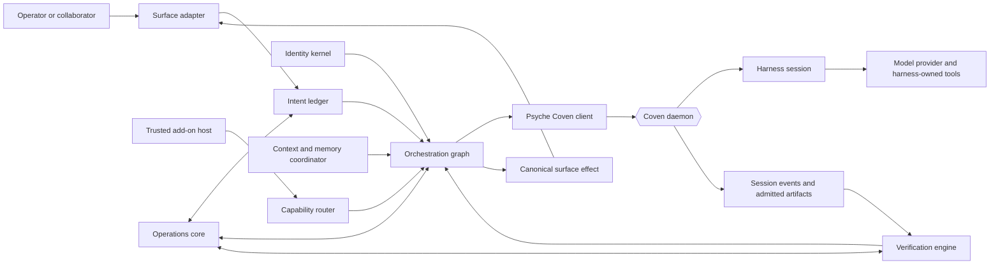

# Psyche Program Decision Dossier

**Status:** Approved program baseline - W0 reconciled and G1 verified 2026-08-01

**Decision owner:** Val

**Approved:** 2026-07-31 after final Nova and Sage consensus review

**Architecture reviewers:** Nova and affected Coven maintainers

**Research reviewer:** Sage

**Product home:** planned standalone `OpenCoven/psyche` repository

**Temporary design home:** `specs/psyche/` in `OpenCoven/coven`

**Canonical architecture:** [Psyche Familiar Runtime Design](./RUNTIME_DESIGN.md)

**Decision-support purpose:** Consolidate what has been decided, what is
supported by evidence, what remains unresolved, and what must be true before
each stage of the Psyche program may proceed.

**Consensus record:**

- **Nova:** Approved. Ratify Psyche as the surface-neutral familiar runtime;
  preserve identity separately from authorization; keep Psyche, Coven,
  harness, and surface authority distinct; and adopt the single-node Telegram
  vertical slice with W0-W11/G0-G12 progression.
- **Sage:** Approved after correcting the runtime design's trajectory-evaluation
  confidence from high to medium-high with local validation required. The
  dossier's evidence/inference separation, local benchmark gates, and deferred
  research claims are accepted.
- **Val:** Approved the dossier based on the Coven's final conclusion. G0 is
  satisfied and W0 reconciliation is authorized. Evidence-blocked O-* decisions
  remain unresolved until their named gates produce the required evidence.

> This dossier is the program-level decision record. It does not replace the
> detailed runtime design, Telegram parity ledger, threat model, or future
> subsystem implementation plans. W0 reconciles the older Telegram-scoped
> companion material to this dossier; this document remains authoritative if a
> later child plan attempts to reopen a fixed boundary.

## 1. Executive decision

### 1.1 Recommendation

Proceed with Psyche as the **local-first, surface-neutral, durable familiar
runtime for a Coven**, with comprehensive multi-agent orchestration in the
architecture and capability-gated production execution.

Do not proceed directly to implementation. W0 reconciles the Telegram-era
specifications and freezes minimum surface-neutral schemas; W1 separately
audits Coven's actual current contracts. After G1/G3, build in independently testable
vertical stages:

1. identity, intent, graph, and storage foundations against fakes;
2. one-node execution against a real Coven daemon;
3. a Telegram vertical slice using the common surface contract;
4. evidence-first verification;
5. graph authoring, simulation, and recovery;
6. production multi-agent execution only after Coven exposes and proves the
   required child-session contracts;
7. trusted add-ons and broader Telegram parity; and
8. migration, canary, hardening, and release.

This ordering preserves the broad product direction without pretending the
current execution substrate already supports every orchestration invariant.

### 1.2 Why this direction

The earlier design correctly identified a real need: a reliable local runtime
that preserves familiar identity, durable conversation state, Telegram
behavior, approvals, recovery, and clean-room migration without placing that
logic inside one harness.

Its root error was treating the first proven adapter as the permanent product
boundary. Telegram is important enough to remain the first production and
conformance adapter, but not important enough to define the core identity of
Psyche.

The corrected boundary is:

- **Psyche is the familiar runtime and orchestrator.**
- **Coven is the bounded execution and enforcement substrate.**
- **Harnesses own provider conversations and internal tool loops.**
- **Surfaces adapt people and protocols to Psyche's canonical contracts.**

This boundary gives Psyche a durable reason to exist beyond Telegram while
keeping Coven's Rust authority layer and harness neutrality intact.

### 1.3 Current program state

| Area | State | Consequence |
|---|---|---|
| Product direction | Approved in principle | Psyche is surface-neutral; Telegram is an adapter. |
| Runtime architecture | Written and reviewed with corrections | `RUNTIME_DESIGN.md` is the canonical design artifact. |
| Research review | Approved with corrections applied | Verification claims are evidence-calibrated. |
| Identity and authority review | Approved with corrections applied | Ownership, adoption, cancellation, and recovery invariants are explicit. |
| Product specification | W0 reconciled | Surface-neutral product; Telegram is the first adapter; core and adapter objectives are separate. |
| Technical architecture | W0 reconciled | Canonical intent/graph/evidence/surface contracts own the core; Telegram schemas remain adapter-scoped. |
| Threat model | W0 reconciled | Graph, delegation, verifier, evidence, add-on, principal, and multi-surface threats are included. |
| Telegram parity | W0 reconciled | Adapter evidence maps to common contracts and G8-G11. |
| Coven prerequisites | W0 boundary reconciled; W1 audit pending | Behavior requirements are hypotheses until code/test classification and G3. |
| Program plan | W0 reconciled | W0-W11 workstreams and G0-G12 gates replace the old program. |
| Implementation | Not started | No implementation child plan, issue, or production code begins before G3 and the applicable downstream gate. |

## 2. Canonical product definition

Psyche is the operator-aligned mind of a Coven. It converts human or surface
intent into durable, reviewable orchestration graphs while preserving:

- the selected familiar's declared identity;
- the operator or principal behind the request;
- project and policy constraints;
- delegation and budget boundaries;
- context and memory provenance;
- execution correlation and recovery;
- evidence and verification requirements;
- add-on integrity and trust state; and
- the exact surface on which input arrived and output is delivered.

Psyche is not a generic agent framework. Its unit of organization is a Coven
familiar operating under local identity, project, and authority constraints.

### 2.1 Primary users

| User | Need |
|---|---|
| Principal | Reach a named familiar without weakening its identity or governance. |
| Operator | Inspect, approve, pause, recover, export, restore, and audit durable work. |
| Familiar maintainer | Define identity, lane, roles, skills, routes, and verification policy in reviewable files. |
| Collaborator | Submit authorized work and understand progress, evidence, and outcomes. |
| Surface maintainer | Add a channel without duplicating graph, identity, or recovery logic. |
| Coven maintainer | Expose a narrow, versioned execution contract without absorbing product orchestration. |
| Add-on author | Contribute reviewed behavior through a typed, integrity-pinned protocol. |

### 2.2 Product goals

- Preserve familiar identity across surfaces, models, harnesses, and restarts.
- Durably record accepted intent before dispatch or acknowledgement.
- Coordinate one or many familiar nodes through explicit graph semantics.
- Delegate without widening identity, project, budget, capability, or approval
  scope.
- Recover from lost responses, crashes, orphaned sessions, ambiguous
  cancellation, and ambiguous delivery without inventing success.
- Prefer deterministic and artifact evidence over model confidence.
- Support independent verification and human escalation.
- Keep surface-specific transport and presentation behind adapters.
- Support trusted local add-ons without claiming same-user code is sandboxed.
- Remain local-first and operable without a hosted control plane.
- Make unsupported capabilities visibly unavailable rather than approximating
  them through client-side authority.

### 2.3 Non-goals for the first production program

- A hosted multi-tenant orchestration control plane.
- Replacing Coven, Coven Cave, CastCodes, or a supported harness.
- Owning provider authentication or the harness model conversation.
- Mediating or authorizing individual harness-internal tool calls under the
  current session model.
- Treating prompts, model output, route labels, package metadata, or surface
  identities as familiar identity.
- Claiming untrusted add-on containment without an enforceable isolation
  design.
- Automatic adoption of LangGraph, CrewAI, AutoGen, A2A, NATS, gRPC, WebRTC,
  Cloudflare, or another orchestration or transport stack.
- Cross-host graph execution before the local-first lifecycle is proven.
- Recurring schedules or deferred triggers until ownership and execution
  contracts are separately decided.
- OpenClaw source, database, conversation, credential, cache, hidden memory, or
  runtime compatibility.
- Channels beyond Telegram before the core surface contract and first adapter
  conformance suite are stable.

## 3. Fixed decisions

These decisions should not be reopened during implementation unless new
evidence invalidates an underlying assumption.

| ID | Decision | Rationale |
|---|---|---|
| D-001 | Psyche is a surface-neutral familiar runtime, not a Telegram runtime. | The core responsibilities outlive any one channel. |
| D-002 | Telegram is the first production and conformance adapter. | It has the deepest existing requirements and proves difficult delivery semantics. |
| D-003 | Psyche and Coven remain separate products and repositories. | Their orchestration and execution responsibilities evolve independently. |
| D-004 | Durable and trusted core logic is implemented in Rust. | It matches the local authority stack and avoids a second TypeScript core. |
| D-005 | TypeScript is restricted to reviewed SDK, package, compatibility, test, and thin installer surfaces. | Add-on compatibility should not move runtime authority out of Rust. |
| D-006 | Familiar identity derives only from declared familiar sources, principal, provenance, and revision. | Surfaces, prompts, models, harnesses, and add-ons cannot redefine identity. |
| D-007 | Project bindings are authorization constraints, not identity inputs. | Changing a project scope must not silently create a different familiar. |
| D-008 | Psyche owns graph orchestration; Coven owns bounded session execution. | This is the central product boundary. |
| D-009 | Harnesses own provider authentication, model conversation, and internal tool loops. | Current Coven supervision does not mediate individual tool execution. |
| D-010 | Surfaces authenticate protocol actors; Psyche maps them to principals and authorizes surface behavior under configured policy. | Protocol identity alone is not principal authority. |
| D-011 | Multi-agent orchestration is core architecture but production child dispatch is release-gated. | Schema and simulation can proceed before the execution substrate is complete. |
| D-012 | Unknown adoption, cancellation, verification, or delivery remains explicit and fenced. | Ambiguity cannot be converted into success or safe retry locally. |
| D-013 | A generating node cannot certify its own output. | Self-evaluation evidence is too weak and biased for correctness authority. |
| D-014 | Deterministic evidence and immutable artifacts precede model judging. | External signals are the strongest available correctness evidence. |
| D-015 | V1 add-ons are same-user trusted code. | Process boundaries reduce accidents but do not contain a malicious same-user process. |
| D-016 | Add-ons require approval, allowlisting, immutable digest pinning, provenance, revocation, and audit. | Package and marketplace metadata cannot grant capability. |
| D-017 | Telegram delivery ambiguity remains durable and operator-visible. | Bot API mutations lack a universal client idempotency key. |
| D-018 | OpenClaw migration imports only operator-selected, human-reviewable, secret-free configuration and package concepts. | Hidden runtime state creates unsafe and non-clean-room coupling. |
| D-019 | Capability flags are computed from negotiated contracts and current conformance evidence. | Configuration cannot force-enable unsupported authority. |
| D-020 | No production implementation begins from the architecture document alone. | Each subsystem needs a bounded, test-first child plan. |

## 4. Authority and trust model

### 4.1 Ownership matrix

| Concern | Psyche | Coven | Harness | Surface |
|---|---|---|---|---|
| Operator intent and provenance | Authoritative | Receives bounded requests | Receives task input | Captures protocol observation |
| Familiar identity source | Resolves and snapshots | Validates and binds when supported | Cannot redefine | Cannot redefine |
| Principal mapping | Maps authenticated actors to configured principals | May validate execution-side context | No authority | Authenticates protocol actor |
| Graph and node lifecycle | Authoritative | No graph ownership | No graph ownership | Presents state |
| Delegation and dependency policy | Authoritative | Enforces each admitted execution independently | Executes one admitted task | No authority |
| Project/cwd boundary | Requests constrained scope | Authoritative enforcement | Runs inside admitted scope | No authority |
| Harness selection and process supervision | Requests supported profile | Authoritative admission and lifecycle | Owns its provider loop | No authority |
| Provider authentication | No | No | Authoritative | No |
| Internal tool calls | No mediation claim | No mediation claim under current model | Authoritative | No |
| Orchestration approval | Authoritative | No implied authorization | No implied authorization | Presents interaction |
| Execution approval | Requests | Authoritative where exposed | May own harness-native approval | Presents only |
| Context selection | Authoritative | Supplies explicit contracted data | Consumes supplied input | Supplies observed content |
| Memory authority | Selects requested memory operations | Authoritative for Coven memory contracts | No independent authority | No |
| Evidence policy and verdict | Authoritative | Supplies session/artifact evidence | Produces candidate work | Presents evidence |
| Session terminal state | Correlates and adopts result | Authoritative | Emits harness outcome | No |
| Surface effects | Authorizes under Psyche surface policy | No general surface authority in the corrected boundary | Cannot choose target | Executes exact authorized transport |
| Delivery state | Authoritative logical ledger | May correlate session evidence | No | Reports protocol outcome |
| Add-on trust and lifecycle | Authoritative | No | No | No |

### 4.2 Approval domains

Approval is not one global token.

- **Psyche orchestration approval** covers delegation, graph mutation, budget
  expansion, verification exceptions, and surface effects.
- **Coven execution approval** covers only actions within a versioned Coven
  execution or protected-resource contract.
- **Harness-native approval** remains inside the harness unless an explicit
  contract delegates it.
- **Surface interaction** conveys a principal's decision only after actor,
  locator, nonce, expiry, and scope validation.

Approval in one domain never implies approval in another.

### 4.3 Identity invariant

One graph node binds one immutable familiar identity snapshot:

- `familiar_id`;
- familiar name and lane within its Coven;
- principal binding;
- `IDENTITY.md` digest;
- `SOUL.md` digest;
- role and skill configuration digests;
- aggregate identity digest;
- provenance for each input; and
- familiar revision.

An intentional change creates a new revision. Existing graph nodes and Coven
sessions retain the old snapshot. Project, surface, budget, and capability
constraints are bound separately and cannot alter identity by implication.

## 5. Runtime architecture

### 5.1 Components

| Component | Responsibility | Must not do |
|---|---|---|
| Identity kernel | Resolve coherent familiar snapshots, revisions, provenance, and contradiction checks. | Invent identity from prompts or surfaces. |
| Intent ledger | Persist immutable normalized requests, outcomes, constraints, and supersession. | Rewrite accepted history. |
| Orchestration graph | Manage nodes, dependencies, delegation, attempts, budgets, cancellation, verification, and aggregation. | Execute harness work itself. |
| Capability router | Match reviewed requirements to familiars, projects, runtime contracts, add-ons, and surfaces. | Turn metadata into permission. |
| Context and memory coordinator | Build bounded provenance-bearing context and explicit memory operations. | Convert output into memory silently. |
| Verification engine | Seal evidence, run deterministic gates, schedule independent verification, and escalate. | Let a generator certify itself. |
| Surface contract | Normalize ingress and canonical effects across adapters. | Expose Telegram fields to graph core. |
| Telegram adapter | Authenticate, normalize, route, render, deliver, recover, and prove Telegram parity. | Define Psyche's product identity. |
| Add-on host | Validate pinned packages, supervise workers, broker typed requests, revoke, and audit. | Claim same-user containment. |
| Coven client | Negotiate contracts, request sessions, record authoritative adoption, follow events, cancel, and reconcile. | Create local success fallbacks. |
| Operations core | Store, migrate, lease, diagnose, audit, retain, export, restore, and recover. | Hide blocked or ambiguous state. |

### 5.2 Target topology



### 5.3 Canonical contract families

| Family | Contracts |
|---|---|
| Identity and intent | `psyche.identity_snapshot.v1`, `psyche.intent.v1` |
| Surfaces | `psyche.surface_event.v1`, `psyche.surface_effect.v1`, `psyche.delivery.v1` |
| Graph | `psyche.graph.v1`, `psyche.graph_node.v1`, `psyche.delegation.v1`, `psyche.budget.v1` |
| Execution | `psyche.execution_binding.v1`, versioned Coven capability profile |
| Verification | `psyche.evidence.v1`, `psyche.verdict.v1` |
| Recovery | `psyche.recovery.v1` |
| Approvals | `psyche.approval.v1` |
| Add-ons | `psyche.addon.v1`, a framed worker RPC contract, durable invocation records |
| Operations | strict config, doctor report, migration manifest, and export schemas |
| Telegram extension | `psyche.telegram_event.v1`, `psyche.telegram_effect.v1`, parity fixtures |

Unknown major versions fail closed. Persisted unknown records are quarantined.
Optional additive fields are accepted only where the containing schema
explicitly permits them.

## 6. Orchestration lifecycle

### 6.1 Graph model

The initial graph model is a durable directed acyclic graph. Admission rejects
cycles. Every graph has:

- one root intent and owning principal;
- immutable graph policy and revision;
- stable node IDs and parent/dependency relationships;
- one familiar identity snapshot per node;
- explicit success predicates and verification requirements;
- hierarchical budget reservations;
- cancellation and failure-propagation policy;
- terminal result and artifact aggregation; and
- lease, ambiguity, and operator-recovery state.

### 6.2 Attempt and adoption model

Every execution attempt has:

- a stable attempt ID;
- a stable idempotent execution request ID;
- an immutable request payload digest;
- at most one authoritative Coven session binding, with that Coven session bound
  to no other attempt;
- an ordered event cursor;
- terminal result and artifact correlation; and
- retained ambiguity state.

An adoption-unknown attempt is never redispatched until Coven proves
non-adoption. A request or payload-digest mismatch fences the attempt. Local
fencing prevents further mutation; it does not prove that the execution did not
occur.

### 6.3 Dependency and result model

- Dependencies release only when their committed success predicate is met.
- Completion of a process is not automatically graph success.
- A candidate result proceeds through its declared evidence policy.
- Results and artifacts bind immutably to graph, node, attempt, Coven session,
  and familiar identity revision.
- Descendants remain owned by the root graph and cannot outlive unresolved
  parent cancellation.
- Failure, rejection, skip, and cancellation propagate according to immutable
  graph policy.
- A child cannot widen identity, project, budget, capability, approval, or
  surface scope received from its parent.

### 6.4 Budget model

Psyche can always enforce:

- graph and node admission limits;
- concurrency limits;
- retry and attempt counts;
- elapsed orchestration deadlines;
- context and artifact byte limits under Psyche's control; and
- reservation and accounting policy.

Psyche may call a budget **hard** only for a named resource class that the
execution layer can enforce and report reliably. Token, cost, CPU, memory, or
tool-call limits are not hard merely because a configuration field names them.

Reservations are hierarchical, idempotent, retained during ambiguity, and
charged or released exactly once. Each retry receives separate accounting.
Exhaustion blocks dispatch.

### 6.5 Cancellation model

Cancellation is a durable graph mutation valid from every nonterminal state:

1. record actor, scope, reason, and graph revision;
2. stop admitting affected descendants;
3. cancel only nodes proven not adopted and release only their unused
   reservations;
4. resolve adoption-unknown attempts authoritatively without redispatch;
5. request Coven termination for adopted sessions;
6. retain reservations and recovery state through adoption or termination
   ambiguity;
7. await Coven's authoritative terminal acknowledgement;
8. revoke unused Psyche approvals; and
9. aggregate `cancelled` only when every potentially adopted execution has
   authoritative terminal acknowledgement.

Unresolved execution leaves the graph in `recovery_required`.

### 6.6 Restart and orphan recovery

On startup Psyche:

1. validates schemas, identity revisions, and storage integrity;
2. acquires leases using monotonically increasing fencing tokens;
3. resumes unacknowledged surface cursors;
4. queries Coven for adoption-unknown attempts;
5. resumes event cursors for adopted sessions;
6. reconciles terminal results and artifact references;
7. fences mismatches without redispatch;
8. restores approval and verification waits;
9. reclaims expired local work without treating lease expiry as permission to
   duplicate execution; and
10. surfaces unresolved ambiguity to the operator.

## 7. Verification model

### 7.1 Evidence hierarchy

| Level | Evidence | Decision role |
|---|---|---|
| E0 | Schema, invariant, signature, digest, and deterministic policy checks | Mandatory baseline. |
| E1 | Tests, interpreters, external services, and task-specific oracles | Preferred correctness evidence. |
| E2 | Sealed immutable artifacts and available trajectory evidence | Required for non-trivial agent work. |
| E3 | Independent verifier node with distinct familiar identity and Coven session | Used when deterministic evidence is incomplete. |
| E4 | Human review | Required for configured high-risk work, ambiguity, or conflicting evidence. |

Generator reflection may improve presentation, but it is not correctness
evidence.

### 7.2 Evidence integrity

- The evidence set is sealed and content-addressed before independent review.
- A verdict binds the exact evidence digests it evaluated.
- Missing required evidence blocks dependents.
- Conflicting evidence escalates rather than selecting the favorable result.
- Retries cannot erase failed evidence.
- Human overrides record actor, reason, evidence, scope, and expiry.
- Pairwise model comparisons randomize order and cannot silently become a
  deterministic gate.

### 7.3 Research-supported decisions

Sage's completed self-evaluation research supports these conclusions:

- unaided intrinsic self-correction can degrade reasoning correctness
  (**confidence: high**);
- same-model judging exhibits self-preference and position bias
  (**confidence: high**);
- deterministic or tool-grounded feedback is stronger than intrinsic critique
  (**confidence: high**);
- trajectory and artifact access improves agent evaluation, while generic
  judges remain inadequate on some multi-step trajectory benchmarks
  (**confidence: medium-high; local validation required**); and
- trained process verifiers can be strong but require domain-specific labeled
  data at substantial scale (**confidence: high**).

Published judge accuracy and cost figures are external benchmark observations,
not Psyche operating guarantees. Psyche must benchmark its own task
distribution before enabling an automated verifier as authoritative.

### 7.4 Verification release decisions

- Graph schemas may represent verification immediately.
- Deterministic E0 and E1 gates should ship before model judging.
- Independent E3 verification remains disabled until distinct identity/session
  execution and sealed evidence access pass conformance.
- Confidence scores may route work but never serve as truth probabilities.
- Verbalized confidence elicitation should be instrumented against task outcomes
  before W7. Threshold calibration requires accumulated local task-distribution
  data; external benchmark thresholds are not valid substitutes.
- A trained verifier is a later optimization after enough comparable labeled
  episodes exist.

## 8. Surface strategy

### 8.1 Surface-neutral core

Core graph, identity, intent, evidence, approval, and delivery contracts contain
no Telegram account, chat, topic, message, callback, or Bot API fields.

Each adapter must:

- authenticate protocol ingress;
- preserve actor and exact source locator;
- normalize to `psyche.surface_event.v1`;
- map the actor to a configured principal through Psyche;
- durably acknowledge only committed input;
- render graph progress, approvals, evidence, and results;
- translate canonical effects to protocol operations;
- record physical delivery attempts separately from logical effects; and
- expose protocol ambiguity and operator recovery.

### 8.2 Telegram as first adapter

The existing `TELEGRAM_PARITY.md` remains valuable and should be retained as the
adapter's evidence ledger. It already classifies:

- account, secret, transport, polling, and webhook behavior;
- durable acknowledgement, deduplication, ordering, and rate limits;
- DM, group, topic, mention, and routing policy;
- commands, callbacks, keyboards, polls, and approval presentation;
- formatting, replies, edits, deletes, reactions, typing, and streaming;
- photos, files, audio, voice, video, stickers, locations, and artifacts;
- topic and service events;
- diagnostics, migration, canary, rollback, and distribution; and
- required unit, integration, crash, security, live, and operator evidence.

The parity ledger must be revised only where it assigns core product authority
to Telegram-specific or Coven-specific contracts that the corrected boundary
removed.

### 8.3 Delivery ambiguity

One logical surface effect has one immutable ID. Every physical attempt records
its own authorization, request, outcome, and timing.

For Telegram:

- proven pre-write failures may retry under policy;
- post-write reset, timeout, or ambiguous server failure becomes
  `delivery_unknown`;
- no unrelated chat update proves delivery;
- operator recovery acknowledges duplicate risk; and
- delivery state may remain unresolved after the execution graph is terminal.

## 9. Add-on and marketplace strategy

### 9.1 V1 trust posture

Enabled add-ons are same-user trusted code. Required controls:

- explicit operator approval;
- package and contribution allowlists;
- immutable reviewed digest pinning;
- signature or reviewed provenance;
- minimal environment and no inherited application secrets;
- bounded framed protocol messages;
- private temporary working directories;
- timeout and output limits;
- typed broker requests back through Rust;
- revocation effective before the next invocation; and
- per-invocation audit binding package, graph, node, identity, and request
  digests.

Package names, descriptions, MCP annotations, marketplace claims, and
model-generated metadata are untrusted hints. They grant no capability.

### 9.2 Explicit limitation

Process supervision is not a security sandbox. A malicious add-on running as
the same operating-system user may access resources available to that user.
Documentation, install UX, and marketplace presentation must state this
directly.

### 9.3 Future untrusted tier

An untrusted marketplace tier requires a separately approved containment
design with enforceable isolation and escape testing. WASI or another mechanism
may be evaluated, but no implementation or marketing claim should precede that
design.

## 10. Coven dependency analysis

### 10.1 Confirmed current Coven role

The current public Coven architecture establishes:

- explicit project-root and working-directory validation;
- supported harness admission;
- PTY/process supervision;
- session creation, reading, input, termination, and event history;
- persistent session and event records;
- versioned health and capability negotiation;
- structured errors; and
- ordered event cursors.

These are sufficient to begin a code-level contract audit and fake adapter, not
to claim the full Psyche execution profile.

### 10.2 Contracts not established by the current public surface

The current public API does not, by itself, establish:

- Psyche identity snapshot validation and session binding;
- an idempotent create/adoption lookup retained for Psyche recovery;
- authoritative adoption-ambiguity fencing or quarantine;
- explicit cancellation acknowledgement semantics;
- immutable result and artifact association for graph attempts;
- child-session correlation and parent/child lifecycle;
- orphan recovery suitable for multi-agent redispatch safety;
- resource-class enforcement and trustworthy usage reporting;
- sealed evidence access for independent verification;
- the older proposed all-purpose `coven.psyche.authorize.v1`;
- Psyche principal mapping or surface policy; or
- recurring timers.

Each item requires code-level classification as **current**, **current but
undocumented**, **planned**, **optional**, or **rejected** before work is
assigned to Coven.

### 10.3 Corrected prerequisite boundary

The older prerequisite document over-assigns identity and Telegram effect
authority to Coven. Reconciliation should apply these rules:

- Psyche resolves familiar identity; Coven may validate and bind the snapshot
  to execution.
- Coven authorizes only execution and protected resources exposed through its
  versioned contracts.
- Psyche maps surface actors to principals and authorizes surface effects under
  configured Psyche policy.
- Coven does not become a generic Telegram policy engine.
- Psyche still cannot use a surface effect to widen or bypass a Coven execution
  decision.
- Ward remains Coven's protected-familiar write and audit gate, not the source
  of familiar identity.

### 10.4 Required single-node execution profile

Before real one-node execution is enabled, Coven conformance must prove:

- exact API and capability negotiation;
- session create, input, status, events, and termination;
- familiar snapshot validation and immutable session binding;
- idempotent request/adoption lookup;
- authoritative non-adoption proof or ambiguity fencing/quarantine;
- terminal state and ordered event cursors;
- result and required artifact association;
- cancellation acknowledgement;
- restart persistence; and
- explicit denial with no Psyche-local fallback.

### 10.5 Required multi-agent execution profile

Before production child dispatch is enabled, Coven conformance must additionally
prove:

- parent graph and child node correlation;
- one-to-one attempt/session binding;
- idempotent child adoption;
- descendant cancellation acknowledgement;
- terminal result and artifact association;
- child session orphan discovery;
- ambiguous adoption fencing;
- safe recovery after either daemon restarts; and
- exact rejection of mismatched identity, project, attempt, or digest.

### 10.6 Scheduler clarification

Existing Coven scheduler endpoints concern multi-host placement and redispatch
loops. They do not establish:

- Psyche graph semantics;
- parent/child familiar delegation;
- recurring schedules;
- durable deferred triggers; or
- verification workflows.

They may become an execution input later, but must not be treated as proof that
Psyche orchestration already exists.

## 11. Security and privacy posture

### 11.1 Security objectives

- No prompt, surface, model, harness, or add-on redefines familiar identity.
- No node widens its delegated scope.
- No session request escapes Coven's project/cwd boundary.
- No capability advertisement grants authority.
- No unknown adoption, cancellation, or delivery is retried as if proven safe.
- No generator certifies its own correctness.
- No add-on metadata grants capability.
- No raw secret enters configuration, argv, logs, exports, packages, or
  diagnostics.
- No accepted surface event is acknowledged before durable disposition.
- No unknown schema is interpreted permissively.
- No local state edit force-resolves authoritative ambiguity.

### 11.2 New graph-specific threats to add

| Threat | Required control |
|---|---|
| Malicious child delegation widens scope | Immutable delegation envelope and independent admission. |
| Parent cancellation leaves live descendants | Durable propagation plus Coven termination acknowledgement. |
| Lease expiry causes duplicate execution | Fencing tokens; expiry alone never permits redispatch. |
| Result is attached to the wrong node or identity | Immutable graph/node/attempt/session/identity correlation. |
| Budget is double-released or undercharged | Hierarchical idempotent reservations and once-only accounting. |
| Generator self-certifies | Distinct verifier identity and session; sealed evidence. |
| Verifier reads changed artifacts | Content-addressed evidence set sealed before verdict. |
| Marketplace metadata poisons routing | Treat metadata as untrusted; operator-authored allowlists only. |
| Surface actor is confused with principal | Explicit mapping and fail-closed conflict handling. |
| Graph state is inferred from stale session output | Coven authoritative terminal state and cursor reconciliation. |

### 11.3 Data classes

The reconciled design must set retention and export behavior for:

- raw and normalized surface events;
- conversation observations;
- immutable intents and graph nodes;
- identity snapshots and revisions;
- execution requests and event cursors;
- result and artifact references;
- evidence sets and verdicts;
- approvals and delegation envelopes;
- add-on manifests and invocation records;
- delivery effects and physical attempts;
- audit events; and
- secrets, which must never be persisted by Psyche.

The existing Telegram defaults are useful starting values, but graph,
verification, and cross-surface retention require a new policy review.

### 11.4 Residual risks

The program cannot eliminate:

- compromise of the local operating-system account;
- compromised harnesses, providers, proxies, secret providers, or dependencies;
- prompt injection by authorized users;
- Telegram service observation and delivery ambiguity;
- incomplete or misleading model output;
- deletion persistence in remote clients or provider infrastructure; or
- distribution shift in automated verification.

Operator documentation must describe these as residual risks, not solved
properties.

## 12. Repository and implementation boundaries

### 12.1 Repository decision

Psyche should move to a standalone `OpenCoven/psyche` repository after
specification reconciliation and before production implementation. The current
location is appropriate only while the Coven contract is being designed.

### 12.2 Proposed Rust workspace

```text
psyche/
  Cargo.toml
  crates/
    psyche-core/          # versioned IDs, schemas, errors, invariants
    psyche-config/        # strict configuration and secret references
    psyche-identity/      # identity snapshots, revisions, provenance
    psyche-store/         # SQLite migrations, transactions, leases, retention
    psyche-intent/        # immutable intent ledger
    psyche-graph/         # graph, node, attempt, budget, cancellation, recovery
    psyche-coven/         # Coven negotiation, execution binding, conformance
    psyche-context/       # context and explicit memory coordination
    psyche-verify/        # evidence sets, deterministic gates, verifier policy
    psyche-addons/        # pinned manifests, worker protocol, supervision
    psyche-surfaces/      # adapter-neutral ingress and effect contracts
    psyche-telegram/      # Bot API adapter and parity behavior
    psyche-ops/           # diagnostics, audit, export, restore, migration
    psyche-runtime/       # composition root
    psyche-cli/           # psyche and psyched entry points
  packages/
    sdk/
    openclaw-compat/
    examples/
  npm/
    psyche/
    native/
  schemas/
  tests/
    contract/
    integration/
    crash/
    security/
    migration/
    live/
```

This is an architectural decomposition, not permission to create every crate
at once. Child plans may combine crates where one independently testable
boundary remains clear.

### 12.3 Dependency direction

- Domain crates depend on `psyche-core`.
- Storage implements domain persistence but does not own product policy.
- Surface adapters depend on surface contracts, not graph internals.
- `psyche-coven` contains no Telegram behavior.
- `psyche-telegram` contains no Coven authority logic.
- `psyche-runtime` is the only composition root.
- TypeScript workers communicate only through a versioned Rust-owned protocol.

## 13. Program decomposition

The old seven-workstream Telegram plan is superseded. The corrected program
needs the following independently testable workstreams.

| ID | Workstream | Depends on | Exit result |
|---|---|---|---|
| W0 | Canonical specification reconciliation | G0 | Every companion document describes the same product and ownership model. |
| W1 | Current Coven contract audit | W0, G1 | Every prerequisite is classified with evidence and owner. |
| W2 | Rust foundation and canonical schemas | W0, W1, G3 | Buildable workspace, schemas, store, fake services, and contract tests. |
| W3 | Identity and intent | W2 | Surface-neutral identity snapshots and immutable intent replay pass. |
| W4 | Graph store and simulation | W2, W3 | Graph/node/attempt state, dependencies, budgets, cancellation, and restart recovery work without real harnesses. |
| W5 | Single-node Coven execution | W1, W2, W3 | One node dispatches, adopts, follows, cancels, and recovers against real Coven. |
| W6 | Surface contract and Telegram vertical slice | W2, W3, W5 | One authorized Telegram text turn completes through the common pipeline. |
| W7 | Verification engine | W2, W4, W5 | Deterministic evidence and independent-verifier gating pass. |
| W8 | Production multi-agent execution | W4, W5, W7 and child contracts | Bounded non-widening delegation, one-to-one attempt/session binding, lease fencing, once-only budget accounting, descendant cancellation, result/artifact correlation, and orphan recovery pass real conformance. |
| W9 | Trusted add-on host | W2, W3; integrate after contracts stabilize | Pinned packages invoke through Rust and fail safely. |
| W10 | Telegram parity | W6; may parallel W7-W9 | Required parity rows collect fake, crash, security, and live evidence. |
| W11 | Operations, migration, and release | W6-W10 as applicable | Doctor, privacy, export/restore, migration, canary, rollback, and packages pass. |

### 13.1 Critical path

```text
G0 decision approval
  -> W0 / G1 specification coherence
  -> standalone repository creation
  -> W1 / G3 current Coven audit
  -> W2 / G2 foundation and schemas
  -> W3 identity and intent
  -> W5 / G4 single-node real Coven execution
  -> W6 Telegram vertical slice
  -> W10 / G8-G9 Telegram evidence
  -> W11 / G10-G12 operations, canary, and release
```

W1 begins after G1 and gates W2. W4 may proceed against fakes after W2/W3. W7
and W9 may progress when their contracts stabilize. W8 is never on the first
Telegram release critical path unless Val explicitly makes production
multi-agent execution a launch requirement.

### 13.2 Recommended first release

The lowest-risk useful release is:

- one local operator;
- one or more familiars with immutable identity snapshots;
- durable single-node graphs;
- one real Coven session per executable node;
- deterministic verification and human review;
- Telegram as the only production adapter;
- trusted pinned add-ons only if they do not delay the vertical slice;
- graph authoring and inspection for multi-node workflows;
- production child dispatch disabled unless W8 passes; and
- explicit diagnostics, export/restore, canary, and rollback.

This is not a retreat from comprehensive orchestration. It is the first
release slice of that architecture.

## 14. Release and conformance gates

| Gate | Required evidence | Blocks |
|---|---|---|
| G0 - Decision approval | **Passed 2026-07-31.** Val approved this dossier and `RUNTIME_DESIGN.md` after Nova and Sage corrections were incorporated. | All reconciliation and planning. |
| G1 - Specification coherence | Product, technical, threat, prerequisites, parity, and program docs share one product and ownership model. | Repository creation and the W1 contract audit. |
| G2 - Contract foundation | Schemas, migrations, fake services, state-machine/property tests, and unknown-version denial pass. | Real execution integration. |
| G3 - Coven audit | Every needed contract is classified; accepted gaps have owners and order. | Implementation child plans, issues, code, and Coven assignments. |
| G4 - Single-node conformance | Unmodified fake contract suite passes against pinned real Coven, including denial, restart, cancellation, one-to-one attempt/session binding, digest mismatch, and ambiguity. | Real surface routes. |
| G5 - Verification | Deterministic gates pass. Independent verification additionally requires distinct familiar identity/session, sealed evidence, declared policy, and approved benchmark thresholds measured on Psyche's task distribution. | Automated verified-success claims. |
| G6 - Multi-agent conformance | Bounded non-widening delegation, child correlation and adoption, one-to-one attempt/session binding, lease fencing, once-only budget accounting, descendant cancellation acknowledgement, result/artifact association, and orphan recovery pass. | Production child dispatch. |
| G7 - Trusted add-ons | Approval, allowlisting, digest pinning, provenance, revocation, per-invocation audit, protocol denial, crash, and security evidence pass. | Trusted add-on activation. |
| G8 - Adapter reliability | Fake surface, crash, security, ambiguity, and parity evidence pass repeatedly. | Live Telegram. |
| G9 - Live Telegram | Required live rows pass twice on dedicated non-production accounts and two client families. | Canary. |
| G10 - Operations | Doctor, retention, privacy, export/restore, incident response, migration, token rotation, and rollback drills pass; a release security review finds no open critical or high-severity issue. | Production cutover. |
| G11 - Canary | Core and Telegram adapter service objectives hold for the operator-approved observation window and update volume with zero unauthorized dispatch. The prior seven-day and 1,000-update values remain provisional until operators approve the canary. | General release. |
| G12 - Distribution | Signed/checksummed artifacts, SBOM, provenance, clean-host install, and rollback under threshold pass. | Publication. |

No calendar date overrides a gate.

### 14.1 Capability-to-gate mapping

| Capability | Minimum gate |
|---|---|
| `psyche.graphs.v1` | G2 |
| `psyche.singleNodeExecution.v1` | G4 |
| `psyche.independentVerification.v1` | G5 |
| `psyche.multiAgentExecution.v1` | G6 |
| `psyche.addons.trusted.v1` | G7 |
| `psyche.surface.telegram.v1` | G8 and G9; production use additionally requires G10-G11. |
| `psyche.hardBudgets.<resource>.v1` | A separately approved resource-specific enforcement and reporting gate after O-014. |

Each production capability remains false until its gate passes with current
evidence. Configuration, adapters, or package metadata cannot override the
computed result.

## 15. Decision register

All O-* entries remain open or blocked until a dated decision is recorded.
Recommendations are not decisions. Fixed decisions become effective only when
G0 ratifies the dossier. Deferred decisions require their revisit trigger and a
new approval. An unmet gate means the related capability is blocked.

### 15.1 G0 boundary ratifications

| ID | Status | Ratification | Approved outcome | Owner |
|---|---|---|---|---|
| R-001 | Ratified 2026-07-31 | Surface-effect authority | Psyche authorizes surface effects under configured surface policy. Coven authorizes only execution and protected resources exposed by versioned contracts. | Val + Coven |
| R-002 | Ratified 2026-07-31 | Ward role | Ward is Coven's protected-familiar write and audit gate, never the source of familiar identity. | Val + Coven |

### 15.2 W0 decisions and W1 evidence boundary

| ID | State | Decision | Options | Recommendation | Owner | Blocker or evidence |
|---|---|---|---|---|---|---|
| O-001 | Decided 2026-07-31 | Is production multi-agent execution required for the first release? | Required at launch; architecture plus simulation; defer all graph work | **Architecture, authoring, and simulation at launch; production child dispatch only if G6 passes without delaying the Telegram vertical slice.** | Val | Adopted through the final Coven consensus. |
| O-002 | Blocked | Which current Coven contracts actually satisfy G4? | Trust docs; code audit; implement proposed profile wholesale | **Code audit plus executable conformance; implement only proven gaps.** | Coven + Psyche | W1 code and test evidence; earliest resolution G3. |
| O-005 | Decided 2026-08-01 | Which existing service objectives survive the product reframing? | Keep all Telegram values; drop metrics; adapter-specific plus core objectives | **Separate core durability/security objectives from Telegram adapter latency and duplicate-delivery objectives.** | Val + operators | Adopted for W0; G11 window and volume remain operator-approved before canary. |
| O-006 | Decided 2026-08-01 | When does the standalone repository get created? | Before reconciliation; after reconciliation; after first code | **After G1, before W2 implementation.** | Val | Adopted for W0. |

### 15.3 Decisions required before W5

| ID | State | Decision | Recommendation | Owner | Blocker or evidence |
|---|---|---|---|---|---|
| O-007 | Blocked | Exact session idempotency and adoption retention | Retain through the greater of the configured graph-recovery window and every enabled adapter deduplication window. | Psyche + Coven | Psyche requirement frozen in W0; W1 must prove compatible current Coven retention. |
| O-008 | Decided 2026-08-01 | Cancellation acknowledgement semantics | Require authoritative terminal acknowledgement or explicit unresolved state. | Psyche + Coven | Frozen in W0; verify at G4/G6. |
| O-009 | Decided 2026-08-01 | Artifact model for results and verification | Use opaque content-addressed references bound to session, graph/node/attempt, familiar snapshot, project, digest, type, size, and lifetime. | Psyche + Coven | Frozen in W0; verify at G4-G5. |
| O-010 | Open | Memory integration in first release | Feature-gate; make required only for familiars whose declaration requires it. | Val + Psyche | Decide before W5 planning. |
| O-011 | Blocked | Runtime registry integration | Consume accepted runtime capabilities through Coven; do not make Psyche depend directly on registry internals. | Coven | Current Coven registry-adoption plan and W1 evidence. |

### 15.4 Decisions required before W7-W9

| ID | State | Decision | Recommendation | Owner | Blocker or evidence |
|---|---|---|---|---|---|
| O-012 | Open | Verifier integration point | Begin with post-candidate graph nodes over sealed evidence; benchmark before adding mid-trajectory intervention. | Psyche | Decide during W7 planning. |
| O-013 | Blocked | Automated verifier threshold | Instrument verbalized confidence against task outcomes before W7. Pilot at least 50 representative tasks with human comparison and set task-class thresholds from local results, not external benchmarks. | Psyche + human reviewers | Local calibration data and pilot evidence; earliest resolution G5. |
| O-014 | Blocked | Hard budget resource classes | Enable one flag per enforceable resource; label all others admission/accounting controls. | Psyche + Coven | Enforceable limit and trustworthy usage evidence per resource. |
| O-015 | Open | Add-on inclusion in first release | Include only if W9 does not block W6; ship core without add-ons rather than weaken trust controls. | Val | Decide before W9 joins the release critical path. |
| O-016 | Decided 2026-08-01 | OpenClaw compatibility surface | Support separately reviewed operator-authored prompts, declarations, hooks, commands, and config only; reject source, direct clients, credentials, databases, conversations, hidden memory, caches, runtime state, and gateway internals. | Val + Psyche | Frozen in W0. |

### 15.5 Explicitly deferred decisions

| Decision | Revisit trigger |
|---|---|
| Recurring schedules and deferred triggers | A named user journey and clear Psyche/Coven ownership contract. |
| Cross-host orchestration | Local lifecycle and recovery have production evidence. |
| Untrusted marketplace containment | Approved isolation design and escape-test plan. |
| Additional production surfaces | Telegram adapter contract and conformance suite are stable. |
| Trained process verifier | Tens of thousands of comparable labeled episodes or equivalent evidence. |
| Cloud transport or hosted control plane | A separate product decision; not an implementation convenience. |

## 16. Risk register

| Risk | Likelihood | Impact | Response | Gate |
|---|---|---|---|---|
| Companion docs preserve conflicting product definitions | High | High | W0 line-by-line reconciliation and supersession notes. | G1 |
| Coven gaps are assumed instead of audited | High | High | W1 code audit plus unmodified conformance suite. | G3-G4 |
| Multi-agent architecture becomes a premature launch dependency | Medium | High | Keep W8 capability-gated and off the default critical path. | G6 |
| Client-side orchestration becomes execution authority | Medium | Critical | Independent Coven admission; no local success fallback. | G4 |
| Identity and project authorization are conflated | Medium | Critical | Separate snapshot from authorization constraints in schemas and tests. | G2-G4 |
| Lease expiry causes duplicate execution | Medium | Critical | Fencing tokens and authoritative adoption resolution. | G2, G4, G6 |
| Parent cancellation leaves orphaned children | Medium | Critical | Durable propagation and terminal acknowledgement. | G6 |
| Generator self-certifies or judge overclaims | High | High | Evidence hierarchy, independent verifier, human benchmark. | G5 |
| Add-on metadata expands authority | Medium | Critical | Operator allowlists, immutable pinning, negative tests. | W9 |
| Node workers are marketed as sandboxed | Medium | High | Explicit same-user trust statement and review. | W9, G7, G12 |
| Telegram ambiguity creates duplicates | High | Medium | `delivery_unknown`, separate attempts, operator resolution. | G8-G11 |
| Surface actor is treated as principal | Medium | Critical | Explicit mapping, expiry, and conflict denial. | G2, G8 |
| Sensitive data enters evidence or diagnostics | Medium | High | Redaction, content addressing, retention, secret scanning. | G5, G10, G12 |
| Migration imports hidden or compromised state | Medium | High | Secret-free manifest only; schema and path rejection. | G10 |
| One program becomes one unreviewable PR | High | High | One workstream, plan, worktree, and focused PR per boundary. | All |
| Research inference is presented as established fact | Medium | Medium | Confidence labels and conformance requirements. | G0-G1 |

## 17. Testing and evidence strategy

### 17.1 Required test classes

- Unit tests for schemas, identity, routing, budget accounting, state
  transitions, and error classification.
- Property tests for DAG admission, dependency release, reservation
  conservation, idempotency, cancellation propagation, and retry history.
- Fake Coven and fake surface integration tests.
- The same unmodified Coven conformance suite against a pinned real daemon.
- Crash injection before and after every durable boundary.
- Security and fuzz testing for untrusted metadata, surface input, callback
  values, evidence manifests, add-on frames, paths, and media.
- Live Telegram tests on dedicated non-production accounts.
- Migration, export, restore, token rotation, incident response, and rollback
  operator drills.
- Performance tests with versioned workload manifests.
- Secret, privacy, license, SBOM, provenance, and reproducibility gates.

### 17.2 Required negative evidence

Every subsystem plan must test:

- missing capability;
- capability present but explicitly denied;
- unknown schema or enum;
- digest or identity mismatch;
- authority loss after discovery;
- timeout and process crash;
- restart during each durable transition;
- stale lease or approval;
- duplicate request and conflicting idempotency key;
- ambiguous adoption, termination, and delivery;
- operator recovery without local force-success; and
- scope-widening attempts.

### 17.3 Evidence is not status

Tracker state, issue closure, a merged contract, a capability name, or a
successful fake test is not production evidence. Each gate records:

- Psyche commit;
- Coven commit where applicable;
- schema and capability versions;
- fixture and evidence digests;
- exact test report;
- environment fingerprint where relevant; and
- unresolved exceptions.

## 18. Operations, migration, and release posture

### 18.1 Diagnostics

`psyche doctor` should emit one versioned report rendered for both humans and
machines. Health is:

- `ready`: all required dependencies and identity snapshots are valid;
- `degraded`: optional behavior is unavailable without unsafe fallback; or
- `blocked`: work cannot proceed safely.

Every non-ready state has a stable reason code and remediation. Diagnostics
exclude secrets, message content, callback values, raw remote IDs, and absolute
paths by default.

### 18.2 Export and restore

Production export is checksummed, encrypted, transactionally consistent, and
restore-tested. It includes state required to recover unresolved intent, graph,
execution, evidence, delivery, routing, and audit records. It excludes tokens,
resolved secrets, and secret-provider values.

Restore verifies checksums and schema versions before opening state, requires
secrets to be configured separately, and activates no route until doctor passes.

### 18.3 OpenClaw migration

Allowed input:

- operator-selected account aliases;
- secret reference names but never values;
- numeric ACLs and route structure;
- familiar references;
- reviewable add-on manifests and configuration; and
- explicit operator-authored migration decisions.

Rejected input:

- databases;
- conversations or hidden memory;
- credentials;
- caches;
- device or node state;
- source code or private fixtures;
- executable install hooks; and
- unsupported channels.

### 18.4 Cutover

Only one runtime may own a Telegram token at a time:

1. complete dedicated-token live tests;
2. produce and review the migration manifest;
3. export and restore Psyche state on a clean host;
4. quiesce the previous runtime;
5. confirm no poller or webhook remains active;
6. start Psyche and pass doctor;
7. enable one DM route;
8. enable one group or topic route after the observation window; and
9. widen only while service and security objectives hold.

Rollback stops Psyche intake, records ambiguous work, releases token ownership,
starts the previous runtime, verifies one operator message, and preserves the
Psyche database plus redacted audit evidence.

## 19. Documentation reconciliation map

| Document | Preserved specialist purpose | W0 result |
|---|---|---|
| `RUNTIME_DESIGN.md` | Canonical product boundary, architecture, lifecycle, verification, and gates. | Remains authoritative; companion coherence is verified at G1. |
| `PRODUCT.md` | Users, Telegram journeys, objectives, migration gates. | Product/authority model is surface-neutral; first-release and W0 decisions are fixed. |
| `TECH.md` | Telegram schemas, durability, storage, errors, observability, tests, migration detail. | Adds canonical core contracts and corrected authority; proposed Coven names are removed. |
| `THREAT_MODEL.md` | Telegram, secrets, media, delivery, migration, and local-process threats. | Adds graph/delegation/verifier/evidence/add-on/principal/multi-surface threats. |
| `TELEGRAM_PARITY.md` | Adapter evidence ledger. | Maps Telegram behavior to common contracts and G8-G11 without product authority. |
| `COVEN_PREREQUISITES.md` | Conformance and fail-closed expectations. | Defines W1 classifications and behavior IDs; assigns no speculative implementation. |
| `PLAN.md` | Child-plan discipline, focused delivery, release evidence, migration detail. | Uses W0-W11, G0-G12, corrected critical path, and issue-creation gates. |

W0 remains one documentation workstream rather than a blind repository-wide
rewrite; each reconciled document retains its specialist purpose.

## 20. Progression recommendation

### 20.1 Approve now

Approve:

- Psyche's product definition;
- the Psyche/Coven/harness/surface ownership matrix;
- the runtime components;
- graph lifecycle and ambiguity invariants;
- evidence-first verification;
- trusted add-on posture;
- Telegram as first adapter;
- W0-W11 decomposition; and
- G0-G12 decision gates.

### 20.2 Decide during reconciliation

R-001 and R-002 were ratified at G0. O-001, O-005, O-006, O-008, O-009, and
O-016 are frozen through the reconciled specifications. O-002 and the
Coven-retention half of O-007 remain blocked until W1 produces code and test
evidence; no implementation review may infer their answer.

### 20.3 Audit before assigning Coven work

Perform W1 before creating implementation issues for Coven. Proposed contract
names are hypotheses until the current Rust daemon and tests are inspected.

### 20.4 Build the thinnest complete vertical slice

After G1-G4:

```text
authenticated Telegram event
  -> mapped principal
  -> immutable familiar identity
  -> durable intent
  -> one graph node
  -> one Coven-supervised session
  -> candidate result
  -> deterministic evidence or human review
  -> canonical surface effect
  -> Telegram delivery ledger
```

This slice proves the corrected architecture without requiring every Telegram
feature, add-on, verifier, or production child graph.

### 20.5 Expand only through gates

- Complete Telegram parity after the vertical slice.
- Enable independent verifier execution only after its own conformance and
  benchmark.
- Enable trusted add-ons only after integrity, revocation, and audit gates.
- Enable production child dispatch only after G6.
- Add another surface only after Telegram proves the adapter contract.
- Revisit cross-host, recurring schedules, and untrusted marketplace work only
  through separate design decisions.

## 21. Approval checklist

This dossier was approved on 2026-07-31 to drive specification reconciliation:

- [x] Psyche is the surface-neutral familiar runtime for Coven.
- [x] Telegram is the first adapter, not the product definition.
- [x] Psyche, Coven, harness, and surface ownership is correct.
- [x] Identity and project authorization remain separate.
- [x] Comprehensive orchestration is architectural, with production child
      execution capability-gated.
- [x] The graph lifecycle, cancellation, budget, recovery, and result
      association invariants are acceptable.
- [x] Verification uses sealed external evidence and independent review.
- [x] Add-ons remain same-user trusted code in v1.
- [x] R-001 and R-002 ratify the corrected surface and Ward boundaries.
- [x] W0-W11 is the right program decomposition.
- [x] The first release recommendation is sufficiently useful.
- [x] Open decisions have owners, and blocked decisions name required evidence.
- [x] All six companion specifications are reconciled and pass the local G1
      coherence and repository verification gates.

After G0:

1. reconcile and verify the companion specifications (W0/G1);
2. review the reconciled package with Nova and Sage;
3. create the standalone repository after G1;
4. audit current Coven contracts (W1/G3);
5. write a dependency-gated implementation plan for W2 after G3; and
6. create separate Coven plans only for G3-confirmed contract gaps.

No implementation plan should silently reopen a fixed decision or bypass an
unresolved gate in this dossier.
