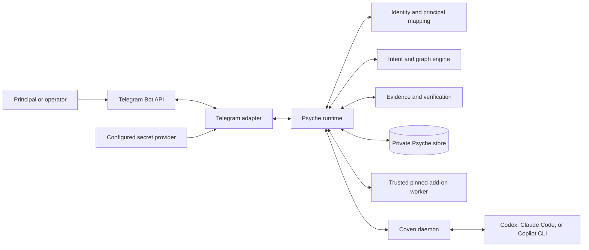
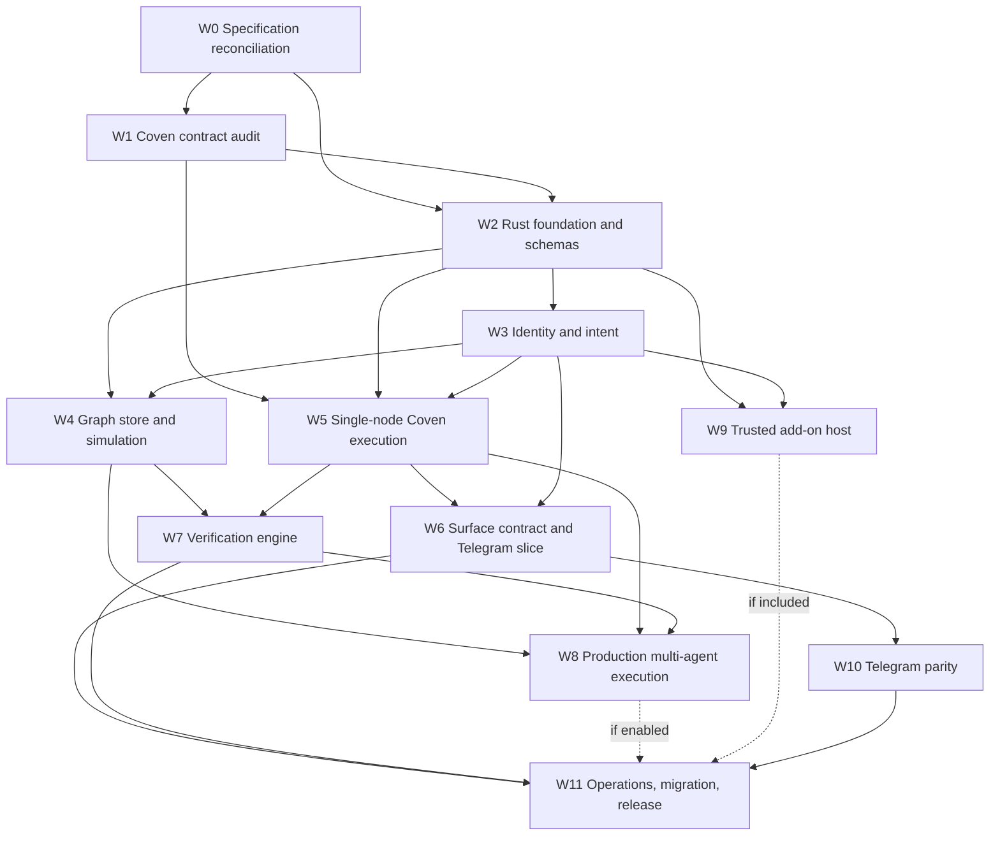

# Psyche Integration Review Dossier

**Status:** Maintainer review candidate for W0/G1
**Review scope:** Complete Psyche-to-Coven integration definition and first
production surface
**Delivery:** [OpenCoven/coven PR #546](https://github.com/OpenCoven/coven/pull/546)
**Work unit:** `coven-psy0`

> This document is a non-normative review aid. It introduces no architecture,
> contract, capability, requirement, or implementation assignment. The
> [runtime design](./RUNTIME_DESIGN.md) and
> [decision dossier](./DECISION_DOSSIER.md) are authoritative. The companion
> specifications linked throughout this dossier own their specialist detail.
> If this summary conflicts with a canonical source, the canonical source wins.

## 1. Review purpose

This dossier gives maintainers one end-to-end view of the reconciled Psyche W0
integration package. It is intended to answer four questions before the
program advances:

1. Is Psyche the right product, with a clear boundary around Coven, harnesses,
   surfaces, and add-ons?
2. Are the identity, durability, authority, ambiguity, evidence, security, and
   operations contracts complete enough to audit rather than infer?
3. Does Telegram prove the surface abstraction without redefining the core?
4. Is the remaining work correctly gated so no implementation issue or code is
   created before W1/G3 establishes current Coven contract truth?

The requested maintainer action is to review this dossier against the linked
sources and either approve W0/G1 coherence, request bounded corrections, or
identify a decision that must block W1.

### 1.1 Decisions requested now

Reviewers are being asked to confirm:

- Psyche is a local-first, surface-neutral familiar runtime for a Coven.
- Psyche owns identity, intent, orchestration, verification, and surface
  policy; Coven owns bounded execution and protected resources.
- Capabilities advertise possible behavior but never confer authority.
- Unknown adoption, termination, verification, and delivery remain explicit
  states and never become inferred success.
- Telegram is the first production adapter, not the product boundary.
- The first release is a complete single-node vertical slice; production
  child dispatch remains off until G6.
- W1 is an evidence audit, not an implementation plan, and G3 blocks all
  implementation plans, issues, code, and Coven assignments.
- OpenClaw compatibility remains clean-room and data-only.

### 1.2 Not requested now

This review does not request:

- creation of the standalone Psyche repository;
- implementation issues, child plans, or code;
- Coven contract changes;
- enablement of production multi-agent dispatch;
- final verifier thresholds, hard-budget claims, or add-on release inclusion;
- production Telegram token migration; or
- approval to merge or release.

### 1.3 Source precedence

| Precedence | Source | Authority in this review |
|---:|---|---|
| 1 | [Runtime design](./RUNTIME_DESIGN.md) | Canonical product boundary, ownership, components, contracts, lifecycles, and gate posture. |
| 1 | [Decision dossier](./DECISION_DOSSIER.md) | Canonical ratifications, decisions, open questions, risks, evidence rules, and progression recommendation. |
| 2 | [Product specification](./PRODUCT.md) | Users, journeys, functional behavior, retention, objectives, and release acceptance. |
| 2 | [Technical architecture](./TECH.md) | Process model, schemas, persistence, errors, observability, testing, migration, and distribution. |
| 2 | [Threat model](./THREAT_MODEL.md) | Trust assumptions, threats, controls, residual risks, and security acceptance. |
| 2 | [Coven prerequisites](./COVEN_PREREQUISITES.md) | Required execution behavior and W1 evidence classifications; not a claim about current Coven. |
| 2 | [Telegram parity ledger](./TELEGRAM_PARITY.md) | Adapter feature scope and required evidence. |
| 2 | [Program plan](./PLAN.md) | W0-W11 dependency graph, G0-G12 gates, and delivery discipline. |
| 3 | This dossier | Integrated summary and maintainer checklist only. |

## 2. Executive integration decision

Psyche converts authenticated observations and local operator actions into
durable intent, binds that intent to an immutable familiar identity and mapped
principal, admits a reviewable orchestration graph, delegates bounded execution
to Coven, evaluates candidate results against sealed evidence, and emits
separately authorized effects through surface adapters.

The central architectural rule is separation of authority:

```text
surface authentication != principal mapping
principal mapping       != graph admission
graph admission          != Coven execution permission
Coven execution          != verification success
verification success     != surface-effect permission
surface-effect permission != transport delivery confirmation
```

Every boundary has its own owner, record, decision, version, and failure mode.
No prompt, capability flag, approval in another domain, model output, transport
response, or local inference may collapse them.

The program deliberately separates architecture from release enablement.
Multi-node graphs, delegation, budgets, recovery, and simulation belong in the
core design. Production child execution remains disabled unless the real Coven
conformance profile passes G6. This preserves the intended architecture without
making the first useful Telegram release depend on every future capability.

## 3. Product definition

### 3.1 Product statement

Psyche is a small, local-first familiar runtime that makes work durable,
inspectable, attributable, recoverable, and verifiable while using Coven as an
independent execution authority. It is surface-neutral: Telegram is the first
adapter and conformance target, while core contracts contain no Telegram IDs or
Bot API concepts.

### 3.2 Users and operational roles

| Role | Primary need | Psyche responsibility |
|---|---|---|
| Principal | Ask a familiar to do bounded work and receive an attributable result. | Map the actor, preserve intent, route to the correct familiar/project, and expose state. |
| Group member | Interact safely in an authorized shared surface. | Apply group, sender, mention, topic, history, and delivery policy independently. |
| Familiar maintainer | Define identity, role, skills, and reviewed extensions. | Resolve an immutable snapshot with provenance and block contradictions. |
| Operator | Configure accounts, projects, routes, secrets, retention, and recovery. | Validate configuration, issue local operator context, provide doctor/audit/export/restore controls. |
| Verifier | Evaluate sealed evidence under a declared policy. | Preserve reviewer provenance, separation, evidence digest, verdict, and escalation. |
| Surface maintainer | Implement protocol-specific ingress and effects. | Supply a narrow adapter contract without acquiring identity or graph authority. |
| Coven maintainer | Maintain execution admission and lifecycle contracts. | Provide versioned, independently enforced behavior and conformance evidence. |

### 3.3 Goals

- Preserve accepted intent across crashes and restarts.
- Bind work to the exact principal, familiar identity snapshot, project,
  constraints, evidence policy, and originating surface.
- Represent orchestration as a durable graph with explicit node, attempt,
  dependency, delegation, budget, approval, and recovery state.
- Use Coven for all harness execution and protected-resource access.
- Require evidence before verified success and preserve human escalation.
- Keep surface effects separately authorized and delivery outcomes honest.
- Make failure, ambiguity, retention, migration, rollback, and operator action
  inspectable through stable records and reason codes.
- Ship a useful Telegram vertical slice without inventing a Telegram-shaped
  core.

### 3.4 Non-goals

Psyche is not:

- a replacement for Coven;
- a model provider, harness, provider conversation loop, or prompt persona;
- a thin Telegram bot whose domain model is Telegram;
- a hosted control plane, cloud scheduler, multi-host coordinator, or generic
  distributed framework;
- an OpenClaw fork, source port, database importer, or gateway compatibility
  layer;
- proof that proposed Coven contracts already exist; or
- a claim that every budget is hard, every verifier is reliable, or every
  delivery is exactly once.

### 3.5 First release slice

The first useful release contains one local operator, one or more familiars,
surface-neutral durable intent, single-node executable graphs, multi-node
authoring and simulation, one Coven session per executable attempt,
deterministic evidence and human review, Telegram as the only production
adapter, and the minimum doctor/export/restore/canary/rollback controls.

Trusted add-ons ship only if W9 does not delay the vertical slice. Automated
independent verification ships only to the scope justified at G5. Production
child dispatch remains false until G6.

## 4. Ownership and authority boundaries

### 4.1 Responsibility matrix

| Concern | Psyche | Coven | Harness/provider | Surface adapter |
|---|---|---|---|---|
| Familiar identity source | Resolve, validate, snapshot, version, bind | Validate exact supplied binding only | No authority | No authority |
| Surface actor to principal | Own versioned mapping and conflicts | No authority | No authority | Authenticate and normalize actor/location observations |
| Intent and graph | Own admission, state, dependencies, delegation, budgets, recovery | Accept only bounded execution request | Execute within session | No authority |
| Project/cwd | Request bounded target | Independently validate and admit | Operate inside admitted context | No authority |
| Harness admission and launch | Request a classified supported harness | Own admission and supervised process launch | Own provider auth and native behavior | No authority |
| Session lifecycle | Correlate, follow, recover, and interpret only authoritative state | Own adoption, input, ordered events, termination, terminal state | Produce native events/output | No authority |
| Execution approvals | Present when needed; never mint Coven authority | Own execution/protected-resource decisions | Own native approvals unless explicitly contracted | Render/collect an authenticated observation only |
| Orchestration approvals | Own policy, decision, expiry, and graph transition | No implied authority | No implied authority | Render/collect within authorized surface scope |
| Evidence and verdicts | Seal evidence, apply policy, record reviewer/verdict/escalation | Return attempt-bound opaque artifacts | Produce candidate output | May carry separately authorized evidence input/output |
| Surface effects | Own effect policy and canonical decision | No implied authority | Cannot choose account/chat/topic | Translate authorized effect and report protocol result |
| Delivery | Own intent, attempts, ambiguity, and recovery decision | No authority | No authority | Own protocol call mechanics and observations |
| Protected familiar writes | Request through execution boundary | Ward gates and audits protected writes | Perform only if admitted | No authority |

Ward is a Coven protected-write and audit gate. It is not the familiar identity
source, principal mapper, graph authority, verifier, or surface policy engine.

### 4.2 Approval domains

The review package defines separate domains for:

- Psyche intent and graph admission;
- Psyche orchestration changes and delegation;
- Psyche surface effects and ambiguity recovery;
- Coven execution admission and protected resources;
- harness-native provider/tool approvals; and
- human verification or escalation.

Telegram may present an approval and authenticate the callback observation. It
does not store or decide the approval. The owning authority revalidates the
principal, action digest, decision set, expiry, and scope. An approval cannot be
replayed or substituted across domains.

### 4.3 Capability discovery is not permission

Capability negotiation determines whether a path might be available. Each use
still requires a current authority decision. Tests must distinguish:

- capability missing;
- capability unknown;
- capability present but denied;
- capability previously present but authority lost mid-flight; and
- capability conformant and currently authorized.

Psyche has no local execution fallback if Coven denies, disappears, stalls, or
returns an unresolved state.

## 5. System topology



### 5.1 Process and deployment model

- One local `psyched` daemon owns the private store and may run multiple
  adapter accounts.
- One account has one active transport owner: polling or webhook, never both.
- Bot tokens exist only in bounded process memory after secret-provider
  resolution and numeric bot identity verification.
- Psyche communicates with the same-user Coven daemon through its versioned
  local contract.
- Add-on workers are pinned, reviewed, same-user trusted code. They are process
  isolated for reliability, not security sandboxes.
- Multi-host operation, network filesystems, and hosted control planes are out
  of scope for v1.

### 5.2 Intended repository and package shape

After G1 and before W2, the standalone repository is expected to contain a
Rust workspace centered on `psyched` and `psyche`, domain crates for core,
identity, storage, intent, graph, Coven integration, context, verification,
add-ons, surfaces, Telegram, operations, runtime, and CLI, plus thin npm/native
distribution packages such as `@opencoven/psyche`.

Core domain crates do not depend on Telegram. The Telegram adapter depends on
surface and core contracts. Coven integration does not learn Telegram concepts,
and Telegram integration does not learn Coven internals. This structure is a
W0 architecture requirement, not code that exists in this repository.

## 6. End-to-end execution flow

```mermaid
sequenceDiagram
  participant U as Surface actor
  participant A as Adapter
  participant P as Psyche
  participant S as Psyche store
  participant C as Coven
  participant H as Harness
  participant V as Verifier or human

  U->>A: Protocol observation
  A->>A: Authenticate and normalize
  A->>P: psyche.surface_event.v1
  P->>P: Map principal, route, resolve identity
  P->>S: Commit event, intent, graph, initial node
  S-->>A: Durable adoption
  A-->>U: Protocol acknowledgement
  P->>C: Versioned, bound execution request
  alt adopted
    C->>H: Supervised session
    H-->>C: Ordered output and terminal state
    C-->>P: Cursor events and bound artifacts
    P->>S: Candidate and sealed evidence
    P->>V: Verification request
    V-->>P: Bound verdict or escalation
    P->>S: Verified/rejected state and effect decision
    P->>A: Authorized psyche.surface_effect.v1
    A->>U: Telegram operation
    A-->>P: Confirmed, failed, or delivery_unknown
  else adoption unresolved
    C-->>P: adopted, proven_not_adopted, or unknown
    P->>S: Block or recover; never blind redispatch
  end
```

### 6.1 Boundary-by-boundary requirements

1. Authenticate the protocol observation before accepting its claims.
2. Normalize it into a surface-neutral event while preserving adapter detail in
   a versioned extension.
3. Resolve one non-conflicting surface actor-to-principal mapping.
4. Resolve familiar inputs with canonical, no-follow filesystem reads.
5. Produce an immutable identity snapshot and exact digest/revision.
6. Route deterministically to one familiar and project; equal precedence
   blocks rather than guesses.
7. Commit the accepted event, mapped principal, intent, graph, and initial node
   before the adapter advances its acknowledgement boundary.
8. Admit the graph only after constraints, evidence policy, authority, and
   budgets are valid.
9. Negotiate the Coven profile; missing, unknown, undocumented, or denied
   behavior blocks the relevant path.
10. Reserve a node and attempt using stable identifiers and a fencing token.
11. Submit one immutable execution request and correlate at most one Coven
    session.
12. On a lost response, query authoritative adoption. Redispatch only after
    Coven proves non-adoption or supplies an effective fence.
13. Consume ordered cursor events and authoritative terminal state; never infer
    terminal state from output text or disconnect.
14. Persist candidate results and opaque artifact references with complete
    graph/node/attempt/session/identity/project binding.
15. Seal the required evidence set before verification.
16. Apply deterministic policy and, when enabled, an allowed independent
    verifier or human decision.
17. Admit a canonical surface effect under current Psyche surface policy.
18. Persist every physical delivery attempt before the Bot API mutation.
19. Record confirmation, definitive failure, or explicit ambiguity. A new send
    after ambiguity requires a new authorized effect and duplicate-risk
    acknowledgement.

## 7. Identity, principal, project, and intent

### 7.1 Identity resolution

Psyche resolves familiar identity from the reviewed declaration,
`IDENTITY.md`, `SOUL.md`, role configuration, and skill configuration. It uses
safe no-follow reads under an approved root, validates regular files and
ownership posture, rejects contradictions, records provenance, and computes an
exact immutable digest and revision.

Prompts, Telegram messages, model output, harness output, add-on metadata, and
Coven responses are untrusted inputs and cannot define or mutate familiar
identity. An intentional change creates a new snapshot and requires an audited
Psyche identity rebind. Old sessions never resume under the new snapshot; they
must be terminal or authoritatively fenced through a W1-classified Coven
contract.

### 7.2 Principal mapping

A surface actor is not a principal. Psyche owns an explicit versioned mapping
from authenticated surface actor and account context to a canonical principal.
Missing, stale, duplicate, conflicting, or ambiguous mappings fail closed.
Usernames are display metadata; numeric Telegram IDs are the authorization
keys.

Local CLI actions likewise cannot self-assert a principal. They carry a
Psyche-minted, short-lived operator context derived from configured local
authentication. That context grants no Coven execution permission.

### 7.3 Project authorization

Identity answers who the familiar is. Project authorization answers where a
particular execution may run. Psyche binds the requested project and
constraints to the intent and node; Coven independently validates project/cwd
and harness admission. Neither decision substitutes for the other.

### 7.4 Intent immutability

Every accepted intent binds:

- one mapped principal;
- one familiar identity snapshot;
- one project;
- normalized requested outcome and constraints;
- originating surface and conversation reference;
- required evidence policy;
- approval and budget policy; and
- a stable digest and idempotency key.

The intent is immutable. Revisions or follow-up work create explicit new
records and relationships rather than editing the original request.

## 8. Canonical contract inventory

The runtime design defines fifteen core schema families. Names below are
canonical at W0; detailed fields and compatibility rules remain owned by the
runtime and technical specifications.

| Contract | Purpose | Critical bindings |
|---|---|---|
| `psyche.identity_snapshot.v1` | Immutable familiar identity and provenance | Familiar, source revisions, digest, validity |
| `psyche.intent.v1` | Durable accepted user/operator intent | Principal, identity snapshot, project, constraints, evidence, origin |
| `psyche.surface_event.v1` | Surface-neutral authenticated observation | Adapter, account, actor locator, conversation locator, dedupe, payload digest |
| `psyche.graph.v1` | Durable orchestration envelope | Intent, principal, identity, project, policy, aggregate state |
| `psyche.graph_node.v1` | Unit of orchestration and candidate production | Graph, dependencies, delegation, budget, attempt policy, evidence policy |
| `psyche.delegation.v1` | Immutable non-widening child authority | Parent/child, project, action, budget, evidence, surface limits |
| `psyche.budget.v1` | Reservation, consumption, release, and evidence | Graph/node/attempt, resource class, enforcement strength, idempotency |
| `psyche.approval.v1` | Domain-specific approval decision | Owning authority, principal, actor, action digest, expiry, decision |
| `psyche.execution_binding.v1` | Psyche attempt to Coven session correlation | Graph, node, attempt, session, identity, project, request digest, cursor |
| `psyche.evidence.v1` | Sealed content-addressed evidence set | Producer, graph/node/attempt/session, artifacts, digests, policy |
| `psyche.verdict.v1` | Verification result and provenance | Evidence set, reviewer, policy, decision, confidence/escalation |
| `psyche.recovery.v1` | Durable reconciliation or operator recovery | Subject, prior state, authority evidence, action, outcome, actor |
| `psyche.addon.v1` | Pinned trusted extension declaration/invocation | Package digest, provenance, contribution scope, decision, invocation |
| `psyche.surface_effect.v1` | Canonical Psyche-authorized surface mutation | Origin graph, account/location, effect class, payload digest, policy decision |
| `psyche.delivery.v1` | Logical response and physical attempt ledger | Effect, attempt, transport observation, ambiguity, recovery |

Adapter extensions such as `psyche.telegram_event.v1` and
`psyche.telegram_effect.v1` preserve protocol detail without leaking Telegram
identifiers into core identity, graph, verification, or execution authority.

### 8.1 Compatibility rules

- Major versions are exact. Unknown major versions and enum values fail closed.
- Additive optional fields may evolve within v1 when absence has a safe defined
  meaning.
- Unknown persisted events are quarantined, not interpreted permissively.
- Clients branch on stable error codes, never message prose.
- Canonical JSON/digest computation is performed by the owning component; a
  caller cannot supply a harmless digest and execute different fields.
- Every artifact, result, verdict, effect, and recovery action retains complete
  provenance to the immutable records that authorized it.

## 9. Graph, node, attempt, and recovery semantics

### 9.1 Graph lifecycle

```text
draft -> admitted | rejected
admitted -> running
running -> waiting_approval | waiting_evidence | cancelling | completed | failed
waiting_approval -> running | cancelling | failed
waiting_evidence -> running | cancelling | failed
cancelling -> cancelled | recovery_required
recovery_required -> running | completed | failed | cancelling
```

Graph completion is transactional with node and dependency state. A graph does
not report success because all processes exited; it reports success only when
required nodes and evidence have reached allowed terminal outcomes.

### 9.2 Node lifecycle

```text
proposed -> admitted | rejected
admitted -> blocked | ready
blocked -> ready | skipped
ready -> reserved
reserved -> dispatching
dispatching -> adopted | adoption_unknown | proven_not_adopted | failed
adoption_unknown -> adopted | proven_not_adopted | recovery_required
proven_not_adopted -> ready | failed
adopted -> running | candidate | failed
running -> waiting_approval | candidate | failed
waiting_approval -> running | candidate | failed
candidate -> awaiting_verification
awaiting_verification -> verified | rejected | escalation_required
escalation_required -> awaiting_verification | verified | rejected
cancelling -> cancelled | termination_unknown
termination_unknown -> cancelled | candidate | failed | recovery_required
recovery_required -> adopted | running | candidate | failed | cancelled
```

Implementations must use the exact transition model from the runtime design;
this summary does not override its guards or event definitions.

### 9.3 Attempts and adoption ambiguity

One node may have multiple historical attempts, but one attempt maps to at most
one Coven session. The stable request ID and digest are immutable. Reusing an ID
with another digest is a conflict.

If submission succeeds but the response is lost, Psyche records
`adoption_unknown`. Lease expiry, coordinator restart, timeout, or operator
desire does not prove non-adoption. Psyche must obtain one of:

- authoritative adopted state and the existing session;
- authoritative proof of non-adoption; or
- an effective Coven fence that makes a new attempt safe.

An inconclusive lookup blocks the node. There is no local force-success or
force-not-adopted edit.

### 9.4 Leases and fencing

Leases coordinate Psyche workers; they do not decide execution truth. Every
reservation/takeover uses a monotonic fencing token. A stale worker cannot
commit after a newer owner. Lease expiration alone never authorizes redispatch.

### 9.5 Budgets

Reserve, consume, and release are idempotent durable operations. A child may
receive only a subset of its parent's envelope. A resource limit is called
hard only when Coven can enforce it and return trustworthy usage evidence
under a separately approved resource-specific gate. All other limits are
admission or accounting controls.

### 9.6 Cancellation

Cancellation is a durable state machine:

1. persist graph/node cancellation intent;
2. stop new dependency release and dispatch;
3. propagate to every adopted descendant;
4. request Coven termination for every bound live session;
5. consume authoritative cancellation/terminal acknowledgements;
6. retain `termination_unknown` wherever acknowledgement is absent;
7. finalize a parent only after descendants are terminal or explicitly
   unresolved; and
8. preserve late candidate output for review without silently converting it to
   success.

### 9.7 Restart recovery

On startup Psyche validates schema and store integrity, reacquires account and
lane ownership, reloads unresolved graphs/nodes/attempts/deliveries, rechecks
identity and principal bindings, negotiates current Coven capability, resumes
ordered cursors, reconciles adoption and cancellation ambiguity, expires stale
approvals and previews through recorded policy, and schedules only work proven
safe. Unknown remains unknown across restart.

## 10. Coven integration and W1 audit

### 10.1 What W0 establishes

W0 establishes the behavior Psyche requires. It does not establish that a
current Coven endpoint, schema, capability, action, field, error, persistence
rule, or retention promise exists.

W1 must classify every behavior as:

- `current`;
- `current_but_undocumented`;
- `planned`;
- `optional`; or
- `rejected`.

Only public, versioned, documented, executable-test-covered `current` behavior
can satisfy production conformance. `current_but_undocumented` remains
non-production until made explicit. `planned` gaps gain owners and order only
after the completed audit is reviewed at G3.

### 10.2 W1 evidence matrix

For every behavior W1 records the exact public contract or `none`, Rust code
path and owning symbol, positive and negative test, restart persistence and
cleanup rule, gap, and owner/order where a planned change is accepted.

A route probe, internal method, capability string, fake implementation, merged
change, or issue state is not sufficient evidence.

### 10.3 Single-node profile: C-S1 through C-S12

| ID | Required Coven behavior | Pass condition |
|---|---|---|
| C-S1 | Exact API/capability negotiation | Supported version succeeds; unknown fails closed. |
| C-S2 | Session create/input/inspect/events/terminate | Public contract tests with canonical project/cwd and supported harnesses. |
| C-S3 | Familiar snapshot and attempt binding | Match/mismatch covers identity, project, graph node, attempt, request digest. |
| C-S4 | Stable request adoption | Same ID/digest yields one adoption; changed digest conflicts; survives restart. |
| C-S5 | Adoption lookup/non-adoption proof | Lost response returns adopted, proven-not-adopted, or explicit unknown. |
| C-S6 | Ambiguity fence | Possible adoption is returned or authoritatively fenced. |
| C-S7 | Ordered event cursor | Replay is monotonic, persisted, bounded, duplicate-safe. |
| C-S8 | Authoritative terminal state | Output/disconnect never substitutes for terminal state. |
| C-S9 | Cancellation acknowledgement | Terminal acknowledgement or explicit unresolved result. |
| C-S10 | Result/artifact association | Opaque content-addressed reference has complete attempt binding and lifetime. |
| C-S11 | Restart persistence | Adoption, cursor, cancellation, terminal, and result bindings survive. |
| C-S12 | Structured denial | Missing/unknown/mismatch/deny/authority-loss errors are stable, redacted, fail closed. |

G4 requires the same unmodified conformance assertions against a pinned real
Coven daemon.

### 10.4 Multi-agent profile: C-M1 through C-M9

| ID | Additional Coven behavior | Pass condition |
|---|---|---|
| C-M1 | Parent graph/child node correlation | Exact immutable graph/node/attempt/session relationship. |
| C-M2 | One attempt to one session | Replay/concurrency cannot create a second live session. |
| C-M3 | Idempotent child adoption | Lost response/restart preserves one child execution. |
| C-M4 | Descendant cancellation acknowledgement | Every adopted descendant is terminal or explicit unknown. |
| C-M5 | Child result/artifact association | No cross-graph/node/attempt/familiar/project result. |
| C-M6 | Orphan discovery | Adopted child sessions are discoverable after either daemon restarts. |
| C-M7 | Ambiguous child fencing | Possible adoption is returned or fenced before redispatch. |
| C-M8 | Safe restart recovery | Neither daemon restart duplicates work or invents terminal state. |
| C-M9 | Exact rejection | Every identity/project/graph/node/attempt/delegation/digest mismatch denies. |

Graph authoring and simulation do not imply this profile exists. G6 is the
minimum gate for production child dispatch.

### 10.5 Retention and optional boundaries

Psyche retains adoption/recovery evidence for the greater of the configured
graph-recovery window and all enabled adapter deduplication windows. W1 must
prove compatible Coven authoritative evidence retention; W0 assumes no fixed
daemon duration.

Memory integration is optional unless required by a familiar declaration.
Artifact bytes are required only for paths that consume or verify them. Runtime
registry data may be used only through an accepted public Coven capability.
Coven-side Telegram policy, principal mapping, graph policy, verification,
add-on trust, recurring timers, and surface delivery are rejected boundaries.

## 11. Surface contract and Telegram integration

### 11.1 Ingress and transport ownership

Each Telegram account has a pinned numeric bot identity, a secret reference,
an explicit default/route posture, and exactly one transport mode. Polling and
webhook are mutually exclusive. A 409 ownership conflict blocks the account.

Webhook authentication uses a distinct secret, exactly one bounded header,
constant-time comparison before JSON parsing, loopback binding by default, and
durable commit before 2xx. Polling advances its offset only after the same
durable disposition. The unique `(account_id, update_id)` key makes replay
idempotent.

Per-account/chat/topic lanes preserve order while allowing unrelated lanes to
run concurrently. Poison or unsupported updates receive a durable typed
classification before the lane advances; they are not silently discarded.

### 11.2 Authorization and activation

DM policies are pairing, numeric allowlist, explicit open, or disabled. Pairing
is one-time, expiring, account/user/DM-scoped, and grants no group or approver
authority.

Group admission independently requires an allowed group, allowed numeric
sender, and configured activation policy. Mentions and temporary activation
cannot weaken ACLs. Anonymous admins/sender-chat events fail closed when policy
requires an attributable human. Other bots are ignored in v1 unless a later
typed policy is approved.

### 11.3 Routing and conversations

Routing is deterministic. Exact account/chat/topic routes outrank topic
defaults and group defaults. Equal-precedence matches block the event and
route set. One route resolves one familiar snapshot, principal mapping, and
project.

The canonical conversation key includes familiar, principal, surface account,
chat, and topic kind/ID. Forum topics and topic-enabled DMs remain isolated.
Authorized bounded observed context may include replies, quotes, forwards,
reactions, and configured history. Telegram does not support arbitrary bot
hydration of historical messages, so Psyche never claims it.

### 11.4 Commands, callbacks, and approvals

Native and custom command menus are validated and bounded. Safe status,
identity, pairing, and diagnostics commands can execute before a model turn.
Callbacks are typed opaque registry values. Unknown callbacks are acknowledged
and refused, never converted into prompt text.

Approval callbacks bind authority domain, account, principal, numeric actor,
chat/topic, message, approval ID, action digest, decision set, expiry, and
one-time nonce. Sensitive approvals default to an authorized DM. Group display
requires explicit surface policy and does not alter the owning decision.

### 11.5 Replies, streaming, and visible actions

Psyche supports policy-gated text, safe Telegram HTML, Unicode-safe chunking,
link previews, replies/quotes, edits, deletes, reactions, typing, polls,
keyboards, pins, and declared media operations. The admitted intent pins the
reply account/chat/topic; model output cannot redirect it.

Streaming modes retain one logical answer and a durable preview state. Every
physical preview create/edit/delete/finalization is a separately authorized
surface effect. The default maximum preview age is ten minutes. On expiry,
Psyche freezes the current preview and may attempt only a newly authorized
final edit. A policy block becomes `preview_finalize_blocked`; an ambiguous
mutation becomes `delivery_unknown`.

### 11.6 Media

Inbound media is untrusted. Psyche fetches only Telegram-returned paths for the
same account from the pinned configured origin, rejects origin-changing
redirects and arbitrary private destinations, streams under byte/time/
decompression/dimension quotas, ignores path components, generates private
filenames, never extracts archives, and removes temporary files on every exit.

Bytes crossing into execution or evidence are content-addressed and bound to
surface source, project, familiar snapshot, graph, node, attempt, type, size,
and lifetime. Coven artifacts are retrieved as opaque attempt-bound streams
through W1-classified contracts, not arbitrary filesystem paths.

### 11.7 Delivery semantics

Psyche persists the canonical effect, surface-policy decision, physical
delivery intent, and attempt before invoking Telegram. Read-only calls and
proven pre-write failures may retry. A post-write timeout, reset, or 5xx for a
non-idempotent mutation becomes `delivery_unknown` because Telegram offers no
client idempotency key.

An operator may inspect and abandon, retry, or clarify through a typed Psyche
surface decision. Retry and clarification require explicit duplicate-risk
acknowledgement and a new immutable effect. Psyche never promises exactly-once
Telegram delivery.

### 11.8 Parity evidence

The parity ledger is the exhaustive adapter checklist. Its rows cover account
and transport, durability and rate limits, authorization and routing,
commands/callbacks/approvals, replies and streaming, media, locations and
actions, and operations/migration/release. Each Required row declares one or
more evidence classes:

- `U`: unit/property test;
- `I`: fake integration test;
- `C`: crash/fault-injection test;
- `S`: security/negative test;
- `L`: dedicated-account live test; and
- `O`: operator drill or review.

Deferred and rejected rows must have no permissive fallback. G8 proves adapter
reliability, G9 proves live behavior twice on dedicated accounts and two client
families, G10 proves operations, and G11 proves the operator-approved canary.

## 12. Evidence and verification

### 12.1 Candidate is not success

A harness result first creates a candidate. Psyche then constructs a sealed,
content-addressed evidence set under the node's declared policy. Evidence may
include deterministic checks, immutable result/artifact references, structured
test reports, and approved human observations. Changing any member creates a
new evidence set and invalidates a pending verdict.

### 12.2 Verdict requirements

A verdict binds:

- the exact evidence set digest;
- graph, node, attempt, session, project, and identity snapshot;
- verifier identity and session provenance;
- policy and threshold revision;
- deterministic outcomes and reviewer findings;
- decision, reason codes, and escalation; and
- creation and expiry/revalidation semantics.

When independent verification is required, the generator cannot act as its own
verifier. The system must reject same-session, disallowed same-familiar, or
forged reviewer provenance.

### 12.3 Honest scope

Deterministic verification may ship for defined task classes. Automated
independent verification requires G5, reviewer separation, sealed-evidence
tests, policy tests, and local calibration. The recommended starting point is
post-candidate graph nodes. Mid-trajectory intervention remains an open design
decision. Thresholds require local representative-task evidence; external
benchmarks alone are insufficient.

## 13. Add-ons and extension trust

V1 add-ons are operator-allowlisted, immutable-digest-pinned, reviewed,
same-user packages run in supervised workers. Manifests and marketplace
metadata are untrusted. Only explicit operator policy grants a contribution,
and every invocation records package provenance, declared contribution,
request/response digest, decision, and outcome.

Add-ons cannot define identity, map principals, widen graphs/delegations,
authorize Coven execution, issue verification verdicts outside an approved
role, or authorize surface effects. Worker isolation contains crashes and
protocol errors but is not a sandbox against malicious same-user code.
Untrusted marketplace execution requires a separate containment design and
escape-test plan.

## 14. Persistence, retention, and durability

### 14.1 Persistent domains

The technical design includes durable records for identity snapshots, intents,
graphs, nodes, edges, attempts, delegations, budgets, execution bindings,
evidence, verdicts, recovery, surface events/effects, accounts, ingress updates,
event cursors, poll offsets, lane leases, routes, conversations, output
adoptions, logical responses, observed messages, pairings, delivery decisions
and attempts, message maps, callback nonces, and audit events.

State transitions that acknowledge external work or release dependencies are
transactional. Hot paths update bounded entries rather than rewriting whole
caches. Store permissions, schema constraints, hashes, migrations, integrity
checks, and restart replay are release gates.

### 14.2 Retention baseline

| Data class | Baseline |
|---|---:|
| Intents, graphs, nodes, attempts, decisions | 90 days after terminal; unresolved retained |
| Identity and principal-mapping snapshots | Graph lifetime plus 90 days |
| Coven adoption keys and cursors | At least effective graph recovery/adapter dedupe window |
| Evidence and verdicts | 90 days |
| Raw Telegram updates | 7 days |
| Normalized content and conversation context | 30 days |
| Downloaded media | 24 hours |
| Delivery and dedupe records | 30 days |
| Security and operator audit | 90 days |
| Resolved tokens | 0 days persisted |

Transactional expiry, startup cleanup, legal/operational holds, export, and
backup handling must preserve unresolved work and ambiguity. Retention is
configurable only within reviewed safety constraints.

### 14.3 At-rest protection

The data directory is mode `0700`; regular state files are mode `0600`.
Content encryption uses a random data key protected by the OS keychain where
the platform profile supports it. Otherwise production startup requires an
explicit acknowledgement that filesystem permissions are the only at-rest
control, and doctor reports that posture.

## 15. Security and privacy review

### 15.1 Trust assumptions

Psyche trusts the local OS account and kernel but does not claim to resist a
fully compromised same-user process. It treats Telegram, proxies, secret
providers, Coven responses, harness/model output, add-on metadata, identity
files, paths, media, callbacks, and operator configuration as untrusted at each
boundary.

### 15.2 Release-blocking invariants

- No harness launch, project edit, familiar-memory write, or protected-resource
  access bypasses conformant Coven execution.
- No external input defines familiar identity.
- No intent/node is admitted without principal, identity, project,
  constraints, and evidence policy.
- No child widens authority, budget, evidence, project, or surface scope.
- No graph reports verified success without sealed required evidence and an
  allowed verdict.
- No generator acts as its required independent verifier.
- No capability advertisement substitutes for authority.
- No unresolved adoption or cancellation triggers redispatch.
- No Telegram update is acknowledged before durable disposition.
- No username authorizes; no DM pairing grants group authority.
- No fallback changes account/chat/topic/action class.
- No raw bot token enters config, argv, logs, diagnostics, database, or package.
- No unknown callback becomes prompt text.
- No outbound ambiguity becomes confirmed success.
- No public webhook starts implicitly.

### 15.3 Secret lifecycle

Configuration stores provider references only. A trusted built-in or
operator-configured absolute executable resolves the bot token without shell
interpolation. Psyche bounds and validates output, calls `getMe`, requires the
numeric bot ID pin, builds redacting Bot API URLs internally, atomically swaps
only a same-bot replacement client, closes the prior client, and drops buffers
on shutdown. A different numeric bot requires a new account identity or an
audited destructive rebind of token-scoped state.

Webhook secrets are separate, never persisted, and rotate only after an
account-activation decision and successful `setWebhook`; the prior secret has
an exact five-minute in-flight grace.

### 15.4 Primary threat groups and controls

| Threat group | Examples | Required posture |
|---|---|---|
| Boundary confusion | Identity override, principal confusion, approval-domain substitution | Typed immutable bindings; independent admission; cross-domain negative tests |
| Duplicate work | Replayed update, lost Coven response, expired lease | Durable dedupe, stable adoption, authoritative lookup/fence, no blind retry |
| False success | Process exit, stale output, self-verification, missing evidence | Authoritative terminal state, sealed evidence, reviewer separation |
| Wrong-surface effects | Model redirect, forged callback, fallback mutation | Pinned destination, typed nonce, canonical effect digest, per-effect decision |
| Delivery ambiguity | Accepted send with lost response | `delivery_unknown`, no automatic non-idempotent resend, audited recovery |
| Secret/SSRF exposure | Token URL, hostile helper, custom API root, media path | Secret refs, absolute helpers, origin pinning, HTTPS/loopback policy, scans |
| Resource abuse | Flood, media bomb, poison update | Bounded durable queues, layered limits, streaming inspection, dead-letter |
| Local/supply-chain compromise | Store tamper, malicious add-on/package | Permissions/integrity, pinning/provenance, minimal deps, SBOM/reproducibility |
| Migration contamination | Hidden state or source import | Human-reviewed data-only manifest and schema/path rejection |

### 15.5 Clean-room and OpenClaw boundary

Allowed migration material is separately reviewed operator-authored prompts,
declarations, hooks, commands, configuration, numeric ACLs, route structure,
account aliases, familiar references, and explicit decisions. Secret values do
not migrate.

Secret reference names may appear in the separately reviewed migration
manifest, but they are never exported from Psyche state and the operator must
configure them separately. OpenClaw source, internal names, fixtures,
credentials, databases, conversations, hidden memory, caches,
runtime/device/node state, gateway internals, and executable install hooks are
rejected. Implementers use public Telegram behavior and independently authored
Psyche fixtures. Each parity PR includes a provenance note.

### 15.6 Residual risks

The operator documentation must retain these unsolved risks:

1. A same-user compromise may access memory, sockets, identity files, or state.
2. Telegram observes bot traffic and controls update delivery.
3. Telegram non-idempotent sends have unavoidable accepted-but-response-lost
   ambiguity.
4. Authorized content may prompt-inject a model; protection comes from typed
   boundaries and non-widening policy, not perfect model obedience.
5. Secret providers, proxies, harnesses, models, and dependencies may be
   compromised outside Psyche.
6. Telegram deletion cannot guarantee deletion from clients, notifications,
   Telegram infrastructure, or already-created Coven events.

## 16. Operations and lifecycle management

### 16.1 Configuration and errors

`psyche.config.v1` is strict: unknown fields fail except inside explicit
versioned extension points, raw tokens are invalid, account/route ambiguity is
an error, and production-unsafe overrides are visible.

`psyche.error.v1` provides stable codes, redacted structured details, subject
references, retriability/ambiguity classification, and operator remediation.
Clients branch on codes rather than prose.

### 16.2 Observability

Logs, traces, metrics, and audit events correlate intent, graph, node, attempt,
session, evidence, effect, delivery, account, route, and recovery IDs. By
default they exclude tokens, content, callback values, raw remote IDs, absolute
paths, raw bytes, and provider event payloads. Diagnostic elevation is
privileged, warned, bounded, and expiring.

Core metrics cover admissions, state transitions, unresolved adoption/
termination, recovery, evidence/verdicts, and Coven health. Adapter metrics
cover ingress durability/latency, lane backlog, transport health, rate limits,
preview age, delivery results, and ambiguity. Security metrics cover denied
actors/routes, callback failures, identity mismatch, secret/auth failures, and
integrity incidents.

### 16.3 Doctor

`psyche doctor` emits one versioned `psyche.doctor_report.v1` for human and
machine rendering:

- `ready`: every required dependency and binding is valid;
- `degraded`: an optional behavior is unavailable without unsafe fallback; or
- `blocked`: work cannot proceed safely.

Every non-ready state has a stable reason and remediation. Doctor covers
identity/config, store/migrations/permissions/encryption posture, secret
resolution and bot pin, transport ownership/auth/DNS/proxy/privacy, routes,
Coven versions/capabilities/denials, unresolved work, retention, export/restore,
and release provenance without leaking sensitive data.

### 16.4 Export and restore

`psyche export` produces a mode-`0600`, encrypted, checksummed,
transactionally consistent `psyche.export.v1` archive with a versioned
manifest, SQLite backup, internal checksums, and detached checksum. It retains
the state needed to recover unresolved ingress, intents, graphs, attempts,
Coven adoption/cancellation, evidence, verdicts, routes, conversations,
callbacks, deliveries, and audit history after retention/redaction.

Tokens, resolved secrets, secret-provider references, and secret-provider
values are excluded. Restore verifies checksum and schema compatibility before
opening state, requires secrets to be configured separately, and activates no
route until doctor passes. A clean-host restore drill blocks canary and
production cutover.

### 16.5 Migration and cutover

Only one runtime owns a Telegram token:

1. complete dedicated-token live tests;
2. generate and human-review the data-only migration manifest;
3. export and restore Psyche on a clean host;
4. quiesce the prior runtime and verify no poller/webhook remains;
5. start Psyche and pass doctor;
6. enable one DM route;
7. enable one group/topic route after observation; and
8. widen only while service and security objectives hold.

There is no shared-token shadow mode.

### 16.6 Rollback and incident response

Rollback stops Psyche intake, preserves and labels ambiguous work, releases
token ownership, starts the prior runtime, verifies an operator message, and
retains Psyche state plus redacted audit evidence. The operator target is under
15 minutes.

Security incidents additionally revoke implicated callbacks/pairings, rotate
secrets where relevant, reconcile or fence every unknown Coven adoption,
preserve cancellation unknowns, explicitly resolve delivery unknowns, and
require a fresh live security probe before reactivation. Operators never repair
authority state through ad hoc database edits.

## 17. Service objectives and workload

### 17.1 Core objectives

- Zero unauthorized dispatches or approvals.
- Zero graph success without required evidence.
- Zero redispatch based only on lease expiry or ambiguous adoption.
- 100% accepted-intent replay across the crash suite.
- 100% execution/result/artifact correlation to graph, node, attempt, session,
  project, and identity snapshot.
- 100% unresolved authority/transport outcomes represented explicitly.
- Zero plaintext secret persistence or diagnostic/package leakage.

### 17.2 Telegram objectives

- 100% accepted-update replay across crash testing.
- At least 99.9% webhook durable acknowledgement within two seconds, excluding
  declared dependency outages.
- p95 ingress commit to Coven adoption under two seconds for the normative
  workload.
- p95 Coven output to preview update under one second.
- Fewer than one duplicate per 10,000 logical deliveries, with every ambiguous
  case exposed rather than counted as confirmed.

These are adapter objectives, not core product definitions. G11 uses an
operator-approved canary duration and volume; prior illustrative seven-day or
1,000-update values are not silently normative.

### 17.3 Normative load profile

Performance evidence uses the versioned workload defined by the product and
technical specifications: AWS c7gd.xlarge, Ubuntu 24.04, four accounts (two
polling and two webhook), 20 updates/second baseline, 50 updates/second bursts,
the declared payload cycle, fake Coven/Telegram services where required, and a
recorded environment/configuration/workload/report fingerprint.

## 18. Verification and evidence strategy

### 18.1 Test classes

- Unit tests for schemas, parsing, policy, state transitions, accounting, and
  error classification.
- Property tests for DAG admission, dependency release, non-widening
  delegation, budget conservation, idempotency, routing, and cancellation.
- Fake Coven and fake surface integration tests.
- One unmodified behavior-level conformance suite against a pinned real Coven
  daemon.
- Crash injection before and after every durable acknowledgement, adoption,
  cursor, cancellation, evidence, and delivery boundary.
- Fuzz/security tests for schemas, paths, identity inputs, callbacks, media,
  add-on frames, evidence manifests, and authority substitution.
- Dedicated-account live Telegram tests.
- Migration, export/restore, token rotation, incident, rollback, and canary
  operator drills.
- Performance tests with versioned workload manifests.
- Secret, privacy, dependency, license, SBOM, provenance, reproducibility, and
  clean-host installation gates.

### 18.2 Required negative evidence

Every subsystem must exercise missing/unknown/denied capability, schema and
digest mismatch, authority loss after discovery, crash/stall/timeout, restart
during durable transitions, stale lease/approval, duplicate and conflicting
idempotency keys, adoption/termination/delivery ambiguity, scope widening, and
operator recovery without local force-success.

### 18.3 Evidence record

Gate evidence records Psyche and Coven commits, schema/capability versions,
fixture and evidence digests, exact test reports, environment fingerprints,
and unresolved exceptions. A tracker status, closed issue, merged contract,
capability name, or passing fake is not production evidence.

## 19. Workstreams and release gates

### 19.1 Workstream dependency graph



The detailed plan additionally requires G3 before W2 implementation and G6
prerequisites before W8. The diagram shows workstream relationships; gate
requirements remain independently binding.

### 19.2 Workstream summary

| ID | Workstream | Exit result |
|---|---|---|
| W0 | Canonical specification reconciliation | One surface-neutral product and ownership model across every companion. |
| W1 | Current Coven contract audit | Every prerequisite classified with exact code/test/persistence evidence. |
| W2 | Rust foundation and canonical schemas | Workspace, schemas, store, fakes, migrations, and contract/property tests. |
| W3 | Identity and intent | Immutable snapshots, principal mapping, durable intent, replay. |
| W4 | Graph store and simulation | Graph/node/attempt/dependency/budget/cancellation/restart simulation. |
| W5 | Single-node Coven execution | Real dispatch/adoption/follow/cancel/recovery against conformant Coven. |
| W6 | Surface contract and Telegram vertical slice | One authorized text turn through the complete common pipeline. |
| W7 | Verification engine | Deterministic evidence and approved independent-verifier scope. |
| W8 | Production multi-agent execution | Real delegation/binding/fencing/budget/cancellation/result/orphan conformance. |
| W9 | Trusted add-on host | Pinned same-user contributions with provenance, revocation, and safe failure. |
| W10 | Telegram parity | Every Required ledger row has all declared evidence. |
| W11 | Operations, migration, and release | Doctor/privacy/export/restore/migration/canary/rollback/distribution. |

### 19.3 G0-G12 review matrix

| Gate | Evidence | Enables |
|---|---|---|
| G0 Decision approval | Val, Nova, and Sage decision review; passed 2026-07-31 | W0 reconciliation |
| G1 Specification coherence | All companion specifications share product, ownership, contracts, and gates | Standalone repository and W1 audit |
| G2 Contract foundation | Schemas, migrations, fakes, state-machine/property tests, unknown-version denial | Real integration after other prerequisites |
| G3 Coven audit | Every C-S/C-M row classified; accepted gaps have owner/order | Child plans, implementation issues/code, Coven assignments |
| G4 Single-node conformance | Unmodified suite against pinned real Coven including denial/restart/cancellation/binding/ambiguity | Real surface routes |
| G5 Verification | Deterministic gates plus sealed evidence, reviewer separation, policy, local calibration | Automated verified-success claims |
| G6 Multi-agent conformance | Delegation, child binding/adoption, fencing, budgets, cancellation, results, orphan recovery | Production child dispatch |
| G7 Trusted add-ons | Allowlist, pin/provenance, revocation, audit, protocol denial, crash/security evidence | Add-on activation |
| G8 Adapter reliability | Fake surface, crash, security, ambiguity, and parity evidence | Live Telegram |
| G9 Live Telegram | Required live rows pass twice on dedicated accounts and two client families | Canary |
| G10 Operations | Doctor, retention, privacy, export/restore, incident response, rollback | Production cutover |
| G11 Canary | Approved core/adapter objectives for approved window/volume; zero unauthorized dispatch | General release |
| G12 Distribution | Signed/checksummed artifacts, SBOM, provenance, clean-host install, rollback threshold | Publication |

No calendar date, configuration flag, issue state, merge, or capability
advertisement overrides a gate.

### 19.4 Capability activation

| Capability | Minimum gate |
|---|---|
| `psyche.graphs.v1` | G2 |
| `psyche.singleNodeExecution.v1` | G4 |
| `psyche.independentVerification.v1` | G5 |
| `psyche.multiAgentExecution.v1` | G6 |
| `psyche.addons.trusted.v1` | G7 |
| `psyche.surface.telegram.v1` | G8 and G9; production additionally G10-G11 |
| `psyche.hardBudgets.<resource>.v1` | Separate approved resource-specific enforcement/reporting gate |

## 20. Decisions, risks, and unresolved evidence

### 20.1 Fixed W0 decisions

- R-001: Psyche authorizes surface effects; Coven authorizes only execution and
  protected resources under versioned contracts.
- R-002: Ward is the protected-familiar write/audit gate, not identity.
- O-001: Multi-agent architecture/simulation belongs at launch; production
  child dispatch requires G6 and must not delay the Telegram vertical slice.
- O-005: Core durability/security and Telegram latency/delivery objectives are
  separate.
- O-006: Create the standalone repository after G1 and before W2.
- O-008: Cancellation requires authoritative acknowledgement or explicit
  unresolved state.
- O-009: Results/artifacts use opaque content-addressed, fully bound references.
- O-016: OpenClaw compatibility is reviewed operator-authored data only.

### 20.2 Blocked or open decisions

| ID | State | Question | Required next evidence |
|---|---|---|---|
| O-002 | Blocked | Which current Coven contracts satisfy G4? | W1 code/test/persistence audit; resolution at G3 |
| O-007 | Partly blocked | Exact compatible Coven adoption retention | W1 proof against effective recovery/dedupe duration |
| O-010 | Open | Memory integration in first release | Familiar requirements and W5 planning decision |
| O-011 | Blocked | Runtime registry integration | Accepted Coven public capability and W1 evidence |
| O-012 | Open | Verifier integration point | W7 design; start with post-candidate sealed evidence |
| O-013 | Blocked | Automated verifier threshold | At least 50 representative local tasks with human comparison |
| O-014 | Blocked | Hard budget resource classes | Per-resource enforceability and trustworthy usage evidence |
| O-015 | Open | Add-ons in first release | W9 must not block W6; explicit Val decision |

Recurring schedules, cross-host orchestration, untrusted marketplace
containment, additional production surfaces, trained process verification, and
hosted/cloud transport remain explicitly deferred to named triggers.

### 20.3 Principal program risks

| Risk | Control/gate |
|---|---|
| Telegram detail redefines core | Surface-neutral schemas; adapter-only extensions; G1/G8 |
| Proposed Coven behavior is assumed current | W1 classification and G3 before assignments/code |
| Graph ambition delays first release | Single-node vertical slice; W8/G6 off default critical path |
| Psyche becomes execution authority | Independent Coven admission; no local fallback; G4 |
| Identity and project authorization collapse | Separate schemas, bindings, and negative tests; G2-G4 |
| Lease/restart duplicates execution | Stable adoption, authoritative lookup/fence, explicit unknown; G4/G6 |
| Parent cancellation orphans children | Durable propagation and terminal/unknown accounting; G6 |
| Generator self-certifies | Sealed evidence and reviewer separation; G5 |
| Add-ons widen trust | Operator allowlist, pinning, provenance, revocation; G7 |
| Telegram ambiguity duplicates sends | Delivery ledger, explicit unknown, typed recovery; G8-G11 |
| Sensitive data leaks | Retention/redaction/encryption/scans; G10/G12 |
| Migration imports hidden state | Clean-room data-only manifest and rejection tests; G10 |
| One program becomes one unreviewable PR | Workstream-specific child plans/worktrees/PRs after G3 |

### 20.4 Rejected alternatives

- Making Coven the familiar identity or surface-policy authority.
- Treating Ward as an identity source.
- Treating Telegram actor IDs as Psyche principals.
- Inferring execution permission from capability presence.
- Assuming proposed Coven endpoints or retention promises.
- Retrying unresolved Coven adoption or non-idempotent Telegram sends blindly.
- Calling process exit, output text, or candidate generation success.
- Allowing the generator to independently certify itself.
- Advertising same-user add-on workers as security sandboxes.
- Importing OpenClaw source, hidden state, credentials, or databases.
- Running polling and webhook, or two runtimes, on one token.
- Using Telegram as the product domain or importing Telegram IDs into core
  authority contracts.

## 21. W0/PR status and evidence posture

PR #546 is a documentation-only W0 reconciliation. It contains the canonical
runtime and decision documents plus six specialist companions and this
maintainer dossier. It creates no implementation issue or production code.

The reconciled source set records:

- G0 ratification on 2026-07-31;
- W0 complete and local G1 coherence verified on 2026-08-01;
- W1 as the next evidence-producing workstream;
- G3 as the hard boundary before implementation plans, issues, code, or Coven
  assignments; and
- draft PR review as the current delivery state.

Any statement about CI, branch head, or review-thread state is intentionally
kept out of this durable specification because it changes over the life of the
PR. The live PR is the authority for delivery status. Before commit/update, the
repository gates must run against the exact staged dossier and current branch.

## 22. Maintainer review checklist

### 22.1 Product and scope

- [ ] Psyche's product definition and non-goals are correct.
- [ ] The first release is useful without requiring production child dispatch.
- [ ] Telegram is clearly an adapter and the core remains surface-neutral.
- [ ] Deferred areas are not accidentally promised.

### 22.2 Authority and contracts

- [ ] Psyche/Coven/harness/surface ownership is correct and complete.
- [ ] Ward and identity are correctly separated.
- [ ] Principal, familiar identity, project, and authority decisions remain
      distinct.
- [ ] The fifteen canonical contract families cover the full integration.
- [ ] Capabilities do not grant authority.

### 22.3 Lifecycle and recovery

- [ ] Graph/node/attempt transitions preserve immutable bindings.
- [ ] Adoption ambiguity, fencing, ordered cursors, and terminal state are
      fail-closed.
- [ ] Cancellation accounts for every adopted descendant.
- [ ] Restart recovery never invents safe state.
- [ ] Budgets are not called hard without enforceability evidence.

### 22.4 Verification and extensions

- [ ] Candidate, evidence, verdict, and verified success are distinct.
- [ ] Sealed evidence and reviewer separation prevent self-certification.
- [ ] Human escalation remains available.
- [ ] Add-on trust is accurately described as same-user trusted, not sandboxed.

### 22.5 Telegram and delivery

- [ ] Durable-before-ack, dedupe, ordering, and token ownership are sufficient.
- [ ] DM/group/topic authorization and routing fail closed.
- [ ] Callbacks and approvals preserve authority-domain ownership.
- [ ] Streaming and every physical effect require current surface policy.
- [ ] Media and SSRF controls cover the execution/evidence boundary.
- [ ] `delivery_unknown` and duplicate-risk recovery are honest.
- [ ] The parity ledger and evidence classes are adequate for G8-G11.

### 22.6 Security, privacy, and operations

- [ ] Secret, webhook, data protection, and clean-room controls are sufficient.
- [ ] Residual risks remain explicit and are not marketed as solved.
- [ ] Retention preserves unresolved state while bounding content.
- [ ] Doctor, observability, export/restore, migration, incident, and rollback
      form a complete operator path.
- [ ] Core and Telegram objectives are separated and testable.

### 22.7 Program progression

- [ ] W0-W11 dependencies and G0-G12 gates are correct.
- [ ] W1 output is a classification matrix with exact evidence.
- [ ] G3 blocks implementation plans, issues, code, and Coven assignments.
- [ ] Open decisions have owners and explicit evidence triggers.
- [ ] No new architecture was introduced by this review dossier.

### 22.8 Review disposition

Record one outcome in the PR:

- **Approve W0/G1:** the package is coherent and W1 may begin.
- **Request bounded changes:** cite the canonical source, conflicting statement,
  and required correction.
- **Block progression:** identify the unresolved decision, owner, and evidence
  needed before W1.

## 23. Post-approval sequence

If W0/G1 is approved:

1. merge the documentation PR through normal protected-branch review;
2. create the standalone `OpenCoven/psyche` repository after G1;
3. perform W1 as a read-only audit of current Coven Rust code, public schemas,
   and tests;
4. review the completed C-S/C-M classification matrix at G3;
5. only then create accepted, dependency-ordered implementation child plans,
   issues, claims, worktrees, and focused PRs;
6. build W2 under an approved test-first child plan; and
7. advance capabilities only through their recorded gates.

No part of approval authorizes direct implementation in `OpenCoven/coven` or
creation of speculative Coven gaps before the W1 matrix exists.

## Appendix A. Source map

| Review topic | Canonical detail |
|---|---|
| Product definition, principles, components | [Runtime design](./RUNTIME_DESIGN.md) |
| Decisions, alternatives, risks, approvals | [Decision dossier](./DECISION_DOSSIER.md) |
| Users, journeys, functional scope, retention, SLOs | [Product specification](./PRODUCT.md) |
| Schemas, storage, errors, observability, testing, migration | [Technical architecture](./TECH.md) |
| Trust, threats, secrets, incident response, acceptance | [Threat model](./THREAT_MODEL.md) |
| Required Coven behavior and audit classifications | [Coven prerequisites](./COVEN_PREREQUISITES.md) |
| Exhaustive Telegram features and evidence | [Telegram parity ledger](./TELEGRAM_PARITY.md) |
| Workstreams, gates, child-plan and delivery discipline | [Program plan](./PLAN.md) |

## Appendix B. Glossary

| Term | Meaning in Psyche |
|---|---|
| Add-on | Operator-approved, digest-pinned same-user extension contribution. |
| Adoption | Coven's authoritative durable association of a stable request with execution. |
| Attempt | One immutable execution try for a graph node, bound to at most one Coven session. |
| Candidate | Produced result awaiting required verification; not success. |
| Coven | Independent Rust authority for project/harness admission, supervised sessions, terminal state, and protected resources. |
| Delivery ambiguity | A non-idempotent transport mutation may have succeeded although its response was lost. |
| Delegation | Immutable non-widening authority/budget/evidence/surface envelope from parent to child. |
| Evidence set | Sealed content-addressed inputs evaluated by a verifier or human. |
| Familiar | The identity-bound agent role represented by a Psyche snapshot. |
| Fence | Authoritative mechanism that makes a possibly adopted prior request unable to execute before retry. |
| Graph | Durable orchestration record derived from one accepted intent. |
| Harness | Codex, Claude Code, or GitHub Copilot CLI provider-facing execution environment supported through Coven. |
| Identity snapshot | Immutable resolved familiar identity inputs, provenance, digest, and revision. |
| Intent | Immutable normalized request bound to principal, familiar, project, constraints, evidence, and origin. |
| Principal | Canonical Psyche authority subject mapped from an authenticated surface actor or local operator context. |
| Recovery | Durable, attributable reconciliation of explicit unresolved state using owning-authority evidence. |
| Surface | Protocol boundary that authenticates observations and translates authorized effects. |
| Surface effect | Canonical Psyche-authorized protocol mutation with immutable destination, class, payload digest, and decision. |
| Verdict | Bound decision over one sealed evidence set under one verification policy. |
| Ward | Coven protected-familiar write and audit gate; never the identity source. |

## Appendix C. Review record template

```text
Reviewer:
Date:
Disposition: approve | request changes | block

Canonical conflicts found:
- none | <source and section>

Required corrections:
- none | <bounded correction>

Open decision blockers:
- none | <decision ID, owner, required evidence>

W1 authorization:
- approved | not approved

Notes:
```
