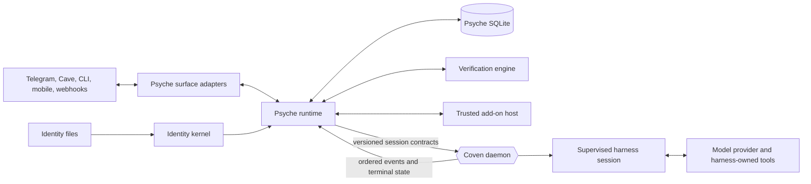

# Psyche Technical Architecture

**Status:** Approved technical baseline - W0 reconciled and G1 verified 2026-08-01
**Work unit:** `coven-psy0`
**Canonical decision:** [Familiar runtime design](./RUNTIME_DESIGN.md)
**Companions:** [Decision dossier](./DECISION_DOSSIER.md), [Product specification](./PRODUCT.md), [Threat model](./THREAT_MODEL.md), [Telegram parity ledger](./TELEGRAM_PARITY.md), [Coven prerequisites](./COVEN_PREREQUISITES.md), [Program plan](./PLAN.md)

## Architecture decision

Psyche is a surface-neutral familiar runtime implemented as a Rust workspace.
The long-running process is `psyched`; the operator CLI is `psyche`.
The canonical npm package is `@opencoven/psyche`. If npm needs native binary
packages, they use `@opencoven/psyche-<platform>-<arch>` and remain
implementation details of the canonical wrapper. The `@psyches/*` namespace is
outside v1.

This specification remains in Coven through G1 because the execution boundary
must be coherent before repository creation. The standalone
`OpenCoven/psyche` repository is created after G1 and before W2; no production
implementation begins in this repository.

## System context



Psyche is authoritative for familiar identity resolution, principal mapping,
intent, graph, verification, add-on, and surface state. Coven is authoritative
for admitted session execution, ordered execution events, terminal state, and
protected resources exposed through versioned contracts. Harnesses remain
authoritative for provider conversations and harness-native tool behavior.

## Repository and crate boundaries

```text
psyche/
  Cargo.toml
  crates/
    psyche-core/       # versioned IDs, schemas, errors, invariants
    psyche-config/     # strict configuration and secret references
    psyche-identity/   # identity snapshots, revisions, provenance
    psyche-store/      # SQLite migrations, transactions, leases, retention
    psyche-intent/     # immutable intent ledger
    psyche-graph/      # graph, node, attempt, budget, cancellation, recovery
    psyche-coven/      # negotiation, execution binding, conformance
    psyche-context/    # surface-neutral conversation and memory coordination
    psyche-verify/     # evidence sets, deterministic gates, verifier policy
    psyche-addons/     # pinned manifests, worker protocol, supervision
    psyche-surfaces/   # adapter-neutral ingress and effect contracts
    psyche-telegram/   # Bot API adapter and parity behavior
    psyche-ops/        # diagnostics, audit, export, restore, migration
    psyche-runtime/    # composition root
    psyche-cli/        # psyche and psyched entry points
  packages/
    psyche/            # @opencoven/psyche wrapper
    psyche-sdk/        # typed trusted add-on SDK
    openclaw-compat/   # bounded declaration/config compatibility
    native/            # optional platform packages
  tests/
    contract/          # schema and API compatibility
    crash/             # crash-window and restart replay
    integration/       # fake Telegram and Coven services
    live/              # opt-in Telegram probes
```

Dependency direction is inward:

```text
config/identity/intent/graph/surfaces/coven/verify/addons -> core
store implements persistence for domain crates
telegram -> surfaces + core
runtime -> all domain crates as the only composition root
cli -> runtime
```

`psyche-telegram` has no Coven knowledge. `psyche-coven` has no Telegram
knowledge. Surface adapters do not depend on graph internals. TypeScript
workers use only a versioned Rust-owned protocol. `psyche-runtime` is the only
composition root that joins an authenticated observation, principal, familiar
snapshot, intent, graph node, execution request, evidence policy, and effect.

## Process model

- One `psyched` process owns the local intent/graph store and may host multiple
  adapters and Telegram accounts.
- An account token is resolved once at startup or explicit reload and remains
  in locked process memory for the account lifetime.
- Every account pins an expected numeric Telegram bot ID. Startup and reload
  block if `getMe` returns another bot, even when the token is otherwise valid.
- One account has one active transport owner. Process-local and database leases
  prevent two Psyche workers from polling one token.
- Horizontal multi-host ownership is not a v1 feature. The database refuses to
  open from a network filesystem unless explicitly supported by a later
  storage profile.
- Surface listeners, the Coven socket client, harnesses, and add-on workers are
  separate trust boundaries.
- Graceful shutdown stops intake, finishes the durable commit in progress,
  releases only safe leases, records execution/evidence/delivery ambiguity,
  and then exits.

## Configuration contract

The root config declares `schema_version = "psyche.config.v1"`. Unknown fields
are errors except under an explicitly versioned `extensions` table. Raw token
values are not valid configuration.

```toml
schema_version = "psyche.config.v1"
data_dir = "/path/to/psyche-data"

[coven]
socket = "/path/to/coven.sock"
required_api_version = "coven.daemon.v1"

[streaming]
preview_max_age_seconds = 600

[[principal_bindings]]
principal_id = "principal:val"
surface = "telegram"
account = "main"
actor_type = "user"
actor_id = "123456789"

[accounts.main]
secret_ref = "op://VAULT/ITEM/token"
expected_bot_id = "987654321"
transport = "polling"
default = true

[accounts.main.telegram]
api_root = "https://api.telegram.org"
media_max_mib = 100

[accounts.webhook]
secret_ref = "op://VAULT/ITEM/token"
expected_bot_id = "123456789"
transport = "webhook"
webhook_secret_ref = "op://VAULT/ITEM/webhook-secret"
webhook_url = "https://bot.example.invalid/telegram"
webhook_bind = "127.0.0.1:8787"

[routes.val_dm]
account = "main"
chat = "123456789"
familiar_id = "cody"
familiar_home = "/path/to/familiars/cody"
project_root = "/path/to/project"
harness = "codex"
dm_policy = "allowlist"
allow_from = ["123456789"]

[routes.dev_topics]
account = "main"
chat = "-1001234567890"
topic = "*"
familiar_id = "cody"
familiar_home = "/path/to/familiars/cody"
project_root = "/path/to/project"
harness = "codex"
group_policy = "allowlist"
group_allow_from = ["123456789"]
require_mention = true
```

`secret_ref` is passed to a configured secret-provider adapter as data, never
interpolated into a shell command. The first-party 1Password adapter invokes
`op` with argv APIs and reads the secret from stdout through a bounded pipe.

Config validation rejects:

- a raw token or token-bearing Bot API URL;
- symlinked identity files;
- relative data, project, familiar, or socket paths;
- a missing or non-numeric expected bot ID;
- multiple default accounts;
- equal-precedence route matches;
- missing, duplicate, stale, or conflicting principal bindings;
- a wildcard DM allowlist without `dm_policy = "open"`;
- empty allowlists under an allowlist policy;
- polling and webhook configuration on the same account;
- webhook mode without a distinct webhook secret reference, URL, and bind
  address;
- a webhook bound beyond loopback without an explicit public-listener flag;
- an unknown schema version, transport, policy, or streaming mode; and
- any route whose project root or Psyche identity snapshot cannot be validated;
  execution additionally remains disabled until its W1-classified Coven
  binding passes G4.

Resolving a token for a different bot ID is not an in-place rotation. The
operator must configure a new account ID or run an explicit audited rebind
while the old account is disabled and has no active work. Rebind archives the
old cursor namespace and invalidates pairings, callback nonces, poll
correlations, cached bot identity, and unsent delivery intents before routes
can validate against the new bot.

Webhook secrets are separate provider references and must resolve to 32-256
characters from Telegram's allowed `A-Z`, `a-z`, `0-9`, `_`, and `-` alphabet.
They never reuse the bot token. Rotation resolves and validates the new secret,
updates Telegram under a fresh `telegram.account.activate` decision, then
atomically makes the new version primary. The listener accepts the prior
version for a five-minute in-flight grace period only after `setWebhook`
succeeds; a failed update leaves the old version active. Logs and health expose
only a version ID and digest prefix. Both secret buffers follow the bot-token
memory and redaction rules.

`streaming.preview_max_age_seconds` defaults to `600` and must be between 30
and 3600. The value is persisted with each logical response so config reload
cannot silently extend an already-open preview.

## Versioned domain schemas

All persisted envelopes carry a schema version. Additive fields may be ignored
only when their containing schema explicitly allows it. Unknown major versions
are quarantined and not dispatched.

The W0 surface-neutral contract set is:

| Contract | Purpose |
|---|---|
| `psyche.identity_snapshot.v1` | Familiar, source digests, provenance, and immutable revision. |
| `psyche.intent.v1` | Immutable operator or surface request, constraints, required outcome/evidence, provenance, and digest. |
| `psyche.surface_event.v1` | Authenticated adapter observation with adapter-owned actor and locator data. |
| `psyche.graph.v1` | Graph identity, owner principal, root intent, policy, state, and aggregate result. |
| `psyche.graph_node.v1` | Task, familiar snapshot, dependencies, limits, acceptance evidence, state, and result. |
| `psyche.delegation.v1` | Parent-child scope, non-widening constraints, budget, evidence access, and cancellation policy. |
| `psyche.budget.v1` | Reserved, consumed, and released accounting by enforceable resource class. |
| `psyche.approval.v1` | Psyche orchestration approval request, provenance, decision, and expiry. |
| `psyche.execution_binding.v1` | Graph attempt, stable request digest, Coven adoption state, event cursor, cancellation, and terminal correlation. |
| `psyche.evidence.v1` | Immutable check, artifact, trajectory, verifier, or human evidence reference. |
| `psyche.verdict.v1` | Verification policy, sealed evidence set, independent verifier, confidence class, and decision. |
| `psyche.recovery.v1` | Lease, ambiguity, fence, reconciliation, and operator disposition. |
| `psyche.addon.v1` | Pinned package identity, provenance, contributions, allowlist, and revocation state. |
| `psyche.surface_effect.v1` | Canonical presentation or interaction intent before adapter translation. |
| `psyche.delivery.v1` | Logical effect, physical attempts, surface-policy decision, ambiguity, and resolution. |

Adapter schemas extend rather than replace these contracts. Telegram uses
`psyche.telegram_event.v1` and `psyche.telegram_effect.v1`, both of which map
to a canonical surface event or effect. No Telegram identifier appears in the
graph, identity, execution-binding, evidence, or verdict schema.

Minimum lifecycle invariants are frozen in W0:

- an intent is immutable after durable acceptance; corrections supersede it;
- a graph transition is append-only and versioned;
- a node attempt binds one familiar snapshot and at most one Coven session;
- dependency edges are acyclic and cannot be rewritten after admission;
- delegation cannot widen authority, budget, evidence access, or surface scope;
- lease expiry never proves an attempt safe to redispatch;
- cancellation is unresolved until every affected execution boundary returns
  authoritative terminal acknowledgement or an explicit unknown state;
- evidence is content-addressed and sealed before a verdict;
- a generator cannot issue its own independent-verification verdict; and
- a logical surface effect and every physical delivery attempt have distinct
  durable identities.

`psyche.intent.v1`, `psyche.graph.v1`, and `psyche.graph_node.v1` require the
following stable fields. Specific child implementation plans may add
forward-compatible fields but may not weaken these bindings:

```json
{
  "intent": {
    "schema_version": "psyche.intent.v1",
    "intent_id": "int_01J...",
    "principal_id": "principal:val",
    "familiar_snapshot_id": "ids_01J...",
    "project_id": "project:sha256:...",
    "requested_outcome": "Review and verify the scoped change.",
    "constraints": {},
    "required_evidence": ["tests", "diff_review"],
    "surface_event_id": "sev_01J...",
    "created_at": "2026-08-01T00:00:00Z",
    "digest": "sha256:..."
  },
  "graph": {
    "schema_version": "psyche.graph.v1",
    "graph_id": "grf_01J...",
    "root_intent_id": "int_01J...",
    "owner_principal_id": "principal:val",
    "policy_revision": "policy:sha256:...",
    "state": "admitted",
    "version": 1
  },
  "node": {
    "schema_version": "psyche.graph_node.v1",
    "node_id": "nod_01J...",
    "graph_id": "grf_01J...",
    "familiar_snapshot_id": "ids_01J...",
    "dependencies": [],
    "delegation_id": null,
    "budget_id": "bud_01J...",
    "required_evidence": ["tests", "diff_review"],
    "state": "ready",
    "version": 1
  }
}
```

An absent `surface_event_id` represents locally authored operator intent. An
absent `delegation_id` represents a root node. Nullability is allowed only for
those two fields in these minimum examples; unknown fields and unknown major
versions fail closed until the child schema explicitly declares compatibility.

### Graph, attempt, and verification lifecycles

```text
graph: draft -> admitted | rejected
       admitted -> running
       running -> waiting_approval | waiting_evidence | cancelling
       running -> completed | failed
       waiting_approval | waiting_evidence -> running | cancelling | failed
       cancelling -> cancelled | recovery_required
       recovery_required -> running | completed | failed | cancelling

node: proposed -> admitted | rejected
      admitted -> blocked | ready
      blocked -> ready | skipped
      ready -> reserved -> dispatching
      dispatching -> adopted | adoption_unknown | proven_not_adopted | failed
      adoption_unknown -> adopted | proven_not_adopted | recovery_required
      proven_not_adopted -> ready | failed
      adopted -> running | candidate | failed
      running -> waiting_approval | candidate | failed
      waiting_approval -> running | candidate | failed
      candidate -> awaiting_verification
      awaiting_verification -> verified | rejected | escalation_required
      escalation_required -> awaiting_verification | verified | rejected
      cancelling -> cancelled | termination_unknown
      termination_unknown -> cancelled | candidate | failed | recovery_required
      recovery_required -> adopted | running | candidate | failed | cancelled

attempt adoption: not_submitted -> submitting -> adopted | proven_not_adopted
                  submitting -> adoption_unknown
                  adoption_unknown -> adopted | proven_not_adopted | fenced
```

Terminal graph success requires every required node terminal, every required
evidence set sealed, and every required verdict allowed. A failed process, an
unresolved cancellation, or an unknown adoption cannot be converted to success
by another node or an operator database edit.

Budget reservations use `(graph_id, node_id, attempt_id, resource_class)` as an
idempotency key. Reserve, consume, and release are once-only transitions.
Psyche calls a resource limit `hard` only when the W1-classified execution
boundary can enforce it and report trustworthy consumption; other limits are
admission estimates or accounting controls.

`psyche.evidence.v1` binds evidence ID, node/attempt, content digest, producer,
collection method, media type, size, creation time, and retention policy.
`psyche.verdict.v1` binds the sealed evidence-set digest, policy revision,
verdict type (`deterministic`, `human`, or `independent_verifier`), reviewer
identity/session when applicable, outcome, reason codes, and creation time.
Independent verifier execution remains disabled until G5 local calibration;
the initial release may use deterministic checks and human review.

### Normalized Telegram event

`psyche.telegram_event.v1` is a discriminated adapter union and the durable
Telegram input to canonical normalization. Fields unavailable in a Telegram
update are represented explicitly rather than invented. The adapter creates a
`psyche.surface_event.v1` containing the adapter ID, authenticated actor and
locator references, Telegram event digest, receive time, and normalized
content. Psyche then maps the actor to a principal and separately admits an
intent; the Telegram event itself grants neither identity nor authority.

```json
{
  "schema_version": "psyche.telegram_event.v1",
  "event_id": "evt_01J...",
  "account_id": "main",
  "update_id": "123456789",
  "received_at": "2026-07-27T00:00:00Z",
  "telegram_time": "2026-07-26T23:59:59Z",
  "actor": {
    "type": "user",
    "user_id": "123456789",
    "username": "display-only",
    "is_bot": false
  },
  "locator": {
    "type": "message",
    "chat_id": "-1001234567890",
    "chat_kind": "supergroup",
    "topic": { "kind": "forum", "id": "42" },
    "message_id": "314",
    "reply_to_message_id": "300"
  },
  "content": {
    "type": "text",
    "text": "Please review this.",
    "entities": []
  },
  "raw_update_sha256": "sha256:..."
}
```

`actor.type` is one of:

- `user` with `user_id`, optional username, and bot flag;
- `chat` with `chat_id` for sender-chat, anonymous, or poll-voter-chat
  attribution; or
- `none` when Telegram supplies no actor.

`locator.type` is one of:

- `message` with chat, optional topic, and message ID;
- `poll` with Telegram poll ID;
- `inline` with inline-message or callback-query ID; or
- `update` with only the update ID for unsupported or global events.

`content.type` is a tagged enum:

- `text`, `command`, `media`, `media_group`, `location`;
- `callback`, `poll`, `poll_answer`, `reaction_change`,
  `reaction_count`;
- `message_edit`, `service_event`; and
- `unsupported`, which is persisted and acknowledged but never dispatched.

`content.type` is the event's only discriminant. Normalized v1 objects reject
unknown fields; optional fields are omitted rather than set to null unless this
section explicitly permits null. Unknown Telegram source fields remain in the
hashed raw update and do not enter a known normalized variant.

Content contracts:

- `text`: required `text` and `entities`. Each entity requires `type`,
  `offset_utf16`, and `length_utf16`; `url`, `user_id`, `language`, and
  `custom_emoji_id` are optional only for Telegram entity types that define
  them.
- `command`: required normalized `name`, exact `args_text`, optional addressed
  `bot_username`, and the original command entity. Names match
  `[a-z0-9_]{1,32}`.
- `media`: required `media_kind`, `file_id`, and `file_unique_id`; optional
  declared byte size, MIME type, original filename, width, height, duration,
  caption, caption entities, and `sticker`. `sticker` may contain emoji, set
  name, type (`regular`, `mask`, or `custom_emoji`), animated/video flags, and
  custom emoji ID. Sizes/dimensions/durations are non-negative integers.
  `media_kind` is `photo`, `animation`, `document`, `audio`, `voice`, `video`,
  `video_note`, or `sticker`.
- `media_group`: required `media_group_id`, `completion` (`complete` or
  `timed_out`), and non-empty `items`. Each item is a `media` payload plus its
  Telegram message ID; item IDs are unique and ordered by message ID.
- `location`: required finite `latitude` and `longitude`; optional horizontal
  accuracy, live period, heading, proximity radius, and `venue`. Venue requires
  title and address and may carry Telegram-supported place IDs.
- `callback`: required `callback_query_id` and exactly one of `data` or
  `game_short_name`. `data` is preserved as exact UTF-8 with a 64-byte maximum.
- `poll` and `poll_answer`: defined under
  [Poll and reaction payloads](#poll-and-reaction-payloads).
- `reaction_change` and `reaction_count`: defined under
  [Poll and reaction payloads](#poll-and-reaction-payloads).
- `message_edit`: required `edit_time` and `new_content`. `new_content` is one
  of `text`, `media`, or `location`; nested edits are invalid.
- `service_event`: required `event_type` and typed `data`. Known v1 event types
  are `member_joined`, `member_left`, `group_migrated`, `topic_created`,
  `topic_closed`, `topic_reopened`, and `message_pinned`. Unknown service types
  become `unsupported`. Their exact data is: joined numeric `user_ids`; left
  numeric `user_id`; migration `from_chat_id` and `to_chat_id`; topic creation
  `topic_id`, `name`, optional icon color/custom emoji; topic close/reopen
  `topic_id`; and pin `message_id`.
- `unsupported`: required `reason` (`unknown_update`,
  `unsupported_channel_post`, `unknown_service_event`, or `invalid_optional_shape`)
  and sorted `telegram_update_keys`; it contains no source payload values.

Normative field requirements:

| Event kind | Actor | Locator | `telegram_time` |
|---|---|---|---|
| `message`, `message_edit`, `service_event`, `media_group` | `user`, `chat`, or `none` as supplied | `message` | Required when Telegram supplies message date; otherwise null |
| `callback` | `user` | `message` or `inline` | Null unless the attached message supplies a date |
| `poll` | `none` | `poll` | Null |
| `poll_answer` | `user` or `chat` | `poll` | Null |
| `reaction_change` | `user` or `chat` | `message` | Required |
| `reaction_count` | `none` | `message` | Required |
| `unsupported` | Any supplied variant or `none` | Best available locator or `update` | Nullable |

Events without a message locator do not create a conversation turn unless they
correlate to an existing Psyche poll, callback, or delivery record. Their lane
is derived from the correlated record; otherwise it is an account-scoped
object lane and cannot inherit a chat authorization context.

Chat IDs, user IDs, message IDs, topic IDs, and update IDs are stored as
decimal strings at schema boundaries where JavaScript precision could
otherwise corrupt them.

### Identity snapshot

`psyche.identity_snapshot.v1` is resolved by Psyche before intent admission and
pinned to every graph node and execution attempt.

```json
{
  "schema_version": "psyche.identity_snapshot.v1",
  "snapshot_id": "ids_01J...",
  "familiar_id": "cody",
  "principal_id": "principal:val",
  "revision": 7,
  "declaration_digest": "sha256:...",
  "identity_file_digest": "sha256:...",
  "identity_digest": "sha256:...",
  "soul_digest": "sha256:...",
  "role_skill_digest": "sha256:...",
  "provenance": {
    "familiar_home_id": "home:sha256:...",
    "resolver_version": "psyche.identity_resolver.v1"
  },
  "resolved_at": "2026-08-01T00:00:00Z"
}
```

`identity_file_digest` covers the exact `IDENTITY.md` bytes.
`identity_digest` is the aggregate over all named identity inputs. The snapshot
stores digests, provenance, and identifiers, not a second mutable identity.
Psyche reads validated handles and verifies digests before graph admission and
again before execution request construction.

If W1 proves a compatible Coven snapshot-validation contract, Psyche records
its result in `psyche.execution_binding.v1`:

```json
{
  "schema_version": "psyche.execution_binding.v1",
  "attempt_id": "att_01J...",
  "familiar_snapshot_id": "ids_01J...",
  "project_id": "project:sha256:...",
  "request_id": "req_01J...",
  "request_digest": "sha256:...",
  "coven_contract_version": "classified-by-w1",
  "coven_session_id": null,
  "adoption_state": "not_submitted",
  "event_cursor": null,
  "cancellation_state": "not_requested",
  "terminal_state": null
}
```

This binding does not make Coven the identity source. It records whether Coven
accepted the exact Psyche snapshot for one execution request. Missing inputs,
digest disagreement, an unknown contract version, or a stale protected-write
generation blocks execution and cannot be replaced with a local success.

Ward is Coven's protected-familiar write gate and audit authority; its declared
surface and decision lifecycle are described in
[`specs/coven-familiar-spec/PRODUCT.md`](../coven-familiar-spec/PRODUCT.md) and
[`docs/reference/cli-ward.md`](../../docs/reference/cli-ward.md). Ward may issue
an opaque generation token for protected execution validation, but it never
defines familiar identity, principal mapping, graph ownership, or surface
policy. W1 must classify the actual current token and binding semantics before
an implementation plan names a Coven contract.

### Familiar identity rebind

An intentional change to familiar identity is a controlled Psyche identity
migration, not a permissive reload. Detection blocks affected graph admission
and surface routes; it grants no authority to adopt the new snapshot.

Reactivation requires a current Psyche operator context and an audited
`psyche.identity_rebind.v1` orchestration approval containing:

- familiar ID, principal, and project binding;
- old and proposed identity snapshot IDs, input digests, and aggregate digests;
- affected graph, route, and conversation IDs;
- every unresolved execution binding under the old snapshot;
- a human-supplied reason and stable request ID; and
- a digest of the exact proposed rebind record.

Psyche first stops new admissions for the affected routes and waits for every
graph and adapter lane to reach a durable boundary. A rebind is rejected while
a known execution, approval, callback, verification, or delivery remains
active. Delivery ambiguity uses its adapter recovery path. Execution ambiguity
requires Coven to resolve or fence every possible old-bound session through a
W1-classified contract. If Coven cannot prove that fence, execution and route
reactivation remain blocked.

After the Psyche approval commits and every execution boundary returns the
required disposition, Psyche atomically archives the old
route-to-conversation bindings, invalidates pairings and callback nonces whose
policy/identity binding changed, records the old/new snapshots, intent
dispositions, and execution correlations, and activates the new snapshot.
Existing sessions remain permanently bound to the old snapshot; they may be
inspected or terminated but never resumed under the new identity.

Lost rebind responses use stable request adoption within Psyche. An
inconclusive result leaves admission blocked; neither Psyche nor Coven may
infer the new identity active from file state alone.

### Coven execution request

`psyche.execution_request.v1` is Psyche's immutable internal record for one
graph attempt. W1 maps it to the smallest compatible Coven API contract; it
does not invent daemon capabilities or surface authority.

```json
{
  "schema_version": "psyche.execution_request.v1",
  "request_id": "req_01J...",
  "graph_id": "grf_01J...",
  "node_id": "nod_01J...",
  "attempt_id": "att_01J...",
  "operation": "launch",
  "principal_id": "principal:val",
  "familiar_snapshot_id": "ids_01J...",
  "project_id": "project:sha256:...",
  "project_root": "/absolute/project",
  "cwd": "/absolute/project",
  "harness": "codex",
  "context_manifest_digest": "sha256:...",
  "delegation_digest": null,
  "budget_digest": "sha256:...",
  "required_artifact_bindings": [],
  "payload_digest": "sha256:...",
  "created_at": "2026-08-01T00:00:00Z"
}
```

The execution payload contains a typed task and bounded context manifest. It
does not contain a competing persona, hidden permission grant, surface secret,
or untrusted text represented as system instruction. `operation` is `launch`
or `input`; input also names the adopted session. Psyche persists the exact
request and digest before submission, then records adoption and event progress
in `psyche.execution_binding.v1`.

### Surface policy request and decision

Psyche, not Coven, owns surface policy. Before an adapter performs a canonical
effect, Psyche evaluates `psyche.surface_policy_request.v1` against the mapped
principal, familiar snapshot, graph provenance, exact destination, payload
digest, and configured surface policy. Capability presence is discovery only.

```json
{
  "schema_version": "psyche.surface_policy_request.v1",
  "intent_id": "intent_01J...",
  "action_class": "telegram.reply.send",
  "requester": {
    "type": "graph_attempt",
    "principal_id": "principal:val",
    "graph_id": "grf_01J...",
    "node_id": "nod_01J...",
    "attempt_id": "att_01J..."
  },
  "surface": {
    "channel": "telegram",
    "account_id": "main",
    "chat_id": "-1001234567890",
    "chat_kind": "supergroup",
    "topic_kind": "forum",
    "topic_id": "42",
    "relationship": "reply_same_topic"
  },
  "binding": {
    "type": "surface_effect",
    "familiar_snapshot_id": "ids_01J...",
    "project_id": "project:sha256:...",
    "policy_revision": "policy:sha256:..."
  },
  "effect": {
    "schema_version": "psyche.telegram_effect.v1",
    "type": "send_message",
    "format": "html",
    "text": "Review complete.",
    "reply_to_message_id": "314",
    "buttons": [],
    "link_preview": { "enabled": true }
  },
  "effect_digest": "sha256:...",
  "request_digest": "sha256:...",
  "expires_at": "2026-08-01T00:05:00Z"
}
```

`requester.type` is `surface_principal`, `graph_attempt`, or `local_operator`.
Surface principals include the authenticated adapter actor and mapping
revision. Graph attempts include immutable graph/node/attempt correlation.
`local_operator` carries an opaque, unexpired Psyche operator context produced
by the configured local authentication policy.

`psyche.operator_context.v1` is local to Psyche orchestration and surface
policy:

```json
{
  "schema_version": "psyche.operator_context.v1",
  "operator_context_id": "operator_01J...",
  "principal_id": "principal-local-owner",
  "auth_strength": "same_user_local",
  "expires_at": "2026-08-01T00:10:00Z"
}
```

Psyche derives the principal and revalidates the context on every action.
Required CLI sends, polls, buttons, pins, force-document sends, and local
pairing approvals use `local_operator`. Missing local authentication disables
those commands and blocks Telegram parity release. This context never grants
Coven execution or protected-resource authority.

`telegram.account.activate` is the only adapter-lifecycle rather than visible-
effect decision. Its requester
is `operator_config`; its surface contains account ID, expected numeric bot ID,
transport mode, and API root; and its binding contains Psyche adapter identity
and the full account config digest instead of familiar/project fields. It
permits only the listed protocol administration needed to receive updates or
fetch media for a locally ACL-admitted event; it cannot send message content,
typing, callback answers, reactions, or other familiar-visible effects. Psyche
renews it on config reload and at least daily. All other action classes require
the full principal, graph attempt or operator provenance, familiar snapshot,
project, policy revision, and conversation-surface binding shown above.

The account-activation request and response use
`binding.type = "account_activation"` with `psyche_adapter_id`, `account_id`,
`expected_bot_id`, `transport`, `api_root`, and `config_digest`. Every other
request and decision uses `binding.type = "surface_effect"`. Unknown binding
types or fields are denied.

Every send-like request has a target `relationship`:

- `reply_same_dm`, `reply_same_group`, or `reply_same_topic`;
- `cross_chat`; or
- `broadcast`.

The adapter supplies a claimed relationship. Psyche derives it from the originating
event/session, target surface, and optional broadcast batch, rejects a
mismatch, and returns the derived value in the decision binding. Generic media,
sticker, location, poll, and pin action classes therefore cannot hide whether
their target is a DM reply, public group/topic reply, cross-chat send, or
broadcast.

Known v1 action classes are:

- `telegram.account.activate`, which alone covers `getMe`, `getUpdates`,
  webhook setup/cleanup, command-menu synchronization, and Telegram file
  metadata/download for one exact account configuration;
- `telegram.reply.send`, `telegram.group_reply.send`, `telegram.broadcast.send`,
  `telegram.cross_chat.send`;
- `telegram.chat_action.send`, `telegram.callback.answer`;
- `telegram.message.edit`, `telegram.message.delete`,
  `telegram.message.react`, `telegram.poll.create`,
  `telegram.message.pin`;
- `telegram.media.send`, `telegram.sticker.send`,
  `telegram.location.send`;
- `telegram.topic.create`, `telegram.topic.edit`;
- `telegram.pairing.prompt`, `telegram.pairing.approve`;
- `telegram.approval.prompt`; and
- `telegram.approval.resolve`;
- `telegram.delivery.resolve_unknown`.

Each action class accepts exactly one `psyche.telegram_effect.v1` type:

| Action class | `effect.type` | Required effect fields |
|---|---|---|
| `telegram.account.activate` | `account_activation` | account ID, expected bot ID, transport, API root, webhook/command config digest |
| `telegram.reply.send`, `telegram.group_reply.send`, `telegram.broadcast.send`, `telegram.cross_chat.send` | `send_message` | format, exact text, target relationship, and materialized link-preview object; optional reply/quote metadata and buttons |
| `telegram.chat_action.send` | `chat_action` | Telegram chat action and bounded duration |
| `telegram.callback.answer` | `callback_answer` | callback query ID, optional exact text, alert flag, cache seconds |
| `telegram.message.edit` | `edit_message` | message ID and exactly one of new text/caption/buttons; text edits also carry materialized link-preview policy |
| `telegram.message.delete` | `delete_message` | message ID |
| `telegram.message.react` | `set_reaction` | message ID, ordered typed reactions |
| `telegram.poll.create` | `create_poll` | question, 1-12 options, anonymity, multi-answer, duration |
| `telegram.message.pin` | `pin_message` | message ID and notification flag |
| `telegram.media.send` | `send_media` | media kind, ordered immutable artifact references with hash/size/type, caption, force-document flag |
| `telegram.sticker.send` | `send_sticker` | Telegram file ID |
| `telegram.location.send` | `send_location` | coordinates and optional venue |
| `telegram.topic.create` | `create_topic` | name and optional icon fields |
| `telegram.topic.edit` | `edit_topic` | topic ID and explicit rename/icon/close/reopen mutation |
| `telegram.pairing.prompt` | `pairing_prompt` | pairing request ID, numeric sender, DM surface, expiry |
| `telegram.pairing.approve` | `pairing_decision` | pairing request ID, numeric sender, DM scope, approve/reject |
| `telegram.approval.prompt` | `approval_prompt` | authority domain, opaque approval ID, action digest, redacted summary, destination, expiry |
| `telegram.approval.resolve` | `approval_decision` | authority domain, opaque approval ID, action digest, approve/reject, callback nonce hash |
| `telegram.delivery.resolve_unknown` | `resolve_delivery_unknown` | original delivery/effect/attempt IDs, `abandon`/`retry`/`send_clarification`, explicit duplicate-risk acknowledgement |

All effect variants reject unknown fields. Fields listed as exact are included
verbatim in policy evaluation; binary media is represented only by immutable
artifact references and hashes. The outer surface and binding must equal the
effect's target and authority fields. Surface authorization never substitutes
for Coven execution admission or protected-resource access.

`send_message.link_preview` and text-bearing `edit_message.link_preview`
contain `enabled` plus optional `url`, `prefer_small_media`,
`prefer_large_media`, and `show_above_text`. Mutually exclusive size
preferences are invalid. Psyche materializes the route's declared default into
every send and cumulative/final streaming edit before digesting, so Telegram
never receives an undigested preview policy. Caption-only and button-only edits
omit the object.

A send-like effect created to resolve an unknown delivery must include:

```json
{
  "recovery": {
    "root_delivery_id": "del_root",
    "parent_delivery_id": "del_unknown",
    "unknown_effect_digest": "sha256:...",
    "unknown_attempt_id": "attempt_01J...",
    "resolution_decision_id": "decision_resolve_01J...",
    "resolution_effect_digest": "sha256:...",
    "duplicate_risk_acknowledged": true
  }
}
```

The recovery object is part of the effect digest. Psyche verifies the surface-
policy decision and ancestry before authorizing the new physical send. It is forbidden
on a delivery that has no unknown parent.

Unknown action classes, effect types, or class/effect combinations are denied.
Psyche computes `effect_digest` as SHA-256 over RFC 8785 canonical JSON of
`effect`. It computes `request_digest` over the complete request with that
field omitted. The surface-policy engine independently parses the typed effect,
recomputes both digests, rejects disagreement, and evaluates the actual fields.

Psyche records `psyche.surface_decision.v1`:

```json
{
  "schema_version": "psyche.surface_decision.v1",
  "decision_id": "decision_01J...",
  "intent_id": "intent_01J...",
  "action_class": "telegram.reply.send",
  "outcome": "allow",
  "request_digest": "sha256:...",
  "effect_digest": "sha256:...",
  "binding": {
    "type": "surface_effect",
    "principal_id": "principal:val",
    "familiar_snapshot_id": "ids_01J...",
    "project_id": "project:sha256:...",
    "graph_id": "grf_01J...",
    "attempt_id": "att_01J...",
    "account_id": "main",
    "chat_id": "-1001234567890",
    "topic_kind": "forum",
    "topic_id": "42",
    "relationship": "reply_same_topic"
  },
  "policy_revision": "policy:sha256:...",
  "expires_at": "2026-08-01T00:05:00Z",
  "approval_id": null
}
```

`outcome` is `allow`, `deny`, or `requires_approval`. Psyche proceeds only on
`allow` after verifying every echoed binding, request digest, action class, and
effect digest, including the policy revision and expiry. `requires_approval` must
include an opaque `approval_id`; it does not authorize the effect. A later
approval decision produces a new allow decision for the same effect digest.
Decisions are single-effect and cannot authorize a different message part,
target, or mutation.

### Delivery intent

`psyche.delivery.v1` records one logical Telegram effect:

```json
{
  "schema_version": "psyche.delivery.v1",
  "delivery_id": "del_01J...",
  "intent_id": "intent_01J...",
  "action_class": "telegram.reply.send",
  "account_id": "main",
  "chat_id": "-1001234567890",
  "topic": { "kind": "forum", "id": "42" },
  "relationship": "reply_same_topic",
  "effect": {
    "schema_version": "psyche.telegram_effect.v1",
    "type": "send_message",
    "format": "html",
    "text": "Review complete.",
    "reply_to_message_id": "314",
    "buttons": [],
    "link_preview": { "enabled": true }
  },
  "effect_digest": "sha256:...",
  "surface_decision": {
    "decision_id": "decision_01J...",
    "request_digest": "sha256:...",
    "policy_revision": "policy:sha256:...",
    "expires_at": "2026-08-01T00:05:00Z",
    "state": "reserved"
  },
  "logical_response_id": "response_01J...",
  "logical_part": 0,
  "state": "ready",
  "attempt_count": 0,
  "telegram_message_id": null
}
```

The canonical effect object and its digest are immutable. One decision ID
authorizes exactly one physical Bot API request.
`delivery_surface_decisions.decision_id` is globally unique, and each row moves
once from `reserved` to `consumed` in the same transaction that records the
physical attempt ID and moves its delivery to `sending`. A consumed decision
can never be attached to another delivery or attempt. Each formatted chunk,
preview create/edit/delete, and fallback is a separate effect, decision, and
delivery row linked by `logical_response_id` and ordered by `logical_part`. A
renewed decision for the same unsent/retryable effect is appended to
`delivery_surface_decisions` and becomes current; it does not rewrite the effect
or any prior decision record. Each append-only authorization stores its own
request digest because intent ID and expiry change on renewal.
`delivery_intents` points to the current surface-decision row.
Recovery rows additionally persist acyclic `recovery_root_id`,
`recovery_parent_id`, and `resolution_decision_id` foreign keys.

States are:

```text
ready -> sending -> sent
                -> retryable
                -> delivery_unknown
                -> failed
ready -> failed
ready -> abandoned
retryable -> sending
retryable -> failed
retryable -> dead_letter
retryable -> abandoned
delivery_unknown -> abandoned
delivery_unknown -> resolving_unknown
resolving_unknown -> compensated
resolving_unknown -> delivery_unknown
```

`sent`, `failed`, `dead_letter`, `abandoned`, and `compensated` are terminal.
`delivery_unknown` requires a policy-specific operator or compensating decision;
it is never silently converted to `sent`. Authorization denial, mismatch, or
expiry before a send uses `ready/retryable -> failed`. Attempt/age exhaustion
uses `retryable -> dead_letter`. Acquiring a retry lease and incrementing the attempt
counter occur in the same transaction as `retryable -> sending`, and that
transaction requires a fresh Psyche surface decision for the same immutable
effect/surface. The decision attached to `ready` is marked consumed by the first
`ready -> sending` transaction, even if the process later proves no bytes were
written. A crash before that transaction leaves the decision unused and
reusable only while it remains unexpired. Every later retry, including after
429, 5xx, or a proven pre-write network failure, uses a new decision. A denied
or mismatched renewal moves to `failed` without calling Telegram.

Unknown delivery resolution requires a `local_operator` or authorized
`telegram_approver` request and an allow decision for
`telegram.delivery.resolve_unknown`. `abandon` records that no retry will be
attempted. `retry` or `send_clarification` moves to `resolving_unknown` and
creates a new immutable effect/delivery row with `recovery_of` pointing to the
unknown delivery; the new physical send requires its own normal action decision
and includes the resolution decision ID plus duplicate-risk acknowledgement.
The original becomes `compensated` only after the recovery delivery reaches
`sent`. A recovery that fails before transmission returns the original to
`delivery_unknown`. If the recovery itself becomes unknown, it is a separate
unknown delivery and the original remains `resolving_unknown` until that child
is explicitly resolved. Resolution propagates transactionally up the acyclic
chain: a child reaching `sent` or `compensated` marks every unresolved ancestor
`compensated`; a child reaching `abandoned`, `failed`, or `dead_letter` returns
its parent to `delivery_unknown` and applies the same rule upward; an unknown or
resolving child keeps ancestors `resolving_unknown`. These rules leave no
parent permanently stranded.

### Delivery-unknown operator recovery

The normative v1 operator surface is:

```text
psyche delivery inspect <delivery-id> [--json]
psyche delivery resolve <delivery-id> --action <abandon|retry|send-clarification> \
  --reason <text> [--acknowledge-duplicate-risk]
```

`inspect` is read-only and displays the immutable effect digest, surface,
attempt write-state classifications, recovery ancestry, and redacted
correlation IDs. `resolve` obtains a current Psyche operator context and the
`telegram.delivery.resolve_unknown` decision described above. `retry` and
`send-clarification` require `--acknowledge-duplicate-risk`; `abandon` forbids
it. Psyche persists the reason, operator context reference, decision, and state
transition before any recovery send. Cave may render this same typed local
admin action, but may not define different recovery semantics or bypass the
CLI contract.

### Poll and reaction payloads

`content.type = "poll"`:

```json
{
  "type": "poll",
  "poll_id": "poll-id",
  "question": "Ship it?",
  "options": [
    { "option_id": 0, "text": "Yes", "voter_count": 2 },
    { "option_id": 1, "text": "No", "voter_count": 0 }
  ],
  "total_voter_count": 2,
  "is_closed": false,
  "is_anonymous": false,
  "allows_multiple_answers": false
}
```

`content.type = "poll_answer"`:

```json
{
  "type": "poll_answer",
  "poll_id": "poll-id",
  "option_ids": [0]
}
```

The actor carries the voter user/chat. Option IDs are distinct integers in the
range present in the correlated poll. Polls contain 1-12 options under Bot API
10.2. Empty `option_ids` means the vote was retracted.

Reaction changes and aggregate counts are distinct variants:

```json
{
  "type": "reaction_change",
  "old_reactions": [{ "type": "emoji", "emoji": "👍" }],
  "new_reactions": [{ "type": "custom_emoji", "custom_emoji_id": "..." }]
}
```

```json
{
  "type": "reaction_count",
  "counts": [
    { "reaction": { "type": "paid" }, "total_count": 1 },
    { "reaction": { "type": "emoji", "emoji": "👍" }, "total_count": 4 }
  ]
}
```

`reaction_change` uses a `user` or `chat` actor as supplied.
`reaction_count` uses actor `none`. Reaction values are tagged `emoji`,
`custom_emoji`, or `paid`; unknown value types make the content
`unsupported`, not text. Counts are non-negative, and duplicate normalized
reaction keys are invalid.

### Error envelope

CLI, admin socket, and internal boundary errors use `psyche.error.v1`:

```json
{
  "schema_version": "psyche.error.v1",
  "error": {
    "code": "coven_capability_missing",
    "message": "The configured route requires a Coven capability that is not advertised.",
    "retryable": false,
    "correlation_id": "corr_01J...",
    "details": {
      "capability": "coven.approvals.v1"
    }
  }
}
```

Callers branch on `code`, never `message`. Details must not contain secrets,
message bodies, callback values, raw local I/O errors, or absolute paths unless
the local CLI explicitly requests a privileged diagnostic view.

## Coven capability profile

At startup Psyche calls `GET /api/v1/health`, requires
`apiVersion == "coven.daemon.v1"`, then calls `GET /api/v1/capabilities`.
Psyche never assumes an endpoint is authorized merely because it exists.

W0 freezes behavior requirements, not speculative Coven names. W1 must classify
each requirement as `current`, `current_but_undocumented`, `planned`,
`optional`, or `rejected`, with a code/test citation and owner. Only `current`
or `current_but_undocumented` behavior with executable conformance can satisfy
G4.

The single-node execution profile requires:

| Behavior | Required evidence |
|---|---|
| Exact API/capability negotiation | Version and unknown-capability denial tests. |
| Session create, input, inspect, events, and terminate | Public contract tests against a pinned daemon. |
| Familiar snapshot validation and immutable execution binding | Match, mismatch, protected-change, and restart tests. |
| Stable request adoption and lookup | Same-request replay, digest conflict, lost response, retention, and restart tests. |
| Authoritative non-adoption or ambiguity fencing | Concurrent adoption, disconnect, operator recovery, and no-local-unblock tests. |
| Ordered event cursor and authoritative terminal state | Pagination, replay, cursor persistence, and stale-event tests. |
| Cancellation acknowledgement | Terminal acknowledgement or explicit unresolved-state tests. |
| Result and required artifact association | Cross-attempt/session mismatch and immutable-reference tests. |
| Structured denial | Unknown version, missing capability, policy denial, and mid-flight authority-loss tests. |

Production child dispatch additionally requires parent graph/child node
correlation, one-attempt/one-session binding, idempotent child adoption,
descendant cancellation acknowledgement, orphan discovery, ambiguity fencing,
safe restart recovery, and exact project/identity/attempt/digest rejection.

Memory and artifact operations are feature-gated by their actual W1
classification. Missing memory support degrades only declarations that require
it. Missing safe artifact input/output blocks the affected media or evidence
path. Psyche never implements a direct fallback into Coven-owned protected
resources. Coven does not authorize Telegram or another surface effect.

## Coven session protocol

1. Resolve and pin `psyche.identity_snapshot.v1`, intent, graph, node,
   delegation, budget, context-manifest, and required-evidence digests.
2. Resolve required media or evidence references through only the protected-
   resource contracts that W1 and G4 prove. Missing support blocks that node;
   Psyche never writes directly into a Coven-owned store.
3. Build and persist the exact `psyche.execution_request.v1` and
   `psyche.execution_binding.v1` with `adoption_state = not_submitted`.
4. Submit through the W1-classified session-create or input contract using one
   stable request ID and digest. Surface policy does not participate in Coven
   execution admission.
5. Require Coven to validate project/cwd, harness, familiar snapshot binding,
   attempt correlation, and any protected-resource references supported by the
   negotiated contract.
6. Repeating one request ID and digest must return the original adoption;
   reusing the ID with another digest must fail as conflict.
7. After timeout, disconnect, or restart, query authoritative adoption before
   any retry. Retry the exact request only after proof of non-adoption. An
   unavailable or inconclusive result becomes `adoption_unknown` and blocks the
   node without redispatch.
8. Require every returned session/adoption binding to match graph, node,
   attempt, project, familiar snapshot, request ID, and digest. A mismatch
   triggers termination request, explicit unresolved handling if termination
   is not acknowledged, and graph blocking.
9. Consume ordered events from the persisted cursor. In one transaction,
   adopt each event, correlate any result/artifact references to the attempt,
   and advance the cursor. Replay creates no duplicate result or effect.
10. Apply verification policy to the candidate and sealed evidence. Only a
    resulting allowed canonical effect enters surface policy and delivery.
11. Forward later input only while the session remains live, the same attempt
    and identity snapshot remain valid, and idempotent input adoption is
    proven.
12. Treat Coven terminal state as authoritative for execution. Psyche derives
    graph disposition only after execution correlation and required evidence;
    it never infers completion from surface delivery or process output alone.

Psyche uses daemon-managed sessions, not external sessions, because Coven owns
the admitted process lifecycle. Exact endpoint, capability, and error names are
W1 outputs and remain absent from this W0 protocol.

### Adoption-unknown operator recovery

An inconclusive adoption lookup blocks exactly one graph node and any dependent
nodes. Psyche exposes:

```text
psyche node inspect <attempt-id> [--json]
psyche node reconcile <attempt-id>
psyche node quarantine <attempt-id> --reason <text> \
  --acknowledge-possible-adoption
```

`inspect` is read-only and returns the stored request digest, graph/node,
familiar snapshot, project binding, submission attempts, lookup history, and redacted
correlation IDs. `reconcile` performs one authoritative adoption lookup and
durably applies only `adopted` or `intent_not_found`; an unavailable or
inconclusive result leaves the lane blocked and never resubmits.

`quarantine` obtains a current Psyche operator context and invokes the W1-
classified Coven recovery contract with the exact attempt/request digest,
project, familiar snapshot, graph/node binding, reason, and possible-adoption
acknowledgement. Coven must atomically return the adopted resource, prove
non-adoption, or fence every resource that may have been adopted. Psyche
records that disposition before unblocking dependencies. There is no local-
only `unblock`, state edit, or force-retry path.

## Identity resolution algorithm

The identity resolver:

1. canonicalizes `familiar_home` and verifies it is an operator-approved root;
2. opens the directory with a no-follow handle;
3. opens the familiar declaration, `IDENTITY.md`, and `SOUL.md` relative to that
   handle;
4. rejects symlinks, reparse points, non-regular files, ownership mismatches,
   files over 4 MiB, and invalid UTF-8;
5. parses the declaration with duplicate-key rejection and a fixed depth/size
   budget;
6. resolves role and skill references only under approved roots;
7. normalizes identifiers without normalizing prose;
8. checks familiar ID, principal, roles, governance, and protected-surface
   declarations for contradiction;
9. hashes the exact bytes and validated metadata; and
10. persists the snapshot, provenance, principal mapping, and revision before
    intent admission.

Each input digest is SHA-256 over exact file bytes or RFC 8785 canonical JSON
for resolved structured role/skill data. The aggregate identity digest is
SHA-256 over RFC 8785 canonical JSON containing the schema version, familiar
ID, principal mapping revision, and sorted named input digests. If W1 proves a
Coven snapshot-validation contract, Psyche and Coven use published test vectors
for the execution binding; disagreement blocks execution but does not replace
the Psyche identity source.

Psyche reloads identity only between turns. A detected change blocks new work
until a complete new snapshot validates; an in-flight turn retains its pinned
snapshot and may deliver only to its original surface.

## Durable ingress

### Polling

1. Call `getUpdates` with the last committed next offset.
2. For each update, normalize enough metadata to derive account and update ID.
3. In one SQLite transaction, insert the raw update, normalized event, dedupe
   key, and next offset.
4. Commit.
5. Make the event eligible for a lane worker.
6. Use the committed next offset on the following poll.

The offset never advances on parse, storage, or commit failure. Invalid but
well-formed updates are durably classified `unsupported` so one poison update
cannot block the account indefinitely.

### Webhook

1. Enforce connection, header-count, body-size, and read-time limits.
2. Verify exactly one Telegram secret header with constant-time comparison.
3. Parse JSON under depth and size limits.
4. Commit the raw update, normalized event, and dedupe key.
5. Return 2xx only after commit.
6. Return non-2xx on authentication, validation, or storage failure.

The listener defaults to loopback. Public binding requires an explicit flag
and documented reverse-proxy trust configuration. The HTTP response reveals no
storage path or parse detail.

### Deduplication and ordering

The ingress uniqueness key is `(account_id, update_id)`. Duplicate delivery
returns the original durable acceptance result and creates no new turn.

The lane key is:

```text
account_id + chat_id + effective_topic_kind + effective_topic_id
```

Forum and DM topic kinds are distinct. Non-topic chats use a fixed `none`
component. Reaction updates that lack topic metadata use the chat's documented
fallback lane and never guess an originating topic.

The General forum topic has the canonical internal representation
`{ "kind": "forum", "id": "1", "is_general": true }` and remains a distinct
route, lane, and conversation. For message-producing methods (`sendMessage`,
media, poll, sticker, location, and replies), Psyche omits `message_thread_id`
when targeting General because Telegram rejects thread ID 1 on those sends.
Edits target an existing message ID and never synthesize thread metadata. For
`sendChatAction`, Psyche includes
`message_thread_id = 1` so typing appears in General. Inbound General-topic
updates normalize to topic ID 1 whether Telegram supplies the explicit thread
ID or the General-topic marker. No non-General topic may use this omission as a
fallback.

One worker owns an adapter-lane lease at a time. Different lanes may progress
concurrently. An ingress event leaves the adapter lane only after its surface
event, principal mapping, intent, graph, and initial node are durably committed.
Conversation and graph scheduling then serialize dependent execution without
holding the transport cursor open through model settlement.

## Authorization pipeline

Surface admission runs before intent creation. Coven execution admission is a
separate later boundary after the exact execution request is immutable:

```text
account enabled
  -> update type allowed
  -> resolve exactly one route by account/chat/topic precedence
  -> actor is a human or explicitly allowed bot
  -> apply that route's DM/group/chat and numeric sender policy
  -> apply that route's topic and mention/command activation policy
  -> map actor to one principal
  -> resolve and pin one familiar identity snapshot
  -> commit immutable intent and graph node
  -> resolve required evidence/artifact references
  -> build and digest exact execution request
  -> Coven session admission through a W1-classified contract
  -> persist adoption and ordered event cursor
```

Every denial is persisted with a stable reason code and redacted identifiers.
Unauthorized message content is not copied into group history. Pairing requests
are accepted only in DMs and expire after one hour.

Callback decisions additionally bind:

- bot account;
- numeric Telegram sender;
- chat and topic;
- originating message;
- opaque callback nonce;
- authority domain, opaque approval ID, and action digest;
- allowed decision set; and
- expiry.

The nonce is single-use. The owning authority revalidates the decision; passing
Telegram adapter checks does not make an approval valid, and approval in one
domain grants nothing in another.

## Conversation and context model

The stable canonical conversation key is a hash of:

```text
familiar_snapshot_id | principal_id | surface_id | canonical_location_digest
```

For Telegram, `canonical_location_digest` covers account, chat, topic kind, and
topic ID. Other adapters define their own locator digest without changing the
conversation schema.

Stored context separates:

- current triggering content;
- current reply/quote metadata;
- observed parent-message content;
- bounded DM or group history;
- service events; and
- derived media text.

Current context always outranks stale ancestry. Group history is rolling, not
destructively cleared after a reply. Context limits apply by UTF-8 bytes,
message count, and age. Text derived from voice, OCR, stickers, or images is
tagged as untrusted machine output.

A `group_migrated` service event changes `chat_id`, so the new supergroup
necessarily has a different conversation key. Psyche blocks the affected route
and emits an operator proposal containing the old/new numeric IDs and
content-free state counts. The old conversation remains retained under its
original key, but its history is never copied, summarized, or injected into the
new conversation automatically. After explicit route reconfiguration, the new
supergroup starts with fresh context.

## Output and streaming

### Text formatting

Psyche parses model output into an original intermediate representation and
renders Telegram HTML. It escapes all model text by default and emits only
allowlisted entities. Psyche renders and chunks the complete non-streaming
delivery plan before surface authorization; every physical Telegram request
becomes its own immutable effect and surface decision. If Telegram rejects
entities or captions, Psyche creates a new plain-text effect and obtains a new
surface decision
before one fallback attempt. A quote-specific 400 similarly creates a new
normal-reply effect and decision. Topic metadata is never removed as a retry
strategy.

Text is split below Telegram's 4096-character limit with a configurable default
of 4000. Splitting preserves Unicode scalar boundaries, entity validity,
reply/topic metadata, and deterministic part numbers. One decision cannot
authorize more than one chunk.

### Streaming state machine

```text
idle -> debouncing -> preview_sent -> editing -> finalized
                         |             |
                         +-------------+-> max_age_finalizing -> finalized
                                                  |          \-> fallback_sent
                                                  |          \-> delivery_unknown
                                                  \-> preview_finalize_blocked
preview_finalize_blocked -> max_age_finalizing
editing -> cleanup -> fallback_sent
```

- Token-sized deltas are coalesced before the first preview.
- One preview message owns one logical answer.
- Every preview create, cumulative edit, final edit, and cleanup delete is a
  separate typed effect with its own Psyche surface decision and delivery row.
- A short text final edits the preview in place.
- A long final uses the preview as the first chunk and sends only remaining
  chunks.
- Media or quote constraints may skip preview mode and use normal final
  delivery.
- A failed final edit triggers one normal final delivery only when the system
  cannot confirm the preview contains the final content.
- Cleanup failures are visible but do not produce another answer.

The maximum age starts when the first preview delivery commits `sent`. That
transaction stores `preview_started_at`, the configured maximum age, and the
absolute deadline on the logical response. If no terminal Coven output arrives
before the deadline, Psyche atomically moves to `max_age_finalizing`, freezes
the latest cumulative content and its digest, and creates an exact
`edit_message` effect that appends a stable interrupted-output marker. Later
model output cannot alter that frozen effect.

The edit requires a fresh Psyche surface decision. A definitive edit rejection or
proven pre-write failure may use the normal authorized final-delivery fallback.
An ambiguous edit moves the logical response and its physical delivery to
`delivery_unknown` and sends no second message. If surface policy is unavailable
or denies the effect, Psyche leaves the existing preview unchanged, persists
`preview_finalize_blocked`, and reports degraded health; it never mutates
Telegram without authority. The blocked state is non-terminal. A worker may
return it to `max_age_finalizing` only after surface policy and the required
action class recover, using the same frozen content with a newly authorized
effect. Restart reloads the persisted deadline and immediately processes any
overdue or blocked response; config reload never extends it.

Raw provider reasoning is never streamed. Tool progress uses stable,
operator-safe labels produced by configured Psyche presentation policy.

## Outbound reliability

Before any familiar- or user-visible Bot API mutation, Psyche persists the
canonical effect, obtains a matching unexpired Psyche surface-policy allow
decision for the exact action class, effect digest, and surface, then persists
the complete delivery/decision binding and attempt number. Every retry after entering
`sending` obtains a fresh decision, even when the previous attempt received a
retryable Telegram response. The bounded
protocol-administration calls listed under
`telegram.account.activate` use that adapter-lifecycle decision instead. All Telegram API
clients sharing a token use one token-scoped limiter.

| Telegram result | Classification | Behavior |
|---|---|---|
| 2xx with valid result | success | Persist returned message ID and terminal `sent`. |
| 400 entity/caption/quote compatibility error | recoverable once | Build a new safe-fallback effect for the same surface and obtain a new Psyche surface decision before sending. |
| 401 or 404 on account identity endpoint | fatal account auth | Block account until secret/config changes. |
| 403 | permanent target denial | Fail delivery and expose redacted target reason. |
| 409 polling conflict | fatal transport conflict | Stop poller; operator recovery required. |
| 429 with `retry_after` | retryable | Honor Telegram delay within an operator-set maximum; retain lane order. |
| 5xx on read-only/account protocol operation | retryable | Exponential backoff with jitter and bounded attempts/age. |
| 5xx after any bytes of a familiar-visible mutation may have been written | ambiguous | Mark `delivery_unknown`; a proxy/server error does not prove rejection. |
| Network failure proven before request write | retryable | Retry under the normal policy. |
| Timeout/reset after request may have reached Telegram | ambiguous | Mark `delivery_unknown`; do not claim exactly-once delivery. |
| Malformed non-JSON error body | classified by status plus read/write state | Preserve bounded redacted diagnostics; never assume Telegram JSON or rejection. |

Retry defaults are 8 attempts and 24 hours, requiring both an attempt threshold
and an age threshold before dead-lettering. A worker refreshes its lease while
waiting. Outbound `retry_after` is not clamped to an unrelated generic retry
ceiling.

## Media pipeline

Media transfer into execution requires a safe artifact-admission contract that
W1 classifies and G4 proves. The `psyche.execution_artifact_request.v1` shape
below is Psyche's required binding, not a claim that a named Coven endpoint or
capability already exists. Without a conformant protected-resource contract,
Psyche may quarantine media locally but must block any execution that requires
those bytes.

```json
{
  "schema_version": "psyche.execution_artifact_request.v1",
  "artifact_request_id": "areq_01J...",
  "graph_id": "grf_01J...",
  "node_id": "nod_01J...",
  "attempt_id": "att_01J...",
  "surface_event_id": "sev_01J...",
  "familiar_snapshot_id": "ids_01J...",
  "project_id": "project:sha256:...",
  "source": {
    "channel": "telegram",
    "account_id": "main",
    "chat_id": "-1001234567890",
    "topic_kind": "forum",
    "topic_id": "42"
  },
  "media_type": "image/jpeg",
  "size_bytes": 1024,
  "sha256": "sha256:...",
  "request_digest": "sha256:...",
  "expires_at": "2026-08-02T00:00:00Z"
}
```

The conformant Coven boundary streams into its private artifact store, verifies
size/hash and every execution binding, and returns an opaque reference wrapped
as `psyche.execution_artifact_ref.v1`:

```json
{
  "schema_version": "psyche.execution_artifact_ref.v1",
  "artifact_id": "artifact_01J...",
  "provider_contract": "classified-by-w1",
  "artifact_request_id": "areq_01J...",
  "graph_id": "grf_01J...",
  "node_id": "nod_01J...",
  "attempt_id": "att_01J...",
  "request_digest": "sha256:...",
  "sha256": "sha256:...",
  "size_bytes": 1024,
  "media_type": "image/jpeg",
  "familiar_snapshot_id": "ids_01J...",
  "project_id": "project:sha256:...",
  "source": {
    "channel": "telegram",
    "account_id": "main",
    "chat_id": "-1001234567890",
    "topic_kind": "forum",
    "topic_id": "42"
  },
  "expires_at": "2026-08-02T00:00:00Z"
}
```

Psyche passes only the opaque artifact ID to the session prompt/intent. It never
passes a local file path. `request_digest` is SHA-256 over RFC 8785 canonical
metadata with that field omitted; the metadata includes the byte hash, every
project/familiar-snapshot/graph/attempt/source binding, request ID, and expiry.
Coven
recomputes the metadata digest and streamed-byte hash. Repeating the same
client-scoped `artifact_request_id` and request digest returns the original
artifact; any field or byte change returns `409 intent_conflict`. Psyche
verifies every echoed response field before use. Coven expiry may shorten but
never extend Psyche's requested lifetime. Without the capability, no media
bytes or path enter Coven and the media parity release gate cannot pass.

1. Persist Telegram file identifiers and declared metadata.
2. Ask Telegram for the file path using the account client.
3. Validate the download origin against the configured Bot API root, allowing
   private addressing only when that exact origin is explicitly configured as
   loopback and rejecting origin-changing redirects.
4. Stream into a private temporary file with byte and time limits.
5. Verify actual size, file type, and decompression budget.
6. Upload the quarantined bytes through the W1-classified protected-resource
   contract and retain only its opaque artifact ID and immutable binding.
7. Delete it according to retention policy.

No inbound filename becomes a filesystem path. Archives are not extracted by
Psyche. SVG, HTML, and active documents are treated as files, never rendered in
an operator web view without a separate sandbox.

Media-group correlation waits a bounded interval for adjacent items with the
same group ID, then emits one event. Late items become a follow-up event in the
same lane.

### Outbound execution artifacts

Outbound media requires a W1-classified, G4-proven artifact-read contract. A
Coven session event references an opaque artifact ID. Psyche reads bounded
metadata through that negotiated contract:

```json
{
  "schema_version": "psyche.execution_output_artifact_ref.v1",
  "provider_contract": "classified-by-w1",
  "artifact_id": "artifact_01J...",
  "session_id": "session-1",
  "graph_id": "grf_01J...",
  "node_id": "nod_01J...",
  "attempt_id": "att_01J...",
  "familiar_snapshot_id": "ids_01J...",
  "project_id": "project:sha256:...",
  "sha256": "sha256:...",
  "size_bytes": 1024,
  "media_type": "image/png",
  "expires_at": "2026-08-02T00:00:00Z"
}
```

The `telegram.media.send` effect contains this complete immutable artifact
reference. After Psyche surface policy allows that exact effect, Psyche
requests bytes through the negotiated protected-resource contract:

```json
{
  "schema_version": "psyche.output_artifact_read.v1",
  "decision_id": "decision_01J...",
  "effect_digest": "sha256:...",
  "artifact_id": "artifact_01J...",
  "session_id": "session-1",
  "expected_sha256": "sha256:...",
  "expected_size_bytes": 1024,
  "expected_media_type": "image/png"
}
```

The Coven boundary revalidates the session, graph attempt, familiar snapshot,
project, expiry, and artifact reference, then streams bytes with authenticated
immutable metadata.
Psyche enforces the configured size limit while streaming and verifies the
exact hash, size, and type before Telegram upload. Bytes never cross a local
path boundary. A mismatch is `coven_artifact_rejected`; missing capability
blocks required outbound media parity.

## Storage model

SQLite runs in WAL mode with foreign keys enabled and migrations applied under
an exclusive startup lock.

| Table | Purpose |
|---|---|
| `identity_snapshots` | Immutable familiar inputs, provenance, principal mapping, and revision. |
| `intents` | Immutable operator/surface request, constraints, required evidence, provenance, and digest. |
| `graphs` | Root intent, owner, policy revision, aggregate state, and version. |
| `graph_nodes` | Familiar snapshot, dependencies, delegation, budget, evidence requirements, state, and result. |
| `graph_edges` | Immutable dependency relationships with acyclic admission checks. |
| `attempts` | One node execution attempt and its immutable request binding. |
| `delegations` | Non-widening parent-child envelope and cancellation policy. |
| `budgets` | Idempotent reserve/consume/release accounting by resource class. |
| `execution_bindings` | Request digest, Coven adoption, session, event cursor, cancellation, terminal state, and ambiguity. |
| `evidence_sets` | Sealed content-addressed evidence inventory per node attempt. |
| `verdicts` | Policy, deterministic/human/independent-verifier provenance, confidence class, and decision. |
| `recovery_records` | Lease, fence, unknown state, reconciliation attempts, and operator disposition. |
| `surface_events` | Authenticated adapter observation and principal-mapping result. |
| `surface_effects` | Immutable canonical effect and surface-policy decision. |
| `accounts` | Non-secret account identity, transport state, health, and lease. |
| `ingress_updates` | Raw accepted update, hash, schema version, retention time. |
| `events` | Telegram adapter event, surface-event mapping, lane, and disposition. |
| `poll_offsets` | Next Telegram polling offset per account. |
| `lane_leases` | Time-bounded ordered-worker ownership. |
| `routes` | Validated adapter config, principal mapping, and familiar snapshot reference, not secret values. |
| `conversations` | Surface-neutral conversation key and adapter locator reference. |
| `session_output_adoptions` | Atomic Coven event-sequence adoption and cursor state. |
| `output_effects` | Immutable effects keyed by session, event sequence, and effect index before authorization. |
| `logical_responses` | Streaming state, first-preview time, persisted maximum age/deadline, frozen max-age content/digest, and terminal or blocked disposition. |
| `observed_messages` | Bounded reply and history context for messages Psyche saw. |
| `pairings` | DM-scoped request/approval state keyed by numeric sender. |
| `delivery_intents` | Immutable typed outbound effects, digests, current surface decision, and terminal/ambiguous state. |
| `delivery_surface_decisions` | Append-only, globally decision-unique bindings with reserved/consumed state, physical attempt ID, and expiry history. |
| `delivery_attempts` | Redacted attempt classifications and timing. |
| `message_map` | Logical delivery parts to Telegram message IDs. |
| `callback_nonces` | One-time typed callback bindings and expiry. |
| `audit_events` | Redacted security/operator records and Coven correlation IDs. |

Raw update JSON and normalized content must be encrypted with an OS-keystore
protected data key whenever the supported profile is available. If it is
unavailable, production startup requires the explicit operator acknowledgement
defined in the threat model; absent acknowledgement, startup blocks. Database
keys, token values, and secret-provider output are never stored in SQLite.

## Error semantics

Stable v1 error codes:

| Code | Retryable | Meaning |
|---|---:|---|
| `config_invalid` | No | Strict config validation failed. |
| `secret_unavailable` | Yes | Secret provider could not resolve the reference. |
| `telegram_unauthorized` | No | Telegram rejected account credentials. |
| `telegram_bot_identity_mismatch` | No | `getMe` returned a different numeric bot ID than the account pin. |
| `telegram_conflict` | No | Another poller or webhook owns the token. |
| `telegram_rate_limited` | Yes | Telegram supplied a retry delay. |
| `telegram_unavailable` | Yes | Telegram or the network is transiently unavailable. |
| `webhook_auth_failed` | No | Secret header validation failed. |
| `storage_unavailable` | Yes | A required durable transaction failed. |
| `event_schema_unsupported` | No | Persisted event major version is unknown. |
| `principal_mapping_invalid` | No | A surface actor has no unique current principal mapping. |
| `graph_invalid` | No | Graph admission found a cycle, missing binding, or invalid transition. |
| `delegation_widened` | No | A child envelope exceeds its parent's scope, budget, evidence access, or surface rights. |
| `budget_unenforceable` | No | A requested hard resource limit lacks trustworthy enforcement/reporting. |
| `evidence_incomplete` | No automatic success | Required evidence is missing, changed, or unsealed. |
| `verdict_invalid` | No | Generator self-certification, stale evidence, or verifier-binding mismatch. |
| `route_not_found` | No | No route matches the authorized surface. |
| `route_ambiguous` | No | More than one equal-precedence route matches. |
| `sender_unauthorized` | No | Numeric sender policy denied the event. |
| `identity_invalid` | No | Identity files are missing, unsafe, or contradictory. |
| `identity_changed` | No | A pinned identity changed before dispatch. |
| `coven_unavailable` | Yes | The local daemon cannot be reached. |
| `coven_version_unsupported` | No | Daemon API version is not exactly supported. |
| `coven_capability_missing` | No | A required capability is not advertised. |
| `coven_policy_denied` | No | Coven rejected the intent. |
| `coven_execution_binding_invalid` | No | Execution admission or result does not match every request binding. |
| `coven_binding_mismatch` | No | Returned project or familiar binding differs. |
| `coven_artifact_rejected` | Depends on Coven code | Coven rejected media metadata, bytes, binding, or lifetime. |
| `coven_intent_conflict` | No | A client intent ID was reused with another request digest. |
| `coven_adoption_unknown` | No automatic retry | Coven may have adopted a turn but lookup cannot reconcile it. |
| `coven_cancellation_unknown` | No automatic redispatch | Coven has not authoritatively acknowledged terminal cancellation. |
| `coven_session_failed` | Depends on daemon code | Daemon session launch or runtime failed. |
| `delivery_unknown` | No automatic retry | Telegram may have accepted a non-idempotent mutation. |
| `preview_finalize_blocked` | No automatic Telegram mutation | Preview maximum age expired, but Psyche surface policy is unavailable or denied. |
| `media_rejected` | No | Media violates size, type, origin, or safety policy. |
| `callback_invalid` | No | Callback is unknown, expired, reused, or misbound. |

Errors cross a boundary with a correlation ID and preserve the underlying Coven
`error.code` in a redacted nested classification.

## Observability

Structured logs contain:

- timestamp, severity, component, account alias, event kind;
- hashed lane and route identifiers;
- correlation, surface-event, intent, graph, node, attempt, session, evidence,
  verdict, effect, and delivery IDs;
- state transition and stable reason code; and
- latency, retry count, and queue age.

They exclude:

- bot tokens, secret references with sensitive paths, and token-bearing URLs;
- message/caption text and callback values;
- raw Telegram user/chat IDs by default;
- full local paths;
- media bytes and transcripts; and
- unredacted Coven events.

Metrics cover accepted/duplicate/rejected intents, graph/node/attempt states,
dependency stalls, budget accounting, evidence/verdict states, Coven request
outcomes, delivery states, rate limits, ambiguous adoption/cancellation/
delivery, adapter latency, polling liveness, and retention cleanup.

Health states:

- `ready`: required stores, identity/principal mappings, and enabled capability
  gates are valid;
- `degraded`: optional feature unavailable without unsafe fallback; and
- `blocked`: account/route cannot accept work safely.

`psyche doctor --json` returns `psyche.doctor_report.v1`; human-readable output
is a deterministic rendering of the same object:

```json
{
  "schema_version": "psyche.doctor_report.v1",
  "generated_at": "2026-07-28T00:00:00Z",
  "overall_status": "blocked",
  "checks": [
    {
      "check_id": "account.main.telegram_auth",
      "component": "telegram",
      "scope": { "type": "account", "id": "main" },
      "status": "blocked",
      "reason_code": "telegram_unauthorized",
      "blocking": true,
      "retryable": false,
      "summary": "Telegram rejected the configured account credentials.",
      "remediation": "Replace the secret reference or expected bot ID, then rerun doctor.",
      "correlation_id": "corr_01J..."
    },
    {
      "check_id": "capability.coven.memory.read",
      "component": "coven",
      "scope": { "type": "capability", "id": "coven.memory.read" },
      "status": "degraded",
      "reason_code": "optional_capability_missing",
      "blocking": false,
      "retryable": false,
      "summary": "Optional Coven memory reads are unavailable.",
      "remediation": "Enable the capability or remove the route memory requirement.",
      "correlation_id": "corr_01K..."
    }
  ]
}
```

Checks are sorted by scope type, scope ID, and check ID. `status` is `ready`,
`degraded`, or `blocked`. Every non-ready check has a stable `reason_code`,
redacted summary, and concrete remediation. Reports exclude tokens, secret
values, message content, callback values, raw user/chat IDs, and absolute paths.

## Testing strategy

### Unit and property tests

- strict config and all invalid combinations;
- route precedence and ambiguity;
- numeric ID normalization and precision preservation;
- actor/locator requirements for message, poll, callback, and reaction events;
- poll option/answer and reaction-change/count payload invariants;
- identity no-follow reads, digests, and contradiction matrix;
- intent immutability and supersession;
- graph acyclicity, transition validity, and restart replay;
- non-widening delegation and hierarchical once-only budget accounting;
- one-node/one-attempt/one-session correlation and lease fencing;
- evidence sealing, artifact-reference immutability, generator/verifier
  separation, and verdict policy;
- surface-event principal mapping and canonical effect isolation;
- Telegram update normalization for every parity row;
- HTML escaping, entity fallback, Unicode chunking, and quote limits;
- retry classification and state-machine transitions; and
- schema round trips plus unknown-major rejection.

### Integration tests

Original fake surface and Telegram services verify canonical normalization,
principal mapping, polling, webhook auth, API results, rate limits, media,
callbacks, topics, and malformed responses. A fake Coven service implements
the behavior-level single-node profile, not assumed current endpoint names.
The same suite verifies negotiation, structured errors, snapshot binding,
stable adoption and lookup, ambiguity fencing, event cursors, cancellation,
terminal/result/artifact association, denials, and authority loss. Every denial
test asserts that no session, surface request, graph-success state, or local
authority fallback occurs.

G4 requires the unmodified fake-service suite to pass against a pinned real
Coven build using the W1-classified adapter. Merging Coven changes, probing an
undocumented endpoint, or passing only the fake service is insufficient.

### Crash tests

The test runner terminates the process at each durable boundary:

- before and after ingress commit;
- before and after webhook response;
- before and after poll-offset commit;
- during lane lease refresh;
- before and after intent, graph, node, delegation, and budget commits;
- at node lease expiry before any authoritative adoption result;
- before and after Coven session/input adoption, including a lost response and
  adoption lookup;
- while Coven terminates or stalls after capability discovery, snapshot
  validation, session/input submission, and cancellation, proving the affected
  node blocks without local fallback;
- with a pre-existing `coven_adoption_unknown`, proving Coven either returns an
  authoritative disposition/fence or leaves the graph blocked;
- before and after atomic Coven output-event/effect/cursor adoption;
- before and after evidence sealing and verdict commit;
- before send, after request write, and after Telegram response;
- during preview edit/finalize; and
- before and after preview deadline persistence, max-age freeze, blocked
  recovery, and restart of an overdue response; and
- during retention cleanup.

Each case asserts no acknowledged update loss, preserved ordering, correct
deduplication, and explicit ambiguous-delivery state where exact recovery is
impossible.

### Live Telegram tests

Opt-in tests use a dedicated secret reference and designated DM, group, forum
topic, and topics-enabled DM. They cover every parity row marked `L`, produce
redacted evidence, clean up test messages when permitted, and never run on a
production token.

### Security and supply-chain tests

- secret scanning of source, fixtures, packages, binaries, logs, and crash
  reports;
- dependency audit and license review;
- fuzzing JSON, HTML rendering, config, callback, and media metadata parsers;
- webhook timing/header-count/body-limit tests;
- SSRF and unsafe-path tests;
- malicious archive and decompression-budget tests; and
- npm wrapper checksum/signature verification.

## Migration and rollback

Psyche imports reviewable operator-authored concepts only: prompts,
declarations, hooks, commands, configuration, account aliases, secret
references, numeric ACLs, route policy, and familiar mapping. It does not read
OpenClaw credentials, databases, conversations, hidden memory, caches, or
runtime files.

Cutover:

1. Pass live tests on a dedicated token.
2. Export a human-reviewable, secret-free migration manifest.
3. Run `psyche export --output <path>` and restore it on a clean host profile.
4. Verify the archive manifest and checksums before recording the artifact ID.
5. Quiesce the previous runtime and wait for its visible in-flight responses.
6. Record the cutover time and operator.
7. Ensure no webhook or poller remains active.
8. Start Psyche and verify `getMe`, transport ownership, Coven profile, routes,
   and identity.
9. Enable one DM route, then one group/topic route under the product gates.

The minimum export is a mode-`0600` encrypted archive containing:

- `manifest.json` with `psyche.export.v1`, Psyche/Coven versions, schema
  versions, creation time, retention policy, identity/route digests, inventory,
  and archive-content checksums;
- a transactionally consistent SQLite backup after retention cleanup, including
  unresolved ingress, intents, graphs, nodes, attempts, delegations, budgets,
  execution adoption/cancellation, evidence, verdicts, effects, delivery/dead-
  letter, route, conversation, message-map, callback, and audit state required
  for recovery; and
- `checksums.sha256` covering every other archive member; and
- a detached `<archive>.sha256` sidecar covering the complete encrypted archive
  bytes, including the internal checksum manifest.

The export excludes bot tokens, resolved secret values, secret-provider
references, raw process diagnostics, and unretained content. Production export
fails rather than writing content-bearing state without encryption. Restore
requires the operator to configure secret references separately, verifies all
checksums and schema versions before opening the database, and never activates
an account until `psyche doctor` passes.

Rollback:

1. Stop Psyche intake.
2. Drain safe committed work or record it as abandoned/ambiguous.
3. Remove Psyche's webhook or poller and confirm token ownership is released.
4. Start the previous runtime.
5. Send one operator test message.
6. Preserve Psyche's database and redacted audit bundle for analysis.

No dual polling, dual webhook, or best-effort shared-token shadow mode is
allowed.

## Compatibility and evolution

- `psyche.*.v1` schemas allow additive optional fields only.
- Renaming, removing, changing meaning, or widening accepted values requires a
  new major schema.
- Database migrations are forward-only during an upgrade; releases that change
  storage include a tested export/restore rollback path.
- Psyche pins supported Coven API versions and capability IDs in release notes.
- Unknown Telegram update kinds are durably classified, not coerced into text.
- Bot API upgrades require contract fixture refresh and live proof before
  enabling new behavior.

## Technical acceptance

Repository creation and W1 remain blocked until G1 proves all six companion
documents coherent. Implementation planning, issues, and production code
remain blocked until G3. The technical design is reconciled when:

1. every crate and process has one owner and dependency direction;
2. schemas, state machines, and stable error codes are versioned;
3. durable acknowledgement and ordering have explicit transaction boundaries;
4. intent, graph, node, delegation, budget, execution, evidence, verdict,
   recovery, surface, and delivery contracts are surface-neutral;
5. Coven contract absence has no local execution-authority fallback;
6. Psyche resolves identity and surface principals while Coven only validates
   supported execution bindings;
7. graph authoring/simulation is separate from G6-gated child dispatch;
8. non-idempotent Telegram ambiguity is represented honestly;
9. storage, retention, testing, migration, and rollback are measurable;
10. the parity ledger maps every required adapter behavior to test evidence;
11. intentional familiar identity changes use an audited Psyche rebind and
    never resume an old session under a new snapshot;
12. G4 is gated on real-Coven conformance for the W1-classified profile,
    explicit denials, and mid-flight authority loss;
13. adoption, cancellation, verification, and delivery ambiguity have audited recovery
    commands with no local force-unblock path;
14. streaming previews have a persisted maximum age and surface-policy-safe expiry
    behavior; and
15. doctor output and the minimum export/restore artifact have versioned,
    testable contracts; and
16. no proposed Coven capability or endpoint is presented as current before W1.
